# Running OrCA Through SAAS

For this introduction, we will consider using OrCa to check that the following simple `Vault` contract only ever allows a user to deposit when the `Vault` is not closed.

```solidity
// SPDX-License-Identifier: GPL-3.0
pragma solidity >=0.4.0 <0.9.0;

contract Vault {
    mapping(address => uint) public balances;
    bool public closed;

    function close() public {
        closed = true;
    }

    function deposit() public payable {
        balances[msg.sender] += msg.value;
    }

    function withdraw() public {
        balances[msg.sender] = 0;
        
        (bool success, ) = payable(msg.sender).call{
            value: balances[msg.sender]
        }("");
        
        require(success, "Unsuccessful withdrawal.");
    }
}
```

## Onboarding process

To start using Orca visit the [SaaS page](https://demo.veridise.com/). 
When you access the platform, you will be redirected to our SSO. 

### Registration 

As shown in the following image, you have three log in options: 
1. Log in using your Google account 
2. Log in using your Github account 
3. Create a new local user

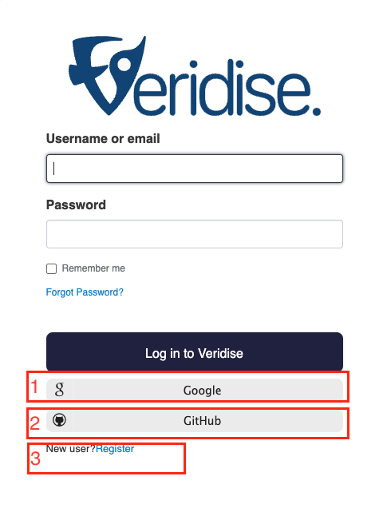

Please note that even if you use the first two options you will have to provide additional required information during the registration process. In the case of local user registration, you will also have to verify your email address.

### Access Request 

As soon as you are logged in to our platform you will have to request access to the SaaS platform. 
When the administrators of SaaS approve your request, you will receive an email that you are ready to use the platform.

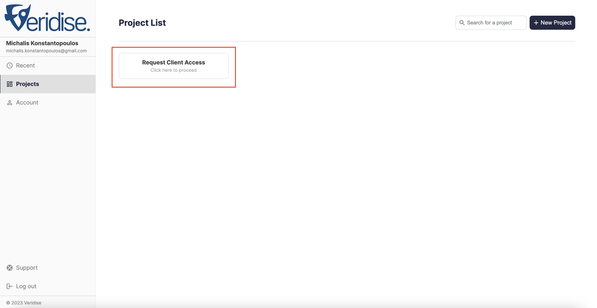

## Using SAAS

You should now have access to the Veridise SAAS platform. Your home screen should look like the following, listing any current projects you have as well as the option to create a new project.

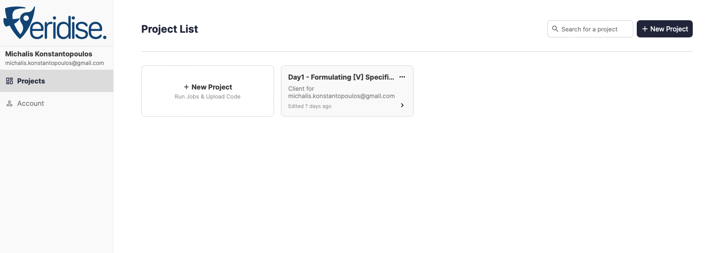

### Creating a Project

A "project" is used to group together the results of multiple runs of Veridise's tools (this could be runs of different tools on the same source code or even multiple runs of the tools over different versions of code for the same project).

To create a project, simply click the `+ New Project` button and enter a suitable name for your new project. We will call our project `Hello World`.

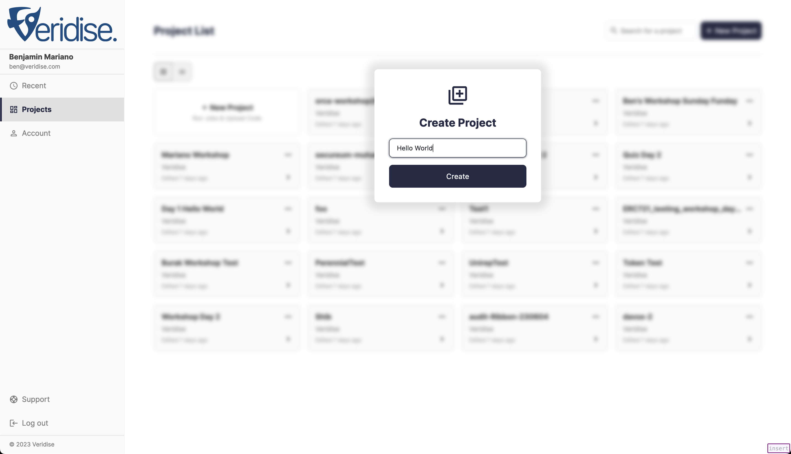

### Selecting an Existing Project

Instead of creating a project, you can also select an existing project by simply clicking on any of the existing projects in view.

### Creating a Job

A "job" is an actual run of one of Veridise's tool against a given project (e.g., running OrCa on a given project to find violations of a [V] specification).

After creating or selecting a project, you can create a new job by clicking `Create Job...`

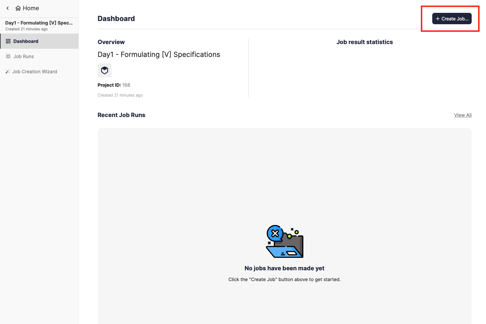

#### Provide Source Code and Job Name

For providing source code, you can either choose from the code already uploaded for this project, or upload a new code archive via the `Upload New Archive` tab. Code archives are expected to be zip files containing the source code of the project to be checked. There are no assumptions about the layout of the code, but all archives are expected to be less than XXX GB. In this case, we will upload a zip file containing a single file that holds the `Vault` contract shown above.

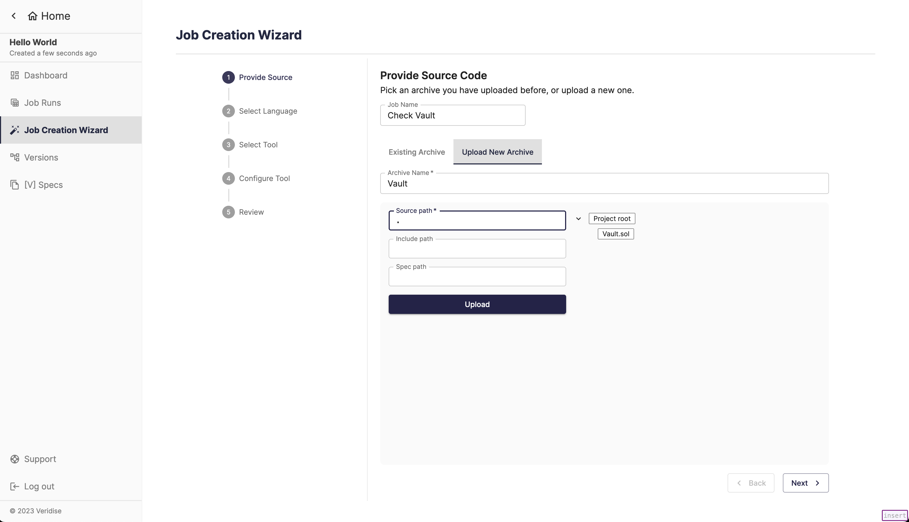

#### Select a Language

After proving the source code, a user must select the platform and language desired. In this case, we choose Ethereum and Solidity.

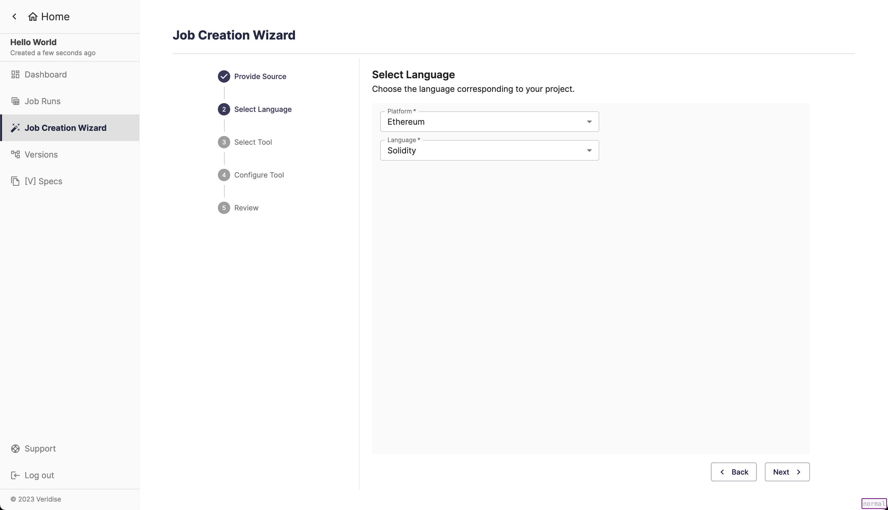

#### Select a Tool

After selecting a language, you will be asked to choose a tool. To run OrCa, choose OrCa.

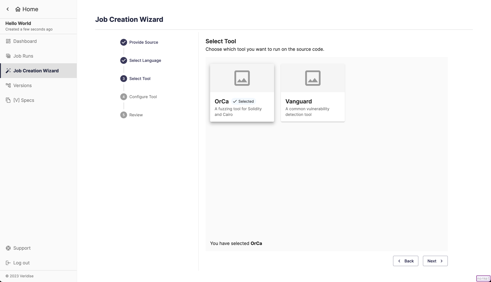

#### OrCa Configuration

Next, you will be asked to configure OrCa, which includes options like timeout, number of users, and other advanced settings. For more information on these configuration options, checkout the [common](../user_guide/orca_configuration/common_settings.md) and [advanced](../user_guide/orca_configuration/advanced_settings.md) settings documentation. In this case, we simply use the default options and click `Next`.

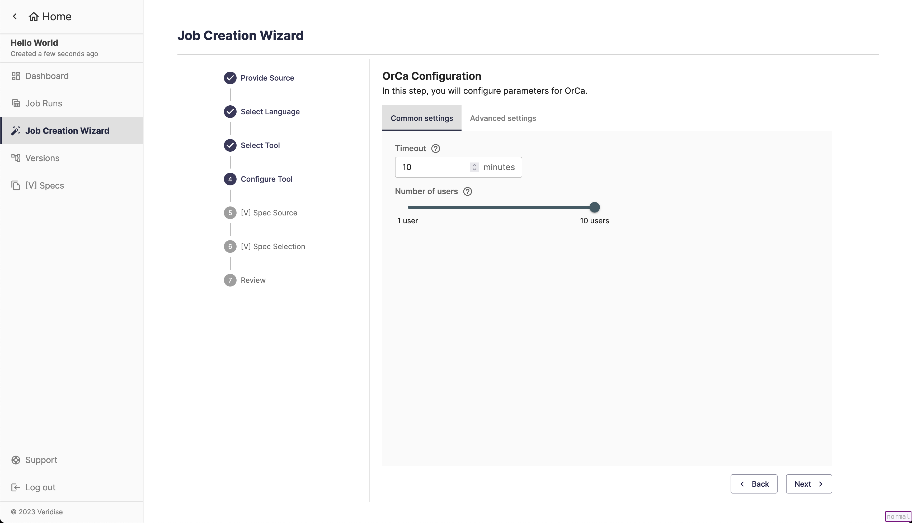

#### Select [V] Specication Source

To provide a [V] specification, you can either:
1. Use our [[V] Specification library](../user_guide/v/specification_library.md)
2. Write your own [V] specification.

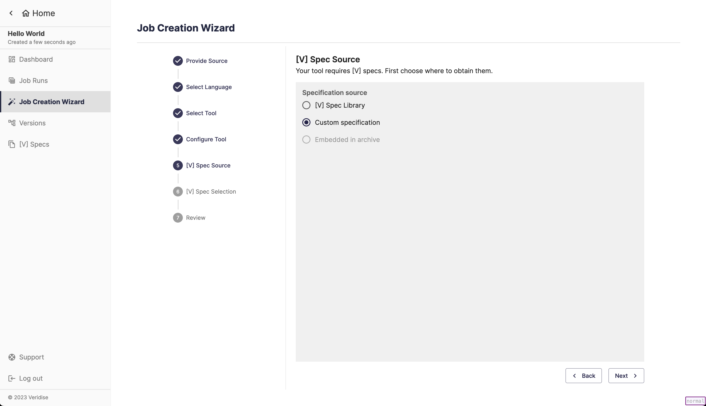

For the `Vault`, we will write our own [V] specification capturing the desired property. To do this, we simply write the specification in the provided box. You can preload an existing specification as a template. Any syntax errors will be highlighted. When we have completed the specification, we click `Next`.

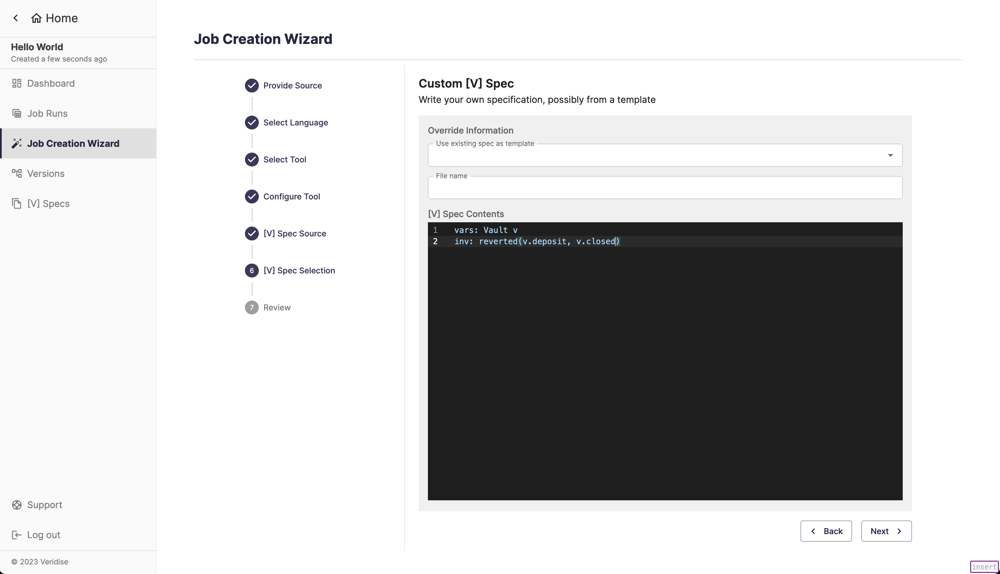

#### Review configuration

The final step of configuration is to review all of the options you have chosen. If anything does not look correct, you can go back and update the Job as needed. When you are ready, click `Launch Job`!

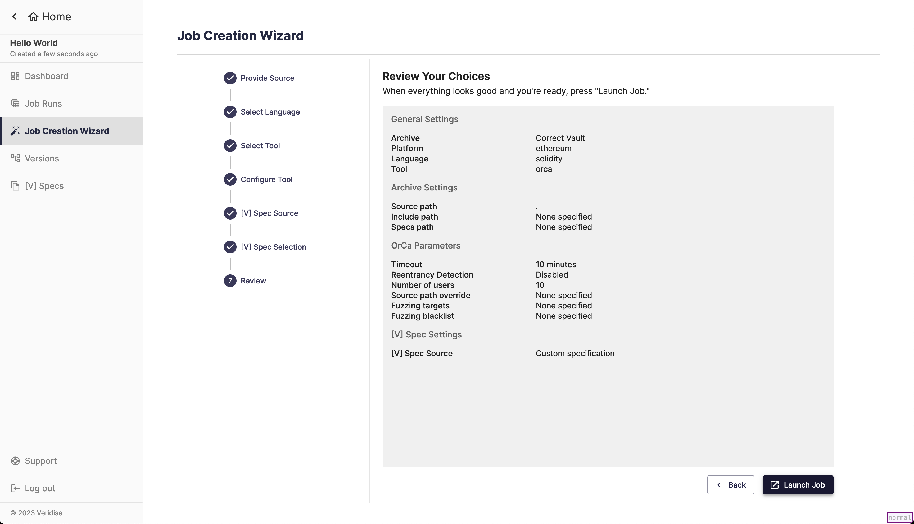

### Job Details and Output

After launching the job, you will be redirected to the Job Details page. This page will allow you to see information about the Job, including the [V] specification chosen, as well as the tool parameters chosen. It will also show you the status of the job, which indicates whether or not the job is still running and what it found. Details of the output of the tool can be seen in the Job Log. 

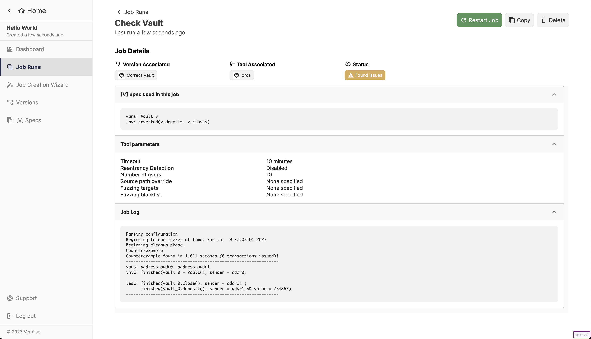

In this case, we can see the OrCa successfully found a counterexample, which is displayed as a [V] specification.
