# Running OrCA Through SAAS

For this introduction, we will consider using OrCa to check that the following simple `Vault` contract only ever allows a user to deposit when the `Vault` is not closed.

```solidity
// SPDX-License-Identifier: GPL-3.0
pragma solidity >=0.4.0 <0.9.0;

contract Vault {
    mapping(address => uint) public balances;
    bool public closed;

    function close() public {
        closed = true;
    }

    function deposit() public payable {
        balances[msg.sender] += msg.value;
    }

    function withdraw() public {
        balances[msg.sender] = 0;
        
        (bool success, ) = payable(msg.sender).call{
            value: balances[msg.sender]
        }("");
        
        require(success, "Unsuccessful withdrawal.");
    }
}
```

## Onboarding process

To start using Orca visit the [SaaS page](https://demo.veridise.com/). 
When you access the platform, you will be redirected to our SSO. 

### Registration 

As shown in the following image, you have two log in options: 
1. Log in using your Google account 
2. Create a new local user

You must log-in with your Veridise e-mail address if you are using Google. Otherwise you must create an account with your Veridise e-mail.

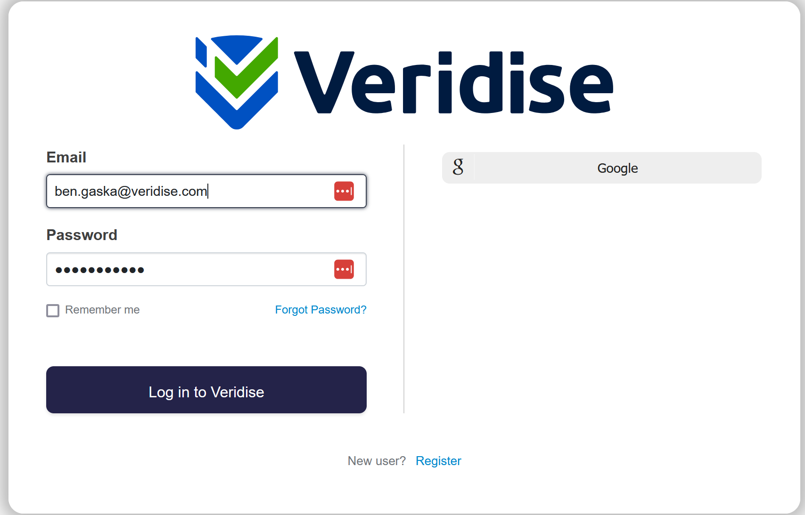

Please note that even if you use the first two options you will have to provide additional required information during the registration process. In the case of local user registration, you will also have to verify your email address.

### Organization Menu

The first thing you will see upon logging in is the Organization menu.

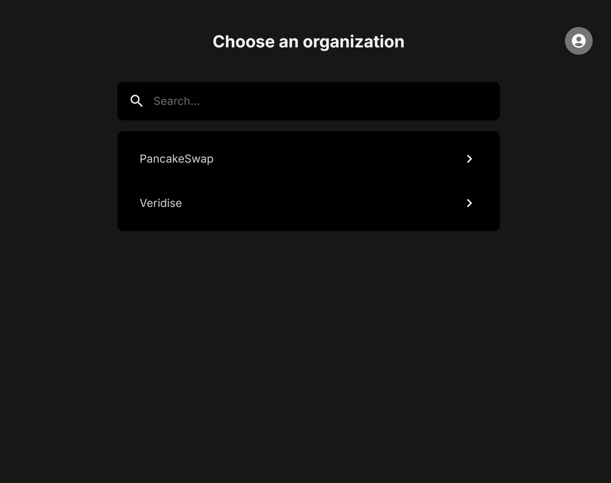

You should have access to a private repo only for you. If you want access to other organizations, currently it will be manually granted by the SaaS team. Upon clicking it you will be taken to this main menu for the organization.

## Using SaaS

You should now have access to the Veridise SAAS platform. You should see the following page:

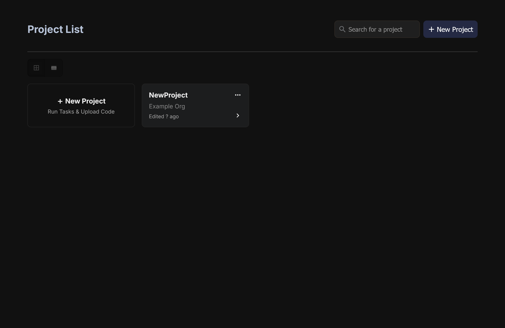

If you see something like this, congratulations. You now have access to the garden of Earthly delights that is, SaaS.

### Selecting an Existing Project

The most basic task is using a pre-existing project. Just click on them in the menu and you're good to go. But that's not exciting, we're engineers and have a powerful urge to press buttons and twiddle bits ourselves.

### Creating a Project

A "project" is used to group together the results of multiple runs of Veridise's tools (this could be runs of different tools on the same source code or even multiple runs of the tools over different versions of code for the same project). The core unit within a project is the code under test. Each project will be associated with a specific folder structure that should be associated with a given set of Ethereum contracts, their build tools, etc.

To create a project, simply click the `+ New Project` button and you will be taken to the project creation Wizard. Enter in a name (we will use Hello World for this demo) and away we go.

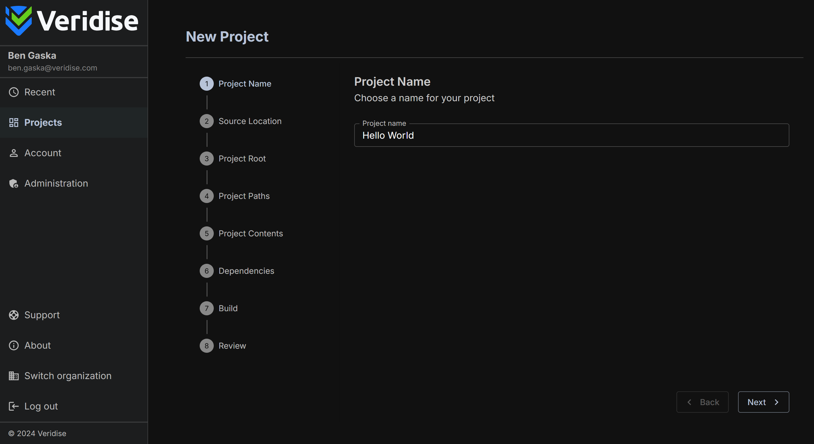

#### Provide Source Code and Job Name

Now we need to provide the actual source code we want t operate one. There are three ways of doing it, let's look at each.

First, you can upload a file. This is uploading a folder directly from you device. This must be a zip file.

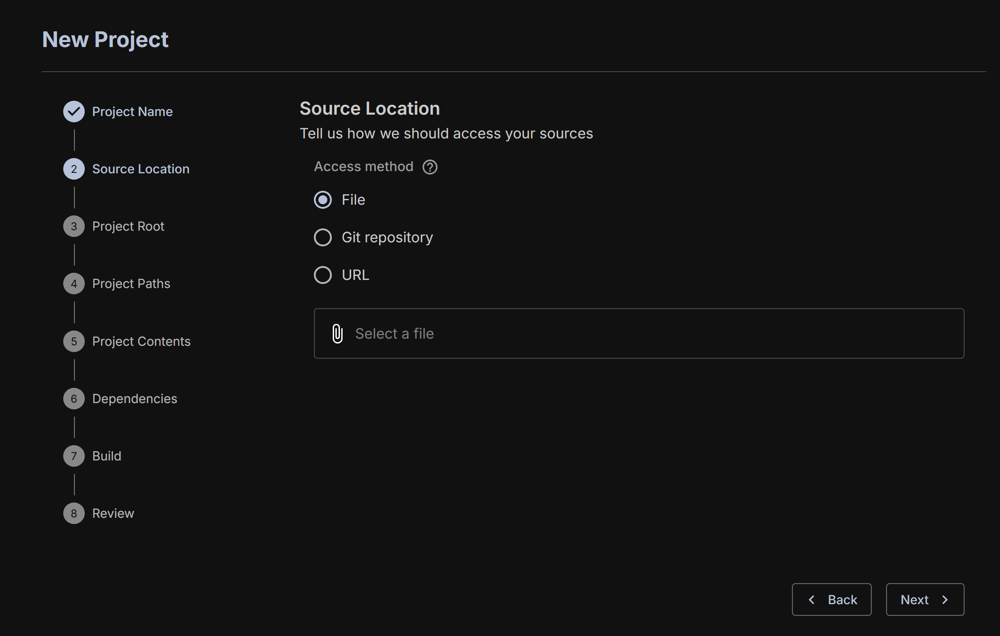

You can also provide the address of a git repo. It's important to know whether your code includes git submodules that have to be reified. These are Git submodules specifically.
If it is a Foundry project, then also select this option. This will pull in the correct Foundry dependencies necessary for execution.

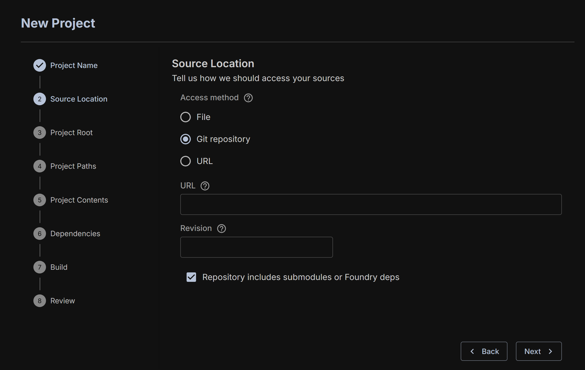

The final one is providing a URL

[TODO] What is this?

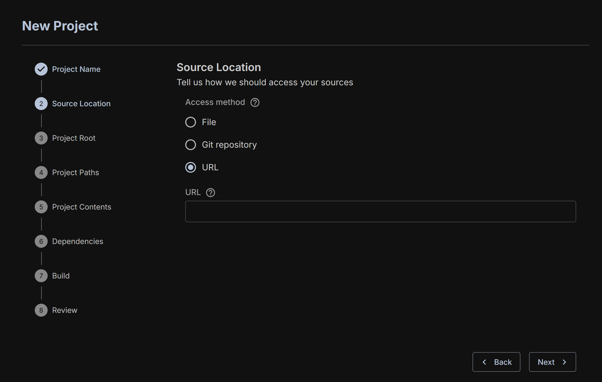

#### Identify the Root of the Project

In Hardhat and Foundry tasks are run from a root folder. You must identify this for SaaS so we can properly execute your tasks. This usually will just be the top level of your zip.

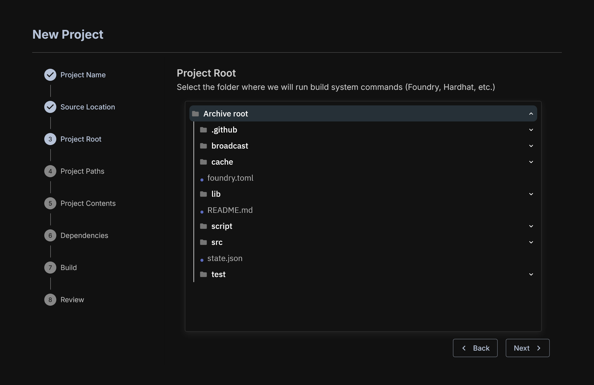

#### Project Paths

You must select where the source code and the V Specs to use at least.

The Source Path is usually /src but depends on what the user set for it. This is where the contracts exist.

Include Path is ...

Specs path is where V-Specs are. These (currently) must be added manually to the zip ahead of time. The preferred way of doing this is to create a /specs folder, but you can name it as you choose.

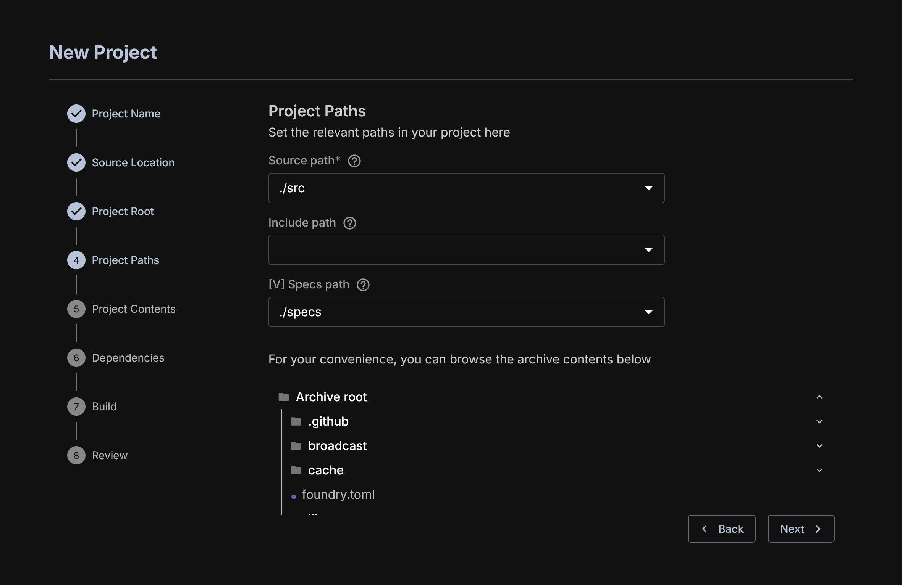

#### Select a Language

After proving the source code, a user must select the platform and language desired. In this case, we select Solidity.

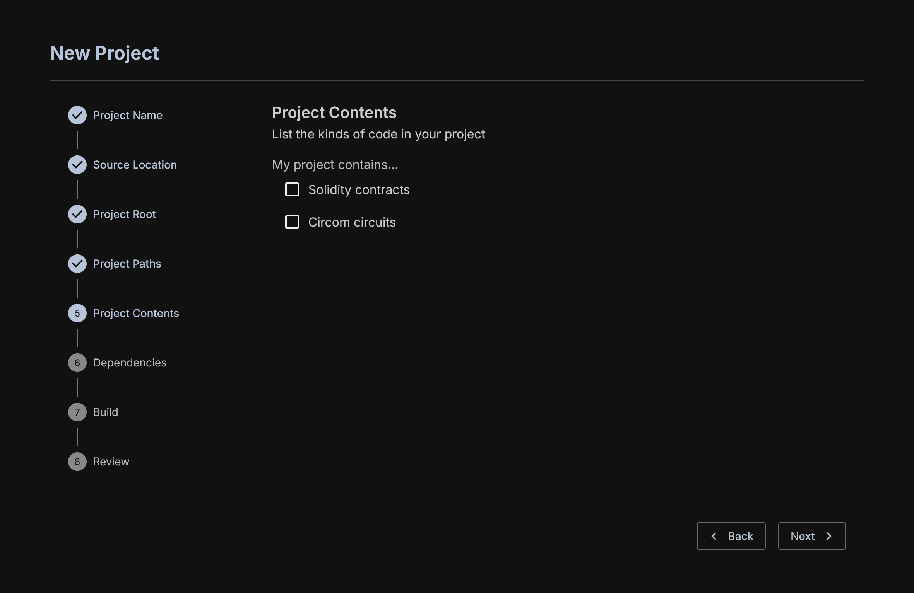

#### Downloading Depedencies

This gathers the required dependencies for the project.

This is mainly used for Hardhat projects as Foundry maintains its own dependency management system. You will have to look to how the Hardhat project is built and select the relevant dependency management tool.

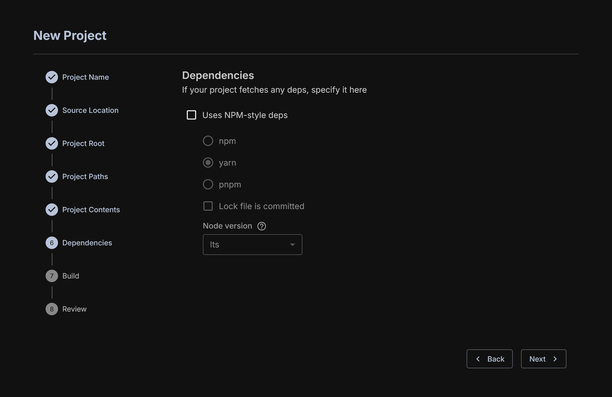

#### Deployment Scripts and Environmental Variables

Foundry and Hardhat have different means of specifying deployment. OrCa will require some version of this to initialize state for fuzzing. You can write your own if you are familiar with it, or use what the user has provided.

Additionally, any Environmental variables that are required by the scripts or the build must be set here. This is project to project and requires some understanding of the project you are trying to deploy.

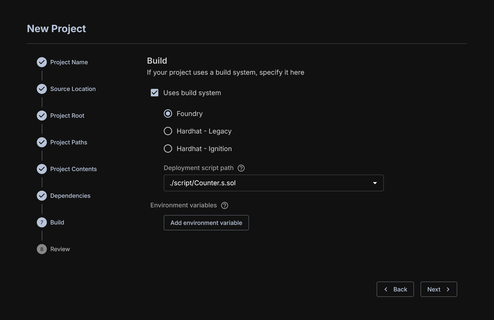

There are three (maybe 2 1/2 really) means for deployment that we support.

1. Foundry by default has its scripts defined in a `/script` folder. The common suffix is `.s.sol` 
2. Hardhat Ignition is what Hardhat is moving towards for its deployment handling. The default path for this information is `/ignition/module` and will contain possibly many module files which can be launched. It is a Javascript file that uses Hardhat Ignitions common library for managing contracts.
3. Hardhat Legacy is what we use to refer to the original means for Hardhat deployment which is a Javascript file. It imports and manipulates the core Hardhat libraries directly and is largely unstructured vs. ignition. This is by default in a `/scripts` folder.

#### Review

One last look at what you've chosen.

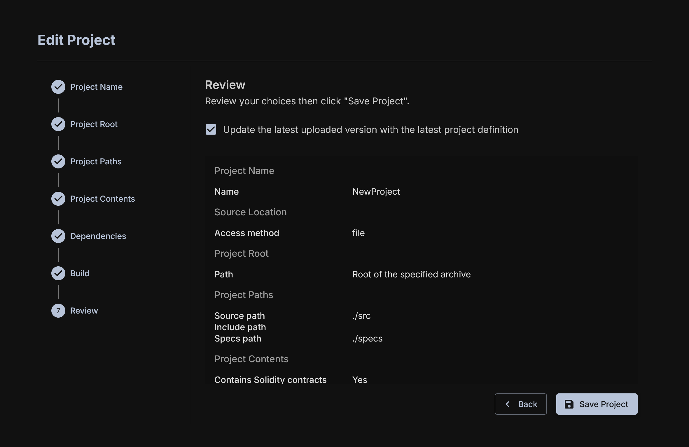

Once you select this, to modify you setup, you must return to the main deployment page and select the three dot menu next to the given project and select `edit`. This will bring you back to the project menu to edit inputs.

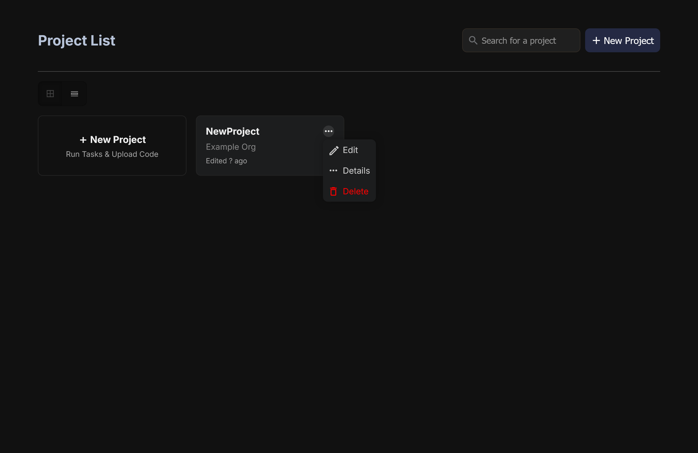

### Task Configuration

Now you will be at the Task Configuration dashboard. 

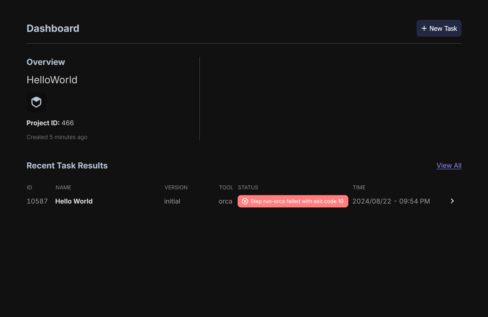

This shows previous tasks you have run; various information about previously run tasks; and a way to select a new task. Click the obvious button `+ New Task` here and let's go.

First, choose a version of the code you want to run against. If you want to upload a new folder with updated code you can do so here. The selector here will include every version of the code you have uploaded.

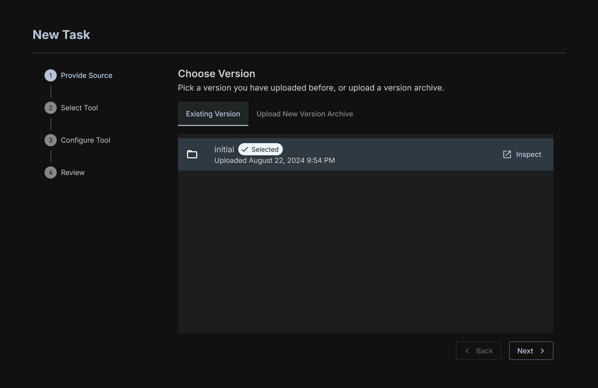

Next, select OrCa.

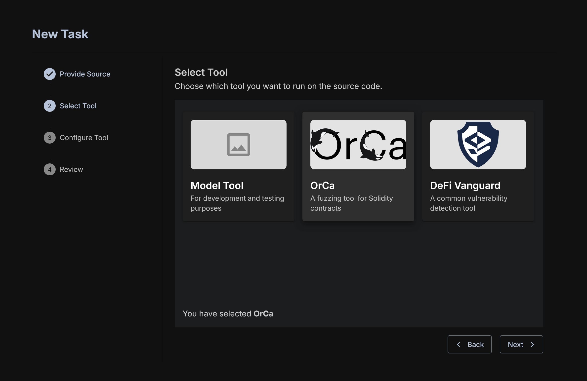

You will see several options available to you.

Currently you can set `Timeout` and `Fork Network`. 

`Timeout` is simply how long to run OrCa before quitting.

`Fork Network` is a set list of known Ethereum networks that you can choose to fork your test from as a basic.

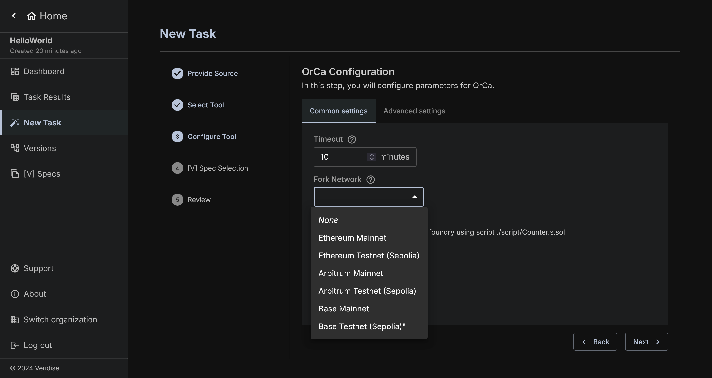

There is additional Advanced Features which allow you to further tune the run.

`Fuzzing Targets` lets you define which contracts you want to specifically fuzz. This will narrow the list of functions to be fuzzed to only those of the specified contracts.

`Fuzzing Blacklist` is the antithesis of the above. This says don't fuzz the functions on the set contract.

`Pure function fuzzing` is what it sounds like. OrCa doesn't fuzz Pure functions by default. This allows you to enable fuzzing of pure functions (pure functions are basically static functions in Solidity. Something that does not change state.)

`Detect Reentrancy` enables testing for Reentracy errors. This will slow down performance but can detect a variety of possible reentrancy errors.

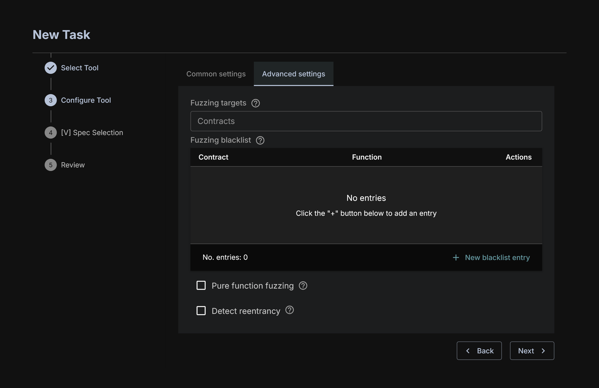

#### VSpec Selection

There are set VSpec detecting common errors that you can select, these are given in the `[V] Specification Library` and have names describing what they are detecting.

The `Embedded in version` field contains VSpecs provided in the folder you provided for specs during project creation.

You can select multiple VSpecs and they will be each tested against the project under test.

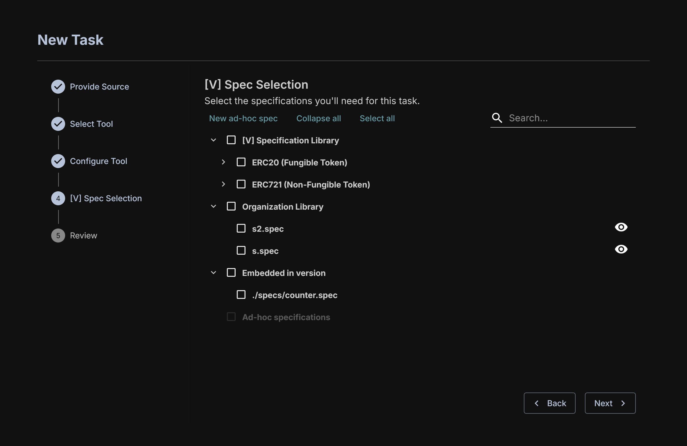

#### Task Review

You'll see another review page. Look it over and click next.

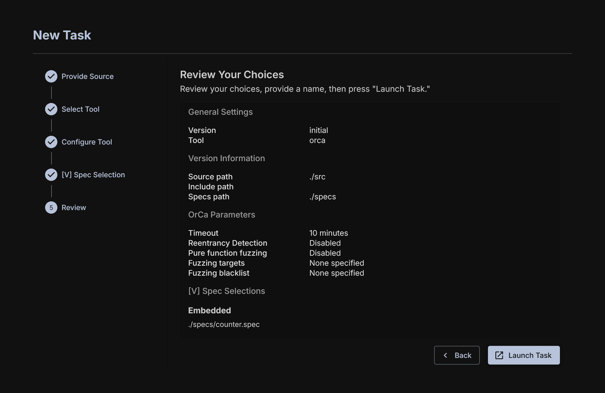

