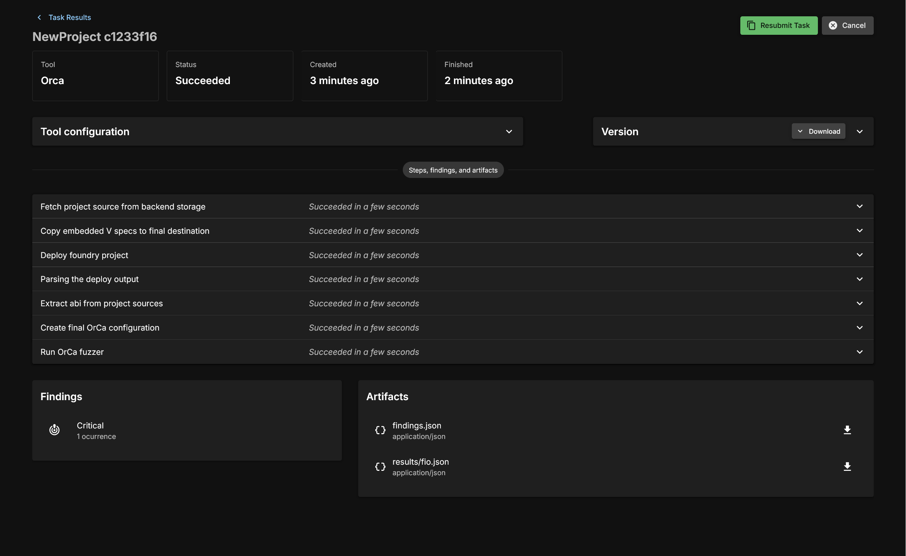
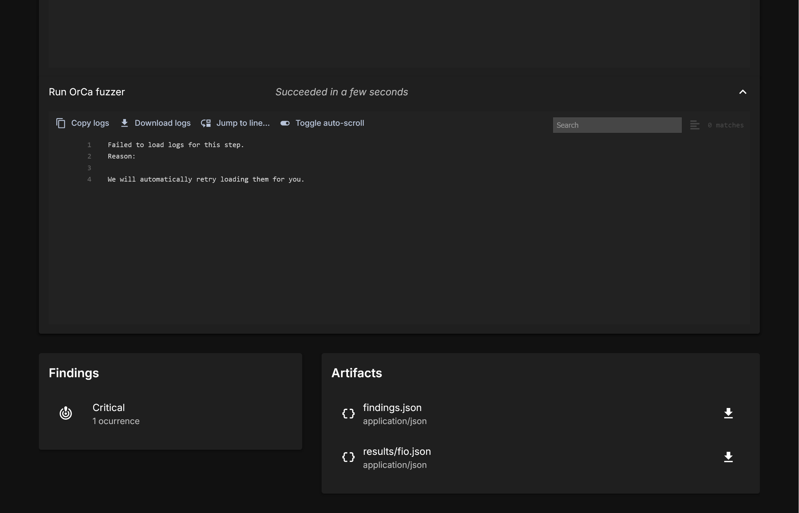
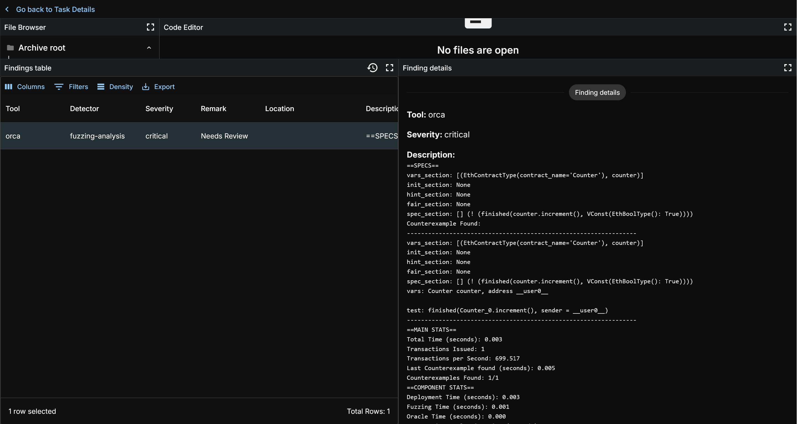
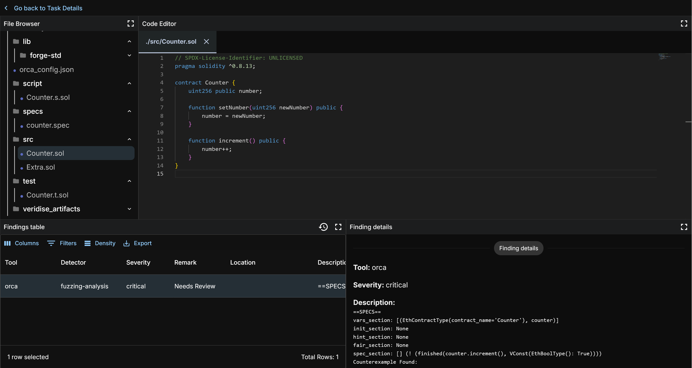
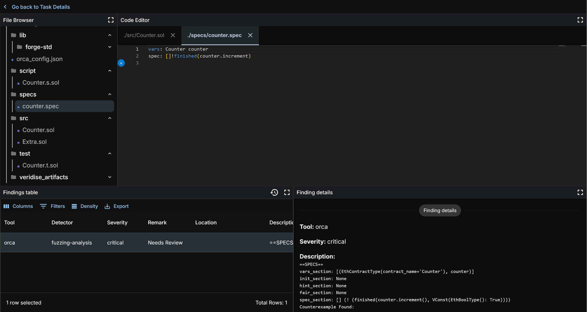
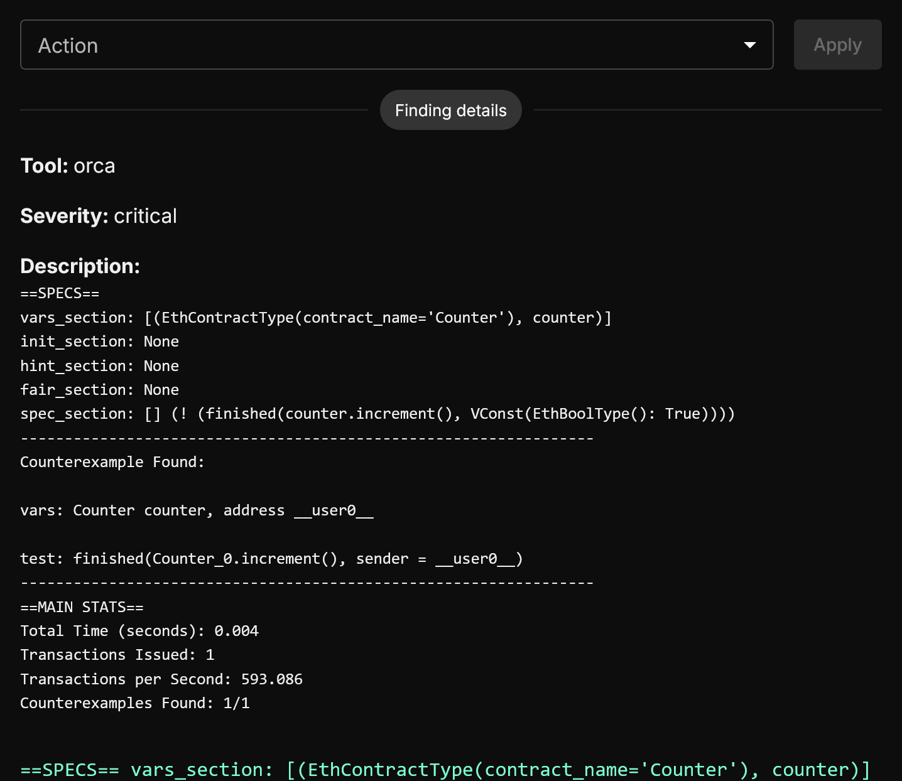

# Running OrCA Through AuditHub

For this introduction, we will consider using OrCa to check that the following simple `Vault` contract only ever allows a user to deposit when the `Vault` is not closed.

```solidity
// SPDX-License-Identifier: GPL-3.0
pragma solidity >=0.4.0 <0.9.0;

contract Vault {
    mapping(address => uint) public balances;
    bool public closed;

    function close() public {
        closed = true;
    }

    function deposit() public payable {
        balances[msg.sender] += msg.value;
    }

    function withdraw() public {
        balances[msg.sender] = 0;
        
        (bool success, ) = payable(msg.sender).call{
            value: balances[msg.sender]
        }("");
        
        require(success, "Unsuccessful withdrawal.");
    }
}
```

## Accessing AuditHub

To start using Orca visit [AuditHub](https://audithub.veridise.com/).
For details about registration and accessing AuditHub, please refer to [this page about onboarding](../../saas/guide/on_boarding).

### Organization Menu

The first thing you will see upon logging in is the Organization menu.


You should have access to a private repo only for you. Upon clicking it you will be taken to this main menu for the organization.

## Using AuditHub

You should now have access to the Veridise AuditHub platform. You should see the following page:


### Selecting an Existing Project

The most basic task is using a pre-existing project. Just click on them in the menu and you're good to go. But that's not exciting, we're engineers and have a powerful urge to press buttons and twiddle bits ourselves.

### Creating a Project

A "project" is used to group together the results of multiple runs of Veridise's tools (this could be runs of different tools on the same source code or even multiple runs of the tools over different versions of code for the same project). The core unit within a project is the code under test. Each project will be associated with a specific folder structure that should be associated with a given set of Ethereum contracts, their build tools, etc.

To create a project, simply click the `+ New Project` button and you will be taken to the project creation Wizard. Enter in a name (we will use NewProject for this demo) and away we go.


#### Provide Source Code and Job Name

Now we need to provide the actual source code we want to operate one. There are three ways of doing it, let's look at each.

First, you can upload a file. This is uploading a folder directly from your device. This must be a zip file.


You can also provide the address of a Git repo. It's important to know whether your code includes Git submodules that have to be reified.
If it is a Foundry project, then also select this option. This will pull in the correct Foundry dependencies necessary for execution.


The final one is providing a URL and a commit hash for the project.


#### Identify the Root of the Project

In Hardhat and Foundry tasks are run from a root folder. You must identify this for AuditHub so that OrCa can properly execute your tasks. This usually will just be the top level of your zip file.


#### Project Paths

You must select where the source code and the [V] specs to use at least.

The Source Path is usually /src but depends on what the user set for it. This is where the contracts exist.

Include Path is not used by OrCa, please consult the Vanguard documentation for details about its usage.

Specs path is where [V] specs are. These (currently) must be added manually to the zip ahead of time. The preferred way of doing this is to create a /specs folder, but you can name it as you choose.


#### Select a Language

After proving the source code, a user must select the platform and language desired. In this case, we select Solidity.

Note: OrCa does not currently support Circom circuits. Please consult the documentation for the other tools for information about what is supported.


#### Downloading Depedencies

This gathers the required dependencies for the project. This is mainly used for Hardhat projects as Foundry maintains its own dependency management system. You will have to look to how the Hardhat project is built and select the relevant dependency management tool.


#### Deployment Scripts and Environmental Variables

Foundry and Hardhat have different means of specifying deployment. OrCa will require some version of this to initialize state for fuzzing. You can write your own if you are familiar with it, or use what the user has provided.

Additionally, any environmental variables that are required by the scripts or the build must be set here. These variables are usually specific to a particular project and requires some understanding of the project you are trying to deploy.


There are three means for deployment that we support.

1. Foundry by default has its scripts defined in a `/script` folder. The common suffix is `.s.sol`
2. Hardhat Ignition is what Hardhat is moving towards for its deployment handling. The default path for this information is `/ignition/module` and will contain possibly many module files which can be launched. It is a Javascript file that uses Hardhat Ignitions common library for managing contracts.
3. Hardhat Legacy is what we use to refer to the original means for Hardhat deployment which is a Javascript file. It imports and manipulates the core Hardhat libraries directly and is largely unstructured unlike Hardhat ignition. This is by default in a `/scripts` folder.

#### Review

One last look at what you've chosen.


Once you select this, to modify you setup, you must return to the main deployment page and select the three dot menu next to the given project and select `edit`. This will bring you back to the project menu to edit inputs.


### Task Configuration

Now you will be at the Task Configuration dashboard.


This shows previous tasks you have run; various information about previously run tasks; and a way to select a new task. Click the obvious button `+ New Task` here and let's go.

First, choose a version of the code you want to run against. If you want to upload a new folder with updated code you can do so here. The selector here will include every version of the code you have uploaded.


Next, select OrCa.


You will see several options available to you.


Currently you can set `Timeout` and `Fork Network`.

`Timeout` is simply how long to run OrCa before quitting.

`Fork Network` is a set list of known Ethereum networks that you can choose to fork your test from as a basis network. This will be used only when the underlying code makes some calls during set-up to pre-existing contracts.

There is a fixed set of networks allowed. If you find reason to allow additional networks, please reach out to AuditHub team to discuss adding it to the list.


There are additional Advanced Features which allow you to further tune the run.

`Fuzzing Targets` lets you define which contracts you want to specifically fuzz. This will narrow the list of functions to be fuzzed to only those of the specified contracts.

`Fuzzing Blacklist` lets you define which functions you _do not_ want to fuzz. They will be ignored by OrCa.

`Pure function fuzzing` lets you enable fuzzing of the pure and view functions (functions that do not affect the blockchain state). OrCa doesn't fuzz pure and view  functions by default.

`Detect Reentrancy` enables checking for reentrancy errors. This will slow down performance but can detect a variety of possible reentrancy errors.

#### [V] Spec Selection

There are a set of [V] spec checking common contract properties that you can select, these are given in the `[V] Specification Library` and have names describing what they are checking.

The `Embedded in version` field contains [V] specs provided in the folder you provided for specs during project creation.

You can select multiple [V] specs and they will be each tested against the project under test.


#### Task Review

You'll see another review page. Look it over and click `Launch Task`. You can give an optional task name here, if you do not add one, the name for the task will be the run ID created by AuditHub.


### Task Run Page

You will now see a large showing the pipeline for an OrCa execution. We will be glossing over certain steps that are specific to AuditHub, and will attempt to focus on OrCa specific operations.



#### Fetch Project Source from Backend Storage

This is a general step. This is just copying information from the backend.

#### Deploy Project

This step runs the user specified deployment script and saves the artifact and the blockchain state for fuzzing.

#### Deployment parsing; ABI Extraction; Configuration creation

These steps are all simple data collection from various compilation and deployment artifacts to construct the input to OrCa.

#### Run OrCa Fuzzer

If everything up until now has worked, the user configuration and the deployment artifacts will be fed to OrCa and fuzzing will begin. This will run until the timeout is reached, or counterexamples are found for the provided [V] specs. Let's look at a completed run.

First, after the run is completed with an error found you will see a Findings field:



Click the findings button, and take a look at our demo output.



There will only be at most one finding per spec. Click the finding and you will see information on the right which details the bug found.

Let's take a look at the contract under test. You can use the code viewer in the findings menu and click the contract to view it.



This test contract is very simple. A Counter class with two functions to set or increment a value.

Now, let's look at the spec we ran.



This spec says that calls to increment should always not finish (so, never finish). Looking at the Counter code we can see that the code will always complete. And so let us look at the results and confirm that is what OrCa found.



At the top here, we see a representation of the [V] spec that was provided. If multiple [V] specs were run, each one will be represented with the counterexample found.

Below that you will see your counterexample. The `vars` field gives the names for variables used counterexample.

The counterexample itself is a minimum number of steps required to recreate something that violates your spec. In this case, it's a simple one. The [V] spec specified `increment()` calls should never finish, and `increment()` always fully executes.

For more complex specs, there will be a list of the minimum number of steps required to create a counterexample. These counterexamples can be arbitrarily large, but will be consistently reproducable given the steps.
