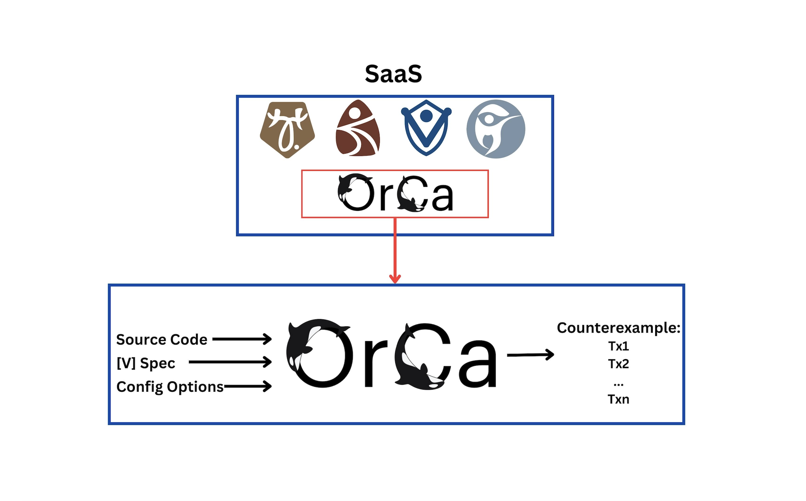

# Welcome to the OrCa Fuzzer Documentation

OrCa is an **Or**acle-guided **C**ontr**a**ct fuzzer, which discovers bugs in DeFi applications by generating and running thousands of (pseudo-)random inputs against a target application. OrCa takes an input a specification of what the application should do (written in [the [V] specification language](user_guide/v/overview.md)) and tries to find a *counterexample*, i.e., a sequence of calls to public functions that trigger a violation of the specification.

## Quickstart

For instructions on how to get started with running OrCa, checkout [the guide here](getting_started/running_orca_through_saas.md).

## User Guide

For learning how to use all of the bells and whistles of OrCa, checkout the User guide on the left, which includes all the details on how to configure OrCa, how to use hints to guide the execution, and how to use the [V] specification language.
