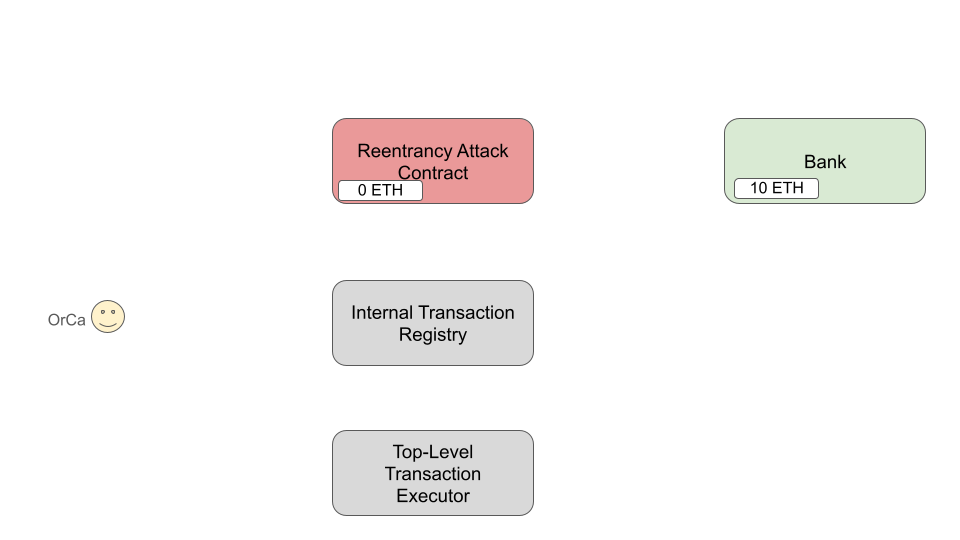
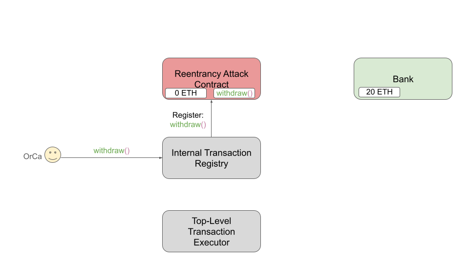
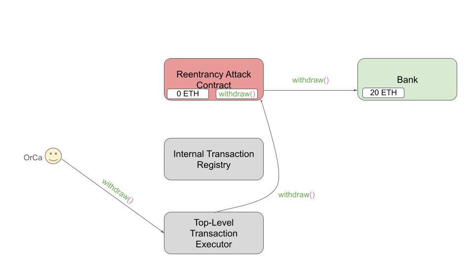
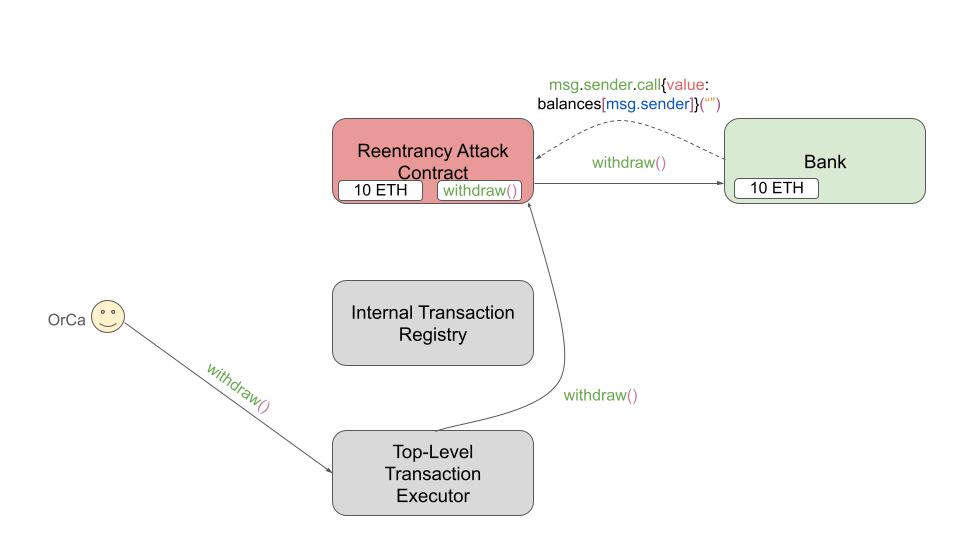
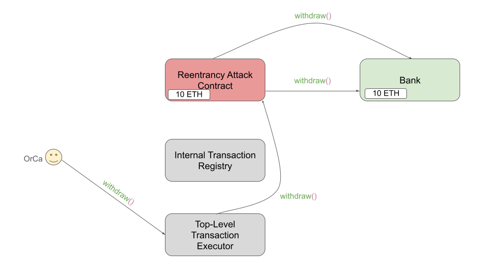
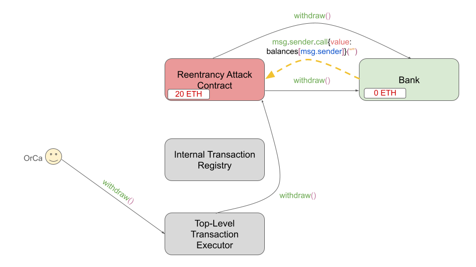

# Understand Reentrancy Detection

This portion of the documentation explains how OrCa can detect oreentrancy vulnerabilities.
Detection works by altering the REVM dump state JSON and ABI passed to OrCa. In the following
sections, we will describe *how* reentrancy detection works and how you can understand OrCa's
output when a reeentrancy vulnerability is discovered.

## How it Works

The following
sections first explain the high-level idea behind reentrancy detection and then the
specific smart contracts used to implement it. Finally, an example is given which
shows how this approach enables OrCa to detect reentrancy vulnerabilities.

### High-Level Idea

Our solution relies on 3 novel contracts which we introduce to enable reentrancy
detection:

1. The Reentrancy Attack Contract (or "RAC" for short)
2. The Internal Transaction Registry Contract (or "registry" for short)
3. The Top-Level Transaction Executor Contract (or "executor" for short)

At a high-level, the solution works by issuing one registry and one executor for
each contract deployed in the protocol. These contracts interact with the RAC to
prepare it for exploiting a reentrancy vulnerability. Lastly, when the RAC is invoked
on an external call, it begins the exploit using the preparation from interactions
with the registries and executors.

### The Contracts

As mentioned above, the solution is implemented via 3 contracts: the RAC, registry,
and executor.

#### Reentrancy Attack Contract ("RAC")

The reentrancy attack contract (or RAC) is used to store transactions which will be
invoked in the event that the RAC is the target of an external call from another
contract. The RAC is mostly straightforward -- transactions are added to its store
via calls to `addInternalTransactionToAttackSequence()` and are executed in the event
the `fallback()` function is invoked. Only registry contracts should ever add internal
transactions (this function is removed from the ABI for the RAC to avoid OrCa calling
it). The RAC also includes the ability to issue calls directly to a contract via
`executeTopLevelTransaction()`, which should only be executed by an executor contract
(again, this function is removed from the ABI for the RAC to avoid OrCa calling it).

The RAC also supports *multiple* attack sequences, where an attack sequence are the
sequence of transactions that will be executed on invoking the RAC `fallback()`. This
enables the RAC to support attacks which require invoking the RAC `fallback()` method
multiple times. The function `moveToNextAttackSequence()` will make it so that future
calls to `addInternalTransactionToAttackSequence()` will add transactions to a new
sequence. OrCa can directly call `moveToNextAttackSequence()` to discover such attacks.

Finally, the RAC includes `resetAttackSequences()` which can be directly invoked by
OrCa. This function simply deletes all current sequences on the RAC. This function is
an optimization to avoid the case that the RAC becomes clogged with incorrect and/or long
sequences.

#### Internal Transaction Registry ("registry")

One registry contract is deployed for each deployed contract in the protocol. We update
the ABI of each registry contract to be identical to that of the contract for which it is
deployed. Because of this relationship, we say the registry contract *shadows* the contract
whose ABI it copies. Furthermore, we will sometimes refer to the registry contract as a type
of *shadow* contract and the contract which it *shadows* as the *shadowed* contract.

Each registry contract is very simple. Whenever its `fallback()` is invoked, it registers the
transaction data sent to the `fallback()` to the RAC via
`addInternalTransactionToAttackSequence()`. If/when this transaction is eventually executed by
the RAC, it will be executed on the contract which the registry shadows.

#### Top-Level Transaction Executor ("executor")

One executor is deployed for each deployed contract in the protocol. We update
the ABI of each executor contract to be identical to that of the contract for which it is
deployed. Because of this relationship, we say the executor contract *shadows* the contract
whose ABI it copies. Furthermore, we will sometimes refer to the executor contract as a type
of *shadow* contract and the contract which it *shadows* as the *shadowed* contract.

Each executor contract is very simple. Whever its `fallback()` is invoked, it forwards the
transaction data sent to the `fallback()` to the RAC via `executeTopLevelTransaction()`
which will then execute the transaction on the contract which the executor shadows.

## An Example

To better understand how this works, consider the following simple contract:

```solidity
contract Bank {
    mapping(address => uint) balances;

    function deposit() payable public {
        balances[msg.sender] += msg.value;
    }

    function withdraw() public {
        require(balances[msg.sender] > 0, "Caller has no balance");

        (bool sent, ) = msg.sender.call{value: balances[msg.sender]}("");
        require(sent, "Failed to send Ether");

        balances[msg.sender] = 0;
    }
}
```

This contract implements a banking application, where users can deposit and withdraw
ETH. This contract is vulnerable to a classic reentrancy attack. The call
`msg.sender.call(value: amount)("")` invokes the fallback function of the caller
(if that caller is a contract). If, in that fallback, the caller invokes `withdraw`
again, the caller can withdraw more of their funds *without* their balance having
been updated. Let's walk through how we enable reentrancy detection for this example.



Above is a pictoral representation of the state of the blockchain after all contracts
have been deployed and initialized. In particular, the `Bank` contract is deployed
(top right) and we will assume some user has already deposited 10 ETH into the bank.
Additionally, a registry and executor contract have been deployed for the `Bank`, as
well as a single RAC contract for the protocol.

The exploit begins with OrCa issuing a `deposit()` request of 10 ETH to the executor
as shown below. The executor forwards the call to the RAC, which calls `deposit()` on
the bank, increasing the total bank balance from 10 ETH to 20 ETH.


Next, OrCa issues a `withdraw()` call to the registry contract (shown below),
which registers the call to `withdraw()` within the RAC for later use.



As the final step of the attack, OrCa issues another call to `withdraw()` (shown below),
this time through the executor. Like the last call to the executor, this is forwarded to
the RAC which issues the `withdraw()` call on the `Bank` contract.



When the call `msg.sender.call{value: balances[msg.sender]}("")` is reached in
`withdraw()`, 10 ETH is sent from the `Bank` contract to the RAC, reducing the
balance of the `Bank` to 10 ETH and increasing the balance of the RAC to 10 ETH.
This is reflected in the image below.



When the RAC receives the call `msg.sender.call{value: balances[msg.sender]}("")`,
the `fallback` function of the RAC is invoked, which reads the registered `withdraw()`
call and issues it to the `Bank` contract.



This subsequent call invokes
`msg.sender.call{value: balances[msg.sender]}("")` again, which now drains the
`Bank` contract down to 0 ETH and the RAC up to 20 ETH (10 ETH was stolen!). This
time, there are no remaining registerred calls in the RAC, so the `fallback` of
the RAC completes successfully and both calls to `withdraw()` complete successfully
(both resetting the balance of the RAC to 0 within the `Bank` contract). OrCa has
successfully orchestrated the RAC's exploit stealing 10 ETH from `Bank`. This final
part of the exploit is shown below.



## How to Interpret the Output of OrCa

As explained in the section above, OrCa discovers reentrancy detection by deploying
"executor" and "registry" shadow contracts for each contract in the protocol, as well
as a single RAC contract. Other than these initial deployments, OrCa is unaware of
reentrancy detection -- thus, it will report counterexamples that reference these
contracts. For example, the sequence of calls
mentioned in the `Bank` example above might appear as follows in the output of OrCa:

```bash
Counterexample Found:

vars: Bank Bank_0, address __user0__

test: finished(ReentrancyAttackTopLevelTransactionExecutor_OrCaBank_0.deposit(), sender = __user0__ && value = 10)
      finished(ReentrancyAttackInternalTransactionRegistry_OrCaBank_0.withdraw(), sender = __user0__)
      finished(ReentrancyAttackTopLevelTransactionExecutor_OrCaBank_0.withdraw(), sender = __user0__)
```

As you can see, there are three calls in counterexample: the first is the `deposit()`
call to the executor contract for the `Bank`. The second is the registering of the
`withdraw()` call in the registry contract for the `Bank`. And the final call is the
 `withdraw()` call through the executor that completes the attack.

For attacks that involve *multiple external calls*, you may also notice calls to
`moveToNextAttackSequence()` on the RAC that appear in the counterexample. This
starts a new attack sequence that will be executed on the *next* external call
encountered.
