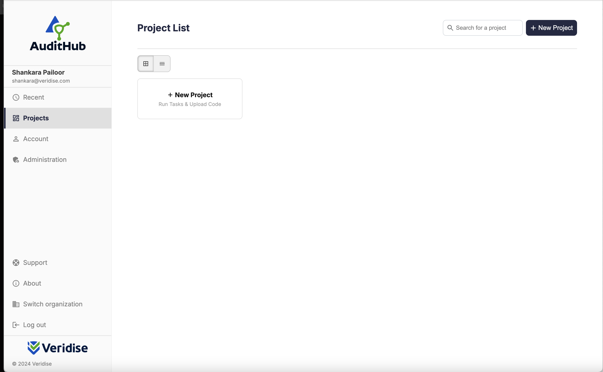
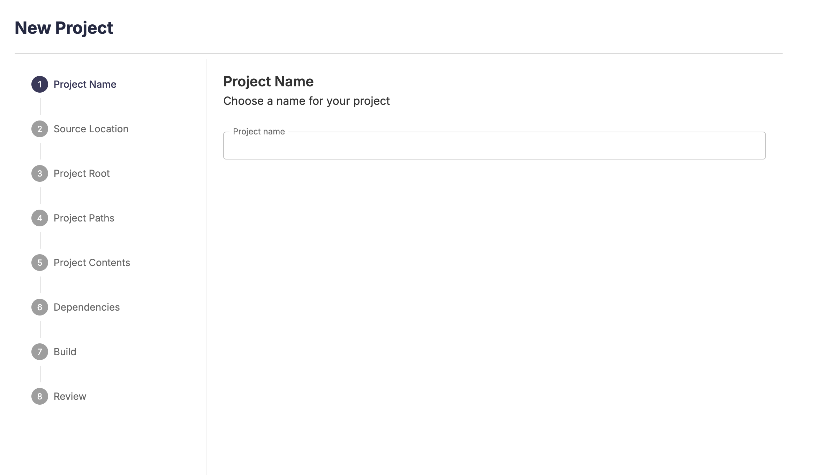
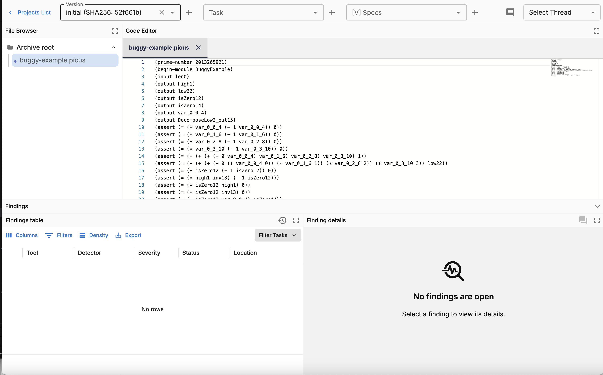
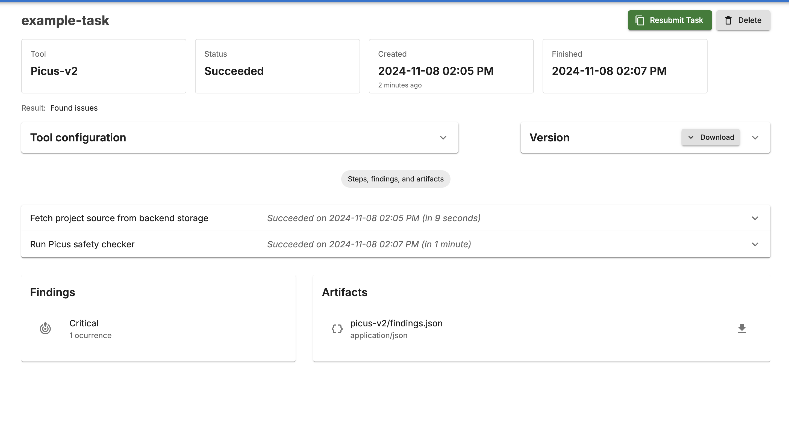
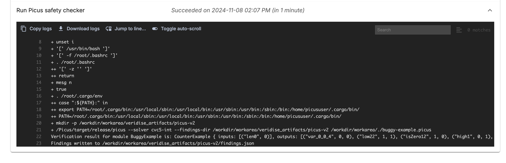

# Running Picus V2 Through AuditHub

As a working example we will use Picus-v2 to prove the following Picus module is underconstrained. For a detailed description about the syntax and semantics of Picus circuit descriptions please see the following [document](../picus_constraint_language.md):

```lisp
(prime-number 2013265921)
(begin-module BuggyExample)
(input len0)
(output high1)
(output low22)
(output isZero12)
(output isZero14)
(output var_0_0_4)
(output DecomposeLow2_out15)
(assert (= (* var_0_0_4 (- 1 var_0_0_4)) 0))
(assert (= (* var_0_1_6 (- 1 var_0_1_6)) 0))
(assert (= (* var_0_2_8 (- 1 var_0_2_8)) 0))
(assert (= (* var_0_3_10 (- 1 var_0_3_10)) 0))
(assert (= (+ (+ (+ (+ 0 var_0_0_4) var_0_1_6) var_0_2_8) var_0_3_10) 1))
(assert (= (+ (+ (+ (+ 0 (* var_0_0_4 0)) (* var_0_1_6 1)) (* var_0_2_8 2)) (* var_0_3_10 3)) low22))
(assert (= (* isZero12 (- 1 isZero12)) 0))
(assert (= (* high1 inv13) (- 1 isZero12)))
(assert (= (* isZero12 high1) 0))
(assert (= (* isZero12 inv13) 0))
(assert (= (* isZero12 var_0_0_4) isZero14))
(assert (= DecomposeLow2_out15 (+ (+ var_0_1_6 var_0_2_8) var_0_3_10)))
(end-module)
```

1. Save this description in a file with a `.picus` extension. In this working example, we will save it inside `buggy-example.picus`. 
2. Compress `buggy-example.picus` as a `.zip` file `buggy-example.zip`
## Accessing AuditHub
This document assumes you have access to AuditHub. To learn more on how to get access to AuditHub go [here](https://docs.veridise.com/saas/guide/on_boarding).

## Using the UI
The following section describes how one can run Picus v2 through AuditHub's UI.

## Creating a Project
1. Login to AuditHub. The landing page should look like: 


2. Click `+ New Project` to open the project creation wizard: 
3. Name the project (e.g., "picus-v2-example") and hit Next.
4. Choose `file` as the source location and upload `buggy-example.zip` and hit Next.
5. Set the source path to `'.'` and leave the other fields blank and hit Next.
6. Check "Picus files" and proceed by clicking "Next" on the Dependencies and Build pages.

If everything is successful you should see a project page: 

## Running Picus-V2 Task

After the project is successfully setup, we can run Picus on the example. 

1. Click `+` next to the `Task` icon in the upper part of the window which will take you to the task creation wizard: [task-wizard](../img/task-wizard.png)
2. Choose the `Existing Version` and hit `Next`.
3. Select `Picus v2`.
4. Put `./buggy-example.picus` as the path to the file.
5. Give the task a name (e.g, `example-task`) and click 'Launch Task`.

This will take you to the Task View page which looks like the following: 


To view the output of Picus, click on `Run Picus Safety Checker`. You will see the following logs: 

At the bottom you can see the following verification result:

```
Verification result for module BuggyExample is: CounterExample { inputs: [("len0", 0)], outputs: [("var_0_0_4", 0, 0), ("low22", 1, 1), ("isZero12", 1, 0), ("high1", 0, 1), ("isZero14", 0, 0), ("DecomposeLow2_out15", 1, 1)], others: [("var_0_1_6", 1, 1), ("var_0_2_8", 0, 0), ("var_0_3_10", 0, 0), ("inv13", 0, 1)] }
```
