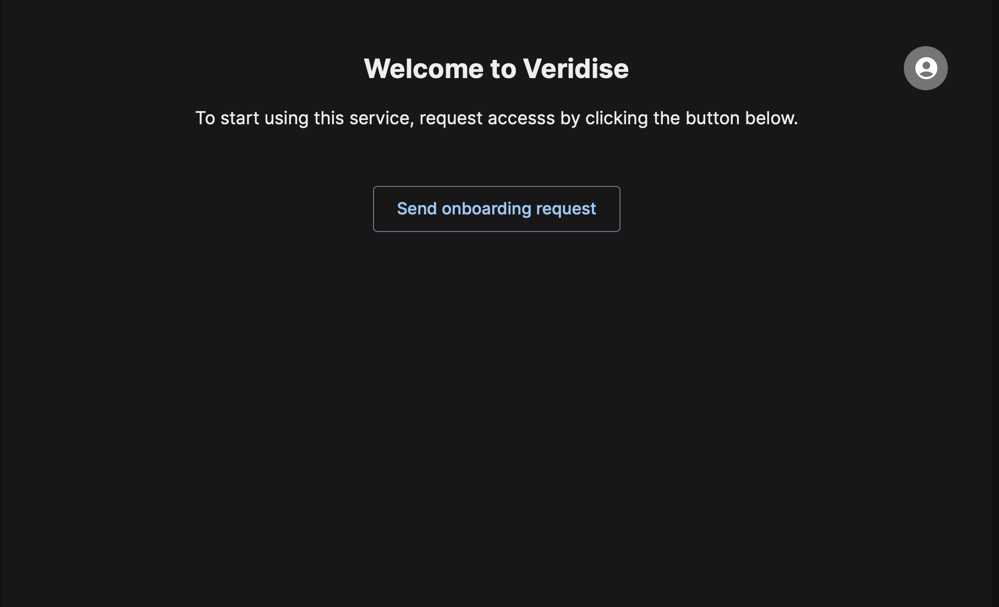
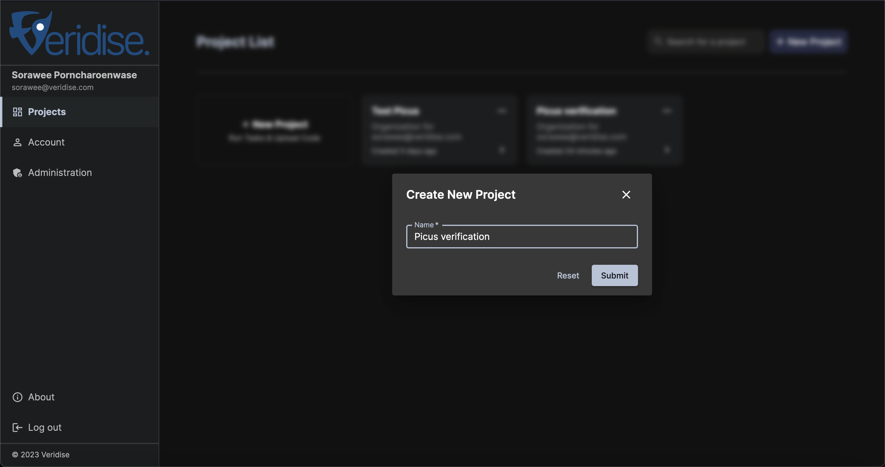
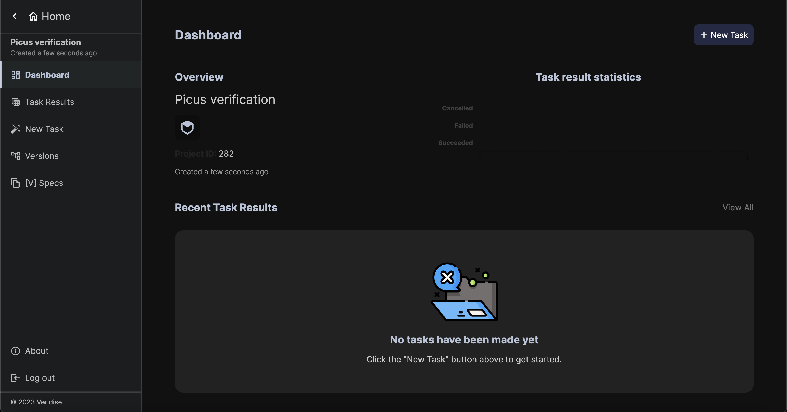
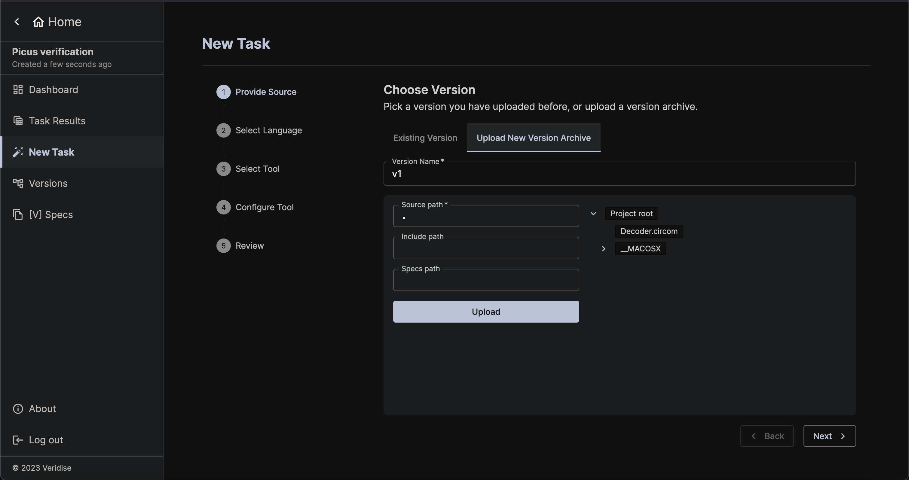
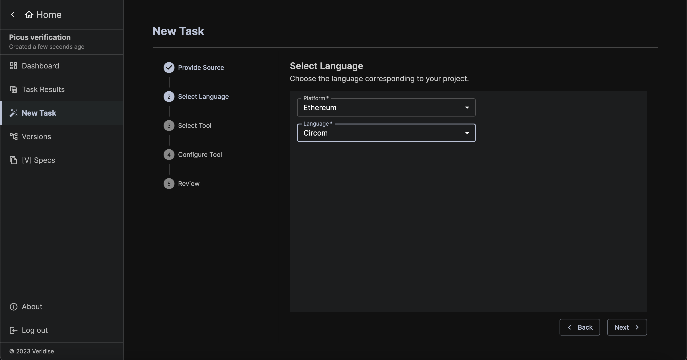
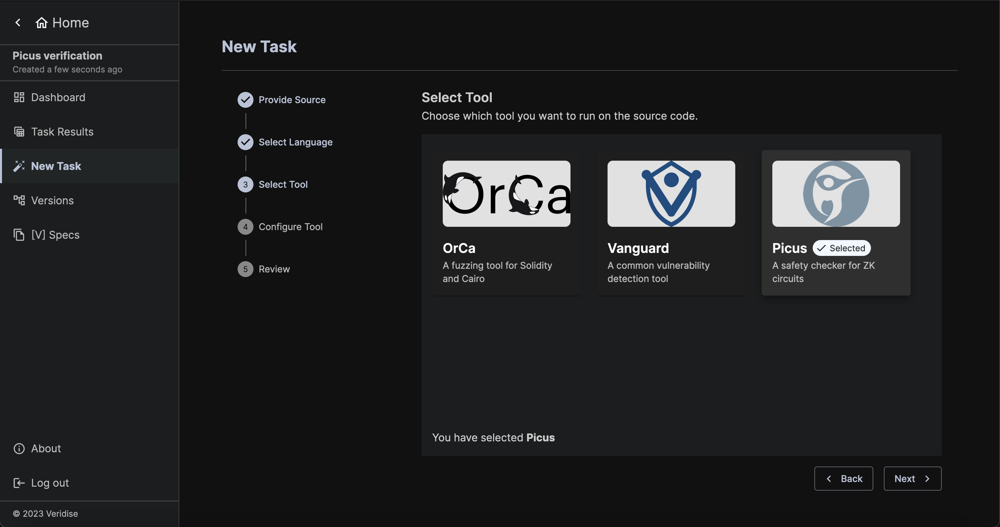
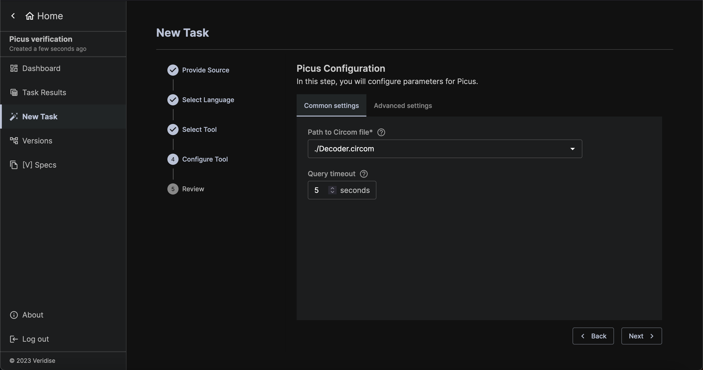
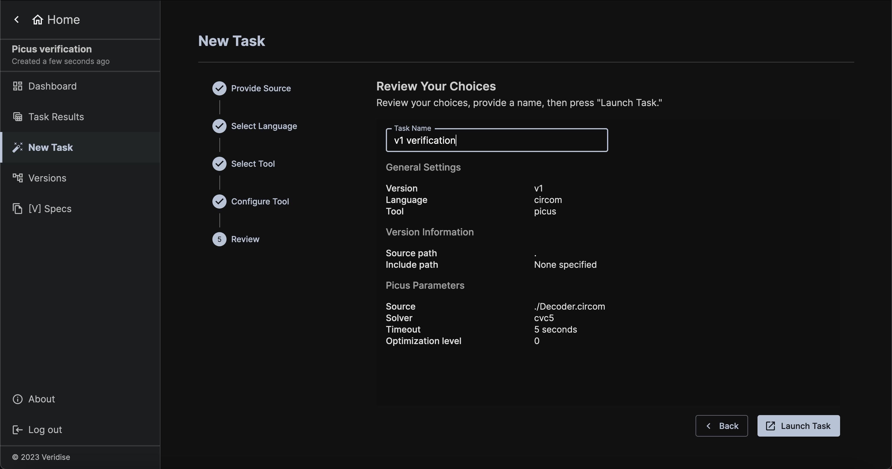
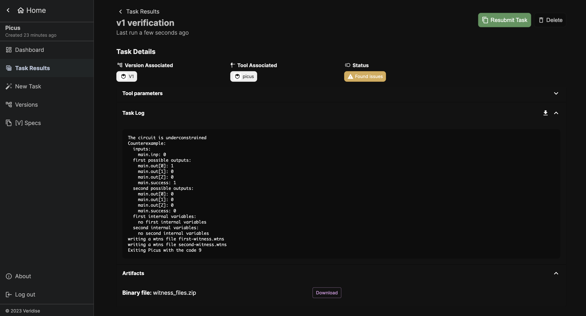

# Running Picus Through SAAS

For this introduction, we will consider using Picus (Circom) to check that the following simple `Decoder.circom` circuit is underconstrained or not.

```circom
pragma circom 2.0.7;

template Decoder(w) {
    signal input inp;
    signal output out[w];
    signal output success;
    var lc=0;

    for (var i=0; i<w; i++) {
        out[i] <-- (inp == i) ? 1 : 0;
        out[i] * (inp-i) === 0;
        lc = lc + out[i];
    }

    lc ==> success;
    success * (success -1) === 0;
}

component main = Decoder(3);
```

## Onboarding process

To start using Picus (Circom) visit the [SaaS page](https://saas.veridise.com/). 
When you access the platform, you will be redirected to our SSO. 

### Registration 

As shown in the following image, you have three log in options: 
1. Log in using your Google account 
2. Log in using your Github account 
3. Create a new local user


Please note that even if you use the first two options you will have to provide additional required information during the registration process. In the case of local user registration, you will also have to verify your email address.

### Access Request 

As soon as you are logged in to our platform you will have to request access to the SaaS platform. 
When the administrators of SaaS approve your request, you will receive an email that you are ready to use the platform.



## Using SAAS

You should now have access to the Veridise SAAS platform. Your home screen should look like the following, listing any current projects you have as well as the option to create a new project.


### Creating a Project

A "project" is used to group together the results of multiple runs of Veridise's tools (this could be runs of different tools on the same source code or even multiple runs of the tools over different versions of code for the same project).

To create a project, simply click the `+ New Project` button and enter a suitable name for your new project. We will call our project `Picus verification`.



### Selecting an Existing Project

Instead of creating a project, you can also select an existing project by simply clicking on any of the existing projects in view.

### Creating a Task

A "task" is an actual run of one of Veridise's tool against a given project (e.g., running Picus (Circom) on a given project to find an underconstraining issue).

After creating or selecting a project, you can create a new task by clicking `New Task`



#### Provide Source Code and Job Name

For providing source code, you can either choose from the code already uploaded for this project, or upload a new code archive via the `Upload New Version Archive` tab. Code archives are expected to be zip files containing the source code of the project to be checked. There are no assumptions about the layout of the code, but all archives are expected to be less than 200 MB. In this case, we will upload a zip file containing a single file that holds the `Decoder.circom` file shown above.



#### Select a Language

After proving the source code, a user must select the platform and language desired. In this case, we choose Ethereum and Circom.



#### Select a Tool

After selecting a language, you will be asked to choose a tool. To run Picus (Circom), choose Picus.



#### Picus (Circom) Configuration

Next, you will be asked to configure Picus (Circom). The most important setting is Path to Circom file. 
The query timeout can also be useful to customize, but the default setting of 5 seconds should work well for most tasks.
In this case, we select `./Decoder.circom` file as the path and click `Next`.



#### Review configuration

The final step of configuration is to review all of the options you have chosen and provide a task name. If anything does not look correct, you can go back and update the task as needed. When you are ready, click `Launch Task`!



### Task Details and Output

After launching the task, you will be redirected to the Task Details page. This page will allow you to see information about the tool parameters chosen. It will also show you the status of the task, which indicates whether or not the task is still running and what it found. Details of the output of the tool can be seen in the Task Log. 



In this case, we can see the Picus (Circom) successfully found a counterexample. You can additionally download the counterexample witness files under the Artifacts section.
