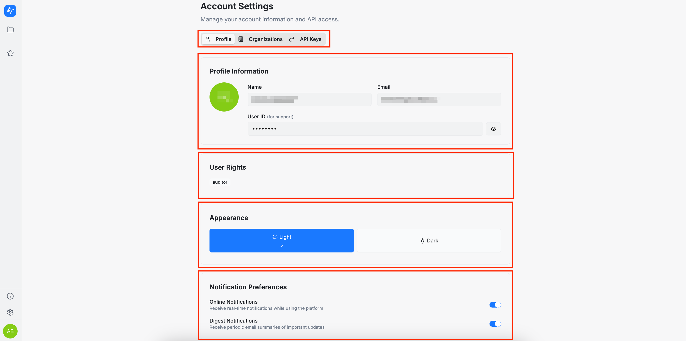

On the **Profile** section, you can view your profile information: name, email, and user ID (the user ID is particularly useful for support-related issues). You can also review your user rights and change the application appearance (light or dark mode).

Additionally, you can configure your notification preferences. Please keep in mind that these are **enabled by default**. 

There are two types of notifications (received via email):
* **Online notifications**: real-time alerts delivered while you are using the platform
* **Digest notifications**: periodic summaries containing important updates.

These notifications are especially helpful when multiple users are part of the same organization and need to stay up to date with each other’s activity.

