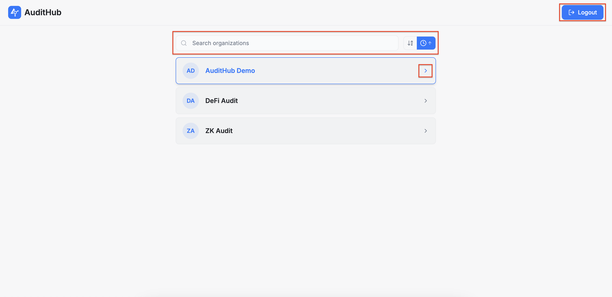
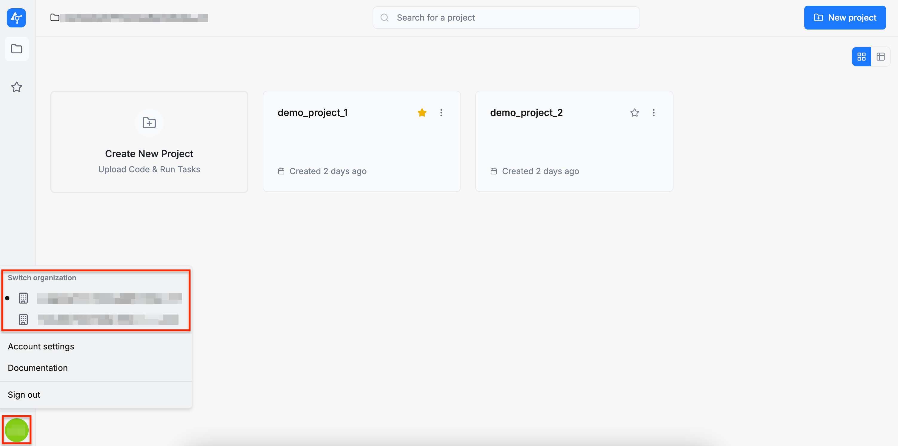

:::info
An organization represents a dedicated workspace for a group of users. It provides a structured environment where members can manage their projects, tasks, and audits.
:::

After logging in, you will be taken to a page that displays all the organizations you have access to. By selecting one of them, you will be redirected to the organization home page. Please note that if you belong to only one organization, you will be taken directly to the organization home page. You can also log out from this page.

If you want to switch to a different organization later, you can do so by clicking the user icon on the left side of the screen and selecting the organization of your choice.

