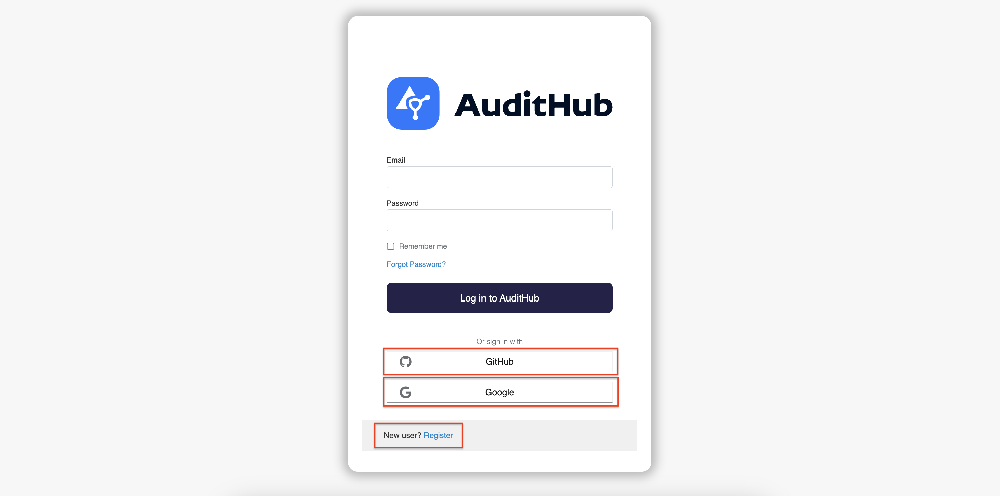
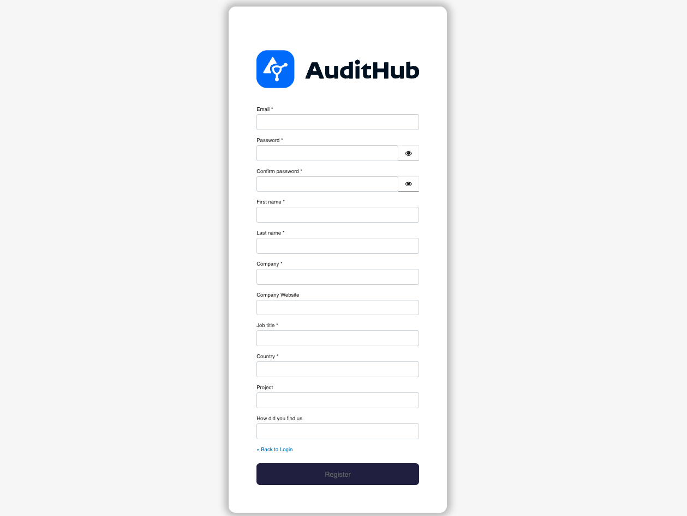
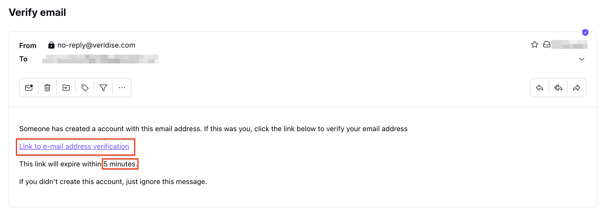
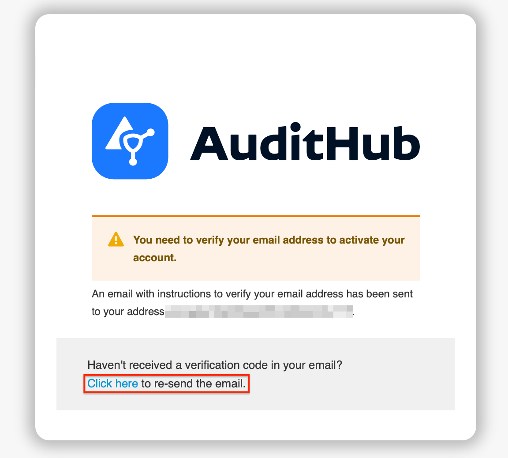
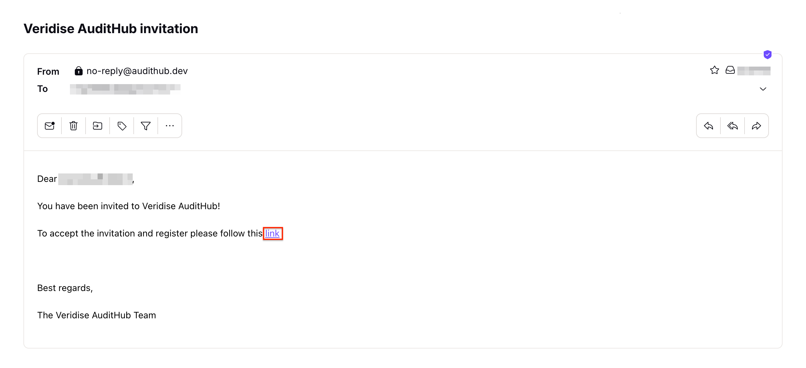
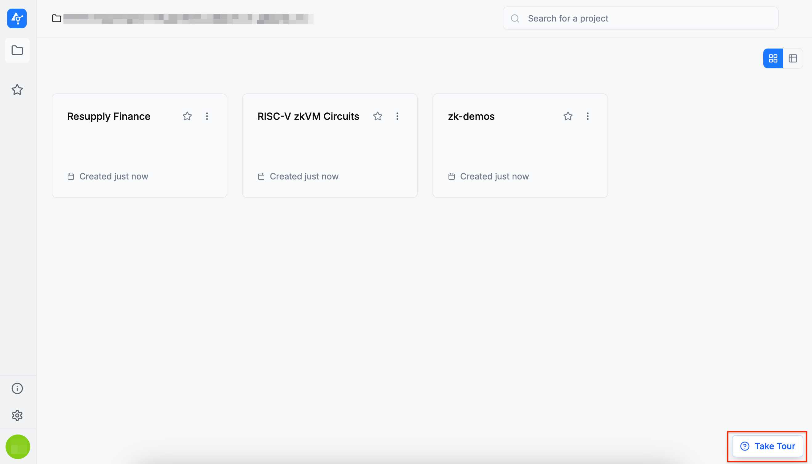

To start using AuditHub, visit the [AuditHub page](https://app.audithub.dev/). When you access the platform, you will be redirected to our SSO.

AuditHub supports two onboarding paths:
- [Free demo of AuditHub](#free-demo-of-audithub)
- [Invitation-based access to AuditHub](#invitation-based-access-to-audithub)

In both cases, you complete the same registration steps, and what happens next depends on how you got started.

## Registration

On the sign-in page, choose one of the following options:
1. Sign in using your Google account
2. Sign in using your GitHub account
3. Create a new local user account

Please note that even if you use the first two options, you will still need to provide additional required information during the registration process, as shown below.

If you create a local user account, you also need to verify your email address as depicted below.

If you haven’t received the email, please click the resend email link.

:::note
If the 5-minute expiration period has passed and you haven’t confirmed your email, log in using your newly created credentials, and you’ll receive a new email containing an account activation link.
:::

## Free demo of AuditHub

If you start from the [AuditHub page](https://app.audithub.dev/) and complete the registration, AuditHub prepares a free demo for you:
- You land in a dedicated demo organization.
- The demo organization is pre-populated with example projects so you can explore the AuditHub features and run the security tools right away.

## Invitation-based access to AuditHub

If you start from an invitation email:
- Click the invitation link and complete the registration.
- After registration, you are automatically added to the organization you were invited to join, so you can open projects, run tools, and explore AuditHub features.

## Guided tour

AuditHub will provide an optional guided tour to help you explore the main AuditHub flows and key features. To proceed, please click the `Take Tour` button.

