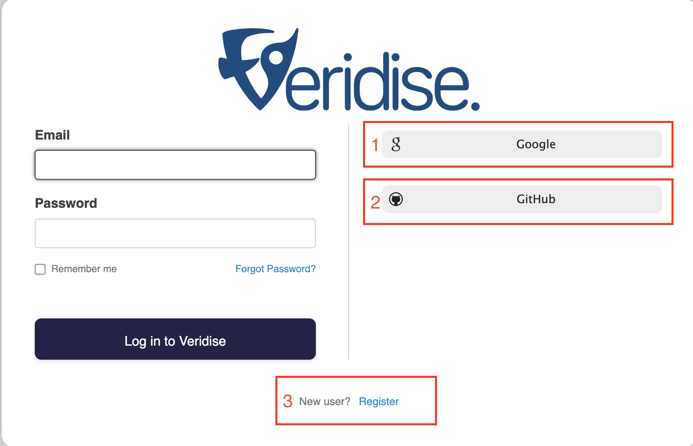

To start using our tools visit the [AuditHub page](https://audithub.veridise.com/).
When you access the platform, you will be redirected to our SSO.

### Registration

As shown in the following image, you have three log in options:
1. Log in using your Google account
2. Log in using your Github account
3. Create a new local user

<!--  -->

Please note that even if you use the first two options you will have to provide additional required information during the registration process.
In the case of local user registration, you will also have to verify your email address.

### Access Request

As soon as you are logged in to our platform you will have to request access to AuditHub.
When the administrators of AuditHub approve your request, you will receive an email that you are ready to use the platform.

<!--  -->
