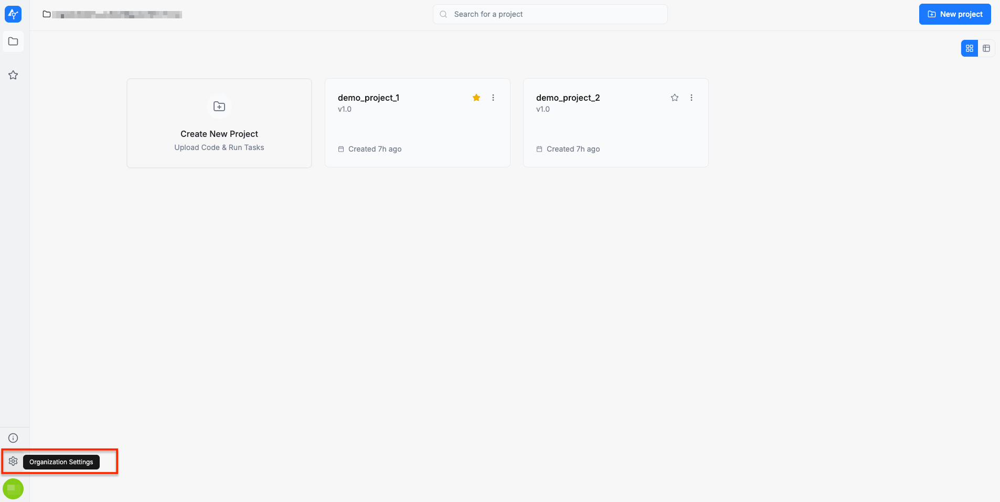
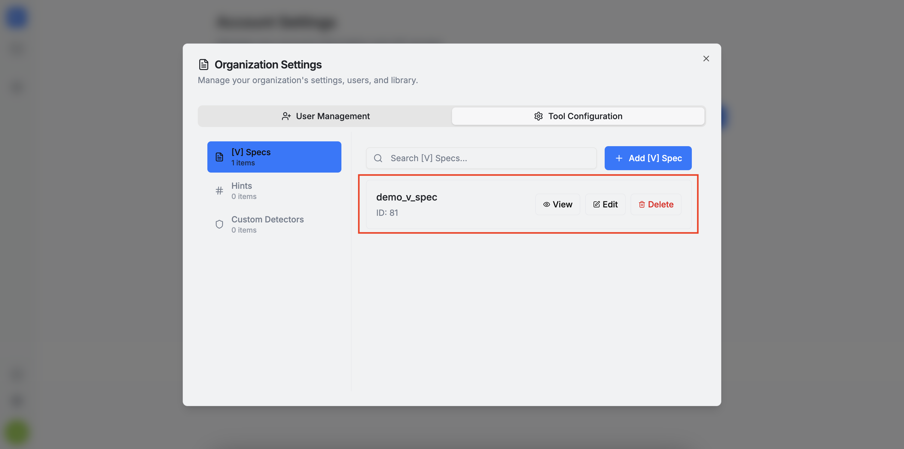
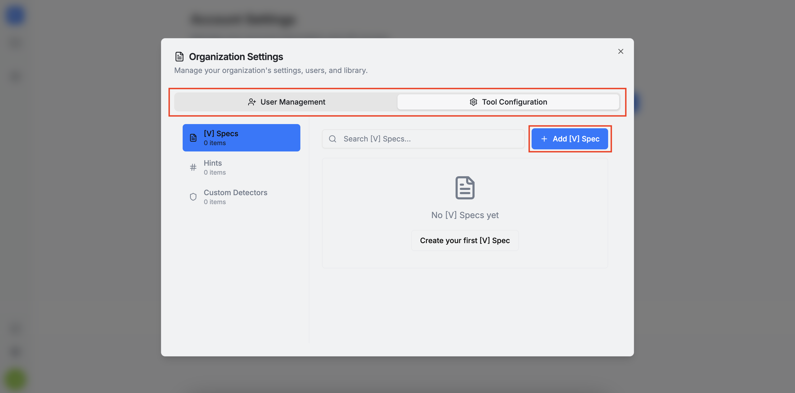
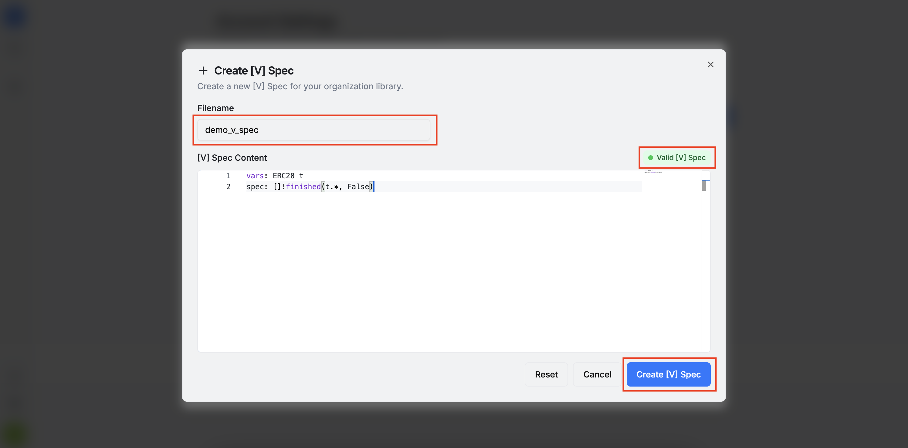
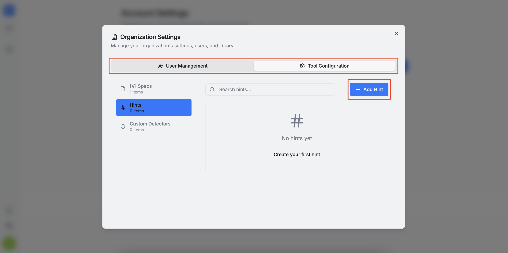
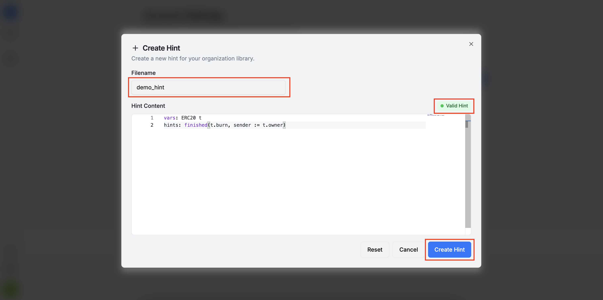
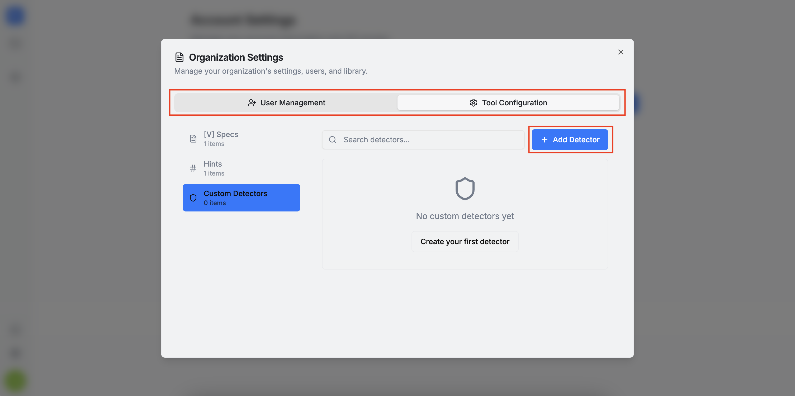
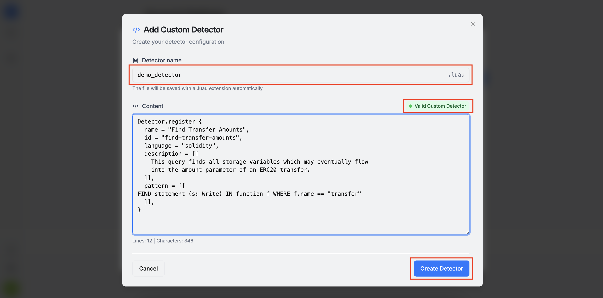

In the **Tool Configuration** section, you can manage your organization’s libraries. 
:::info
An organization library is a collection of either [V] specs, hints, or custom detectors (collectively referred to as **items** for simplicity). These items can be referenced by all members of the organization when configuring [OrCa](/orca) or [DeFi Vanguard](/vanguard) tasks.
:::

In this section, you can add, view, edit, or delete organization library items.

:::warning
The items on this page are **organization-wide**. Please be careful when editing or deleting them.
:::

To add a new [V] spec, click the `+ Add [V] Spec` button. This opens a form where you can name your spec and add its content. Please note that [V] specs follow a specific syntax. More information about the `[V] Specification Language` can be found [here](/orca/user_guide/v/language_description).

To add a new hint, click the `+ Add Hint` button. This opens a form where you can name your hint and add its content. Similar to [V] specs, hints also follow a particular syntax. More information about the `Hint Language` can be found [here](/orca/user_guide/hints/hint_language_description).

To add a new custom detector, click the `+ Add Detector` button. This opens a form where you can name your detector and add its content. Custom detectors must follow the `PAQL` format. More information about the `PAQL` format can be found [here](/vanguard/custom-detectors/paql).

A few things to keep in mind:
* Any deviation from the required syntax will trigger a warning and you cannot proceed with the item creation unless all syntax issues are addressed.
* All items are automatically saved with the `.spec`, `.hint`, or `.luau` file extension, so you do not need to include the extension when naming them.
* Each item has a unique identifier that can be used for debugging purposes (you can find it under the item's name).
