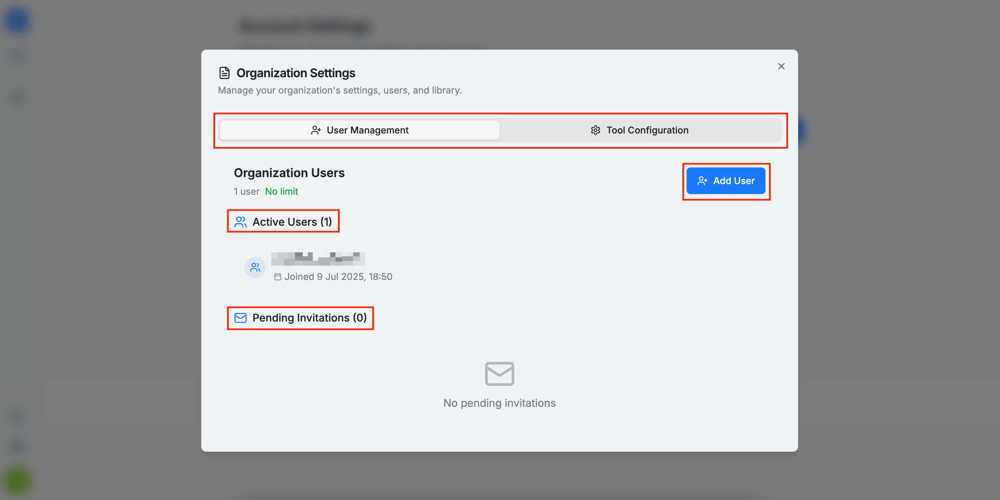

In the **User Management** section, you can manage the organization members. Here, you can view the current active and pending members, as well as send invitations for new users to join. 

Please keep in mind the following information regarding invitations:

1. **If the invited user is already an active AuditHub user**, they will be automatically added to the organization.

2. **If the user is not yet onboarded in AuditHub**, they will receive an email with instructions to complete their registration. After confirming their email address, they will be automatically added to the organization without needing to request access, as described in the [Onboarding](/saas/guide/on_boarding#access-request) section.

3. **There is a user limit for each organization** (set by an administrator when the organization was created). Users with admin or support roles do not count toward this limit. This ensures that administrators and support personnel can be added freely for assistance. If you need to increase the user limit, please contact an administrator.

4. **Only administrators can cancel invitations or remove users from the organization.**

