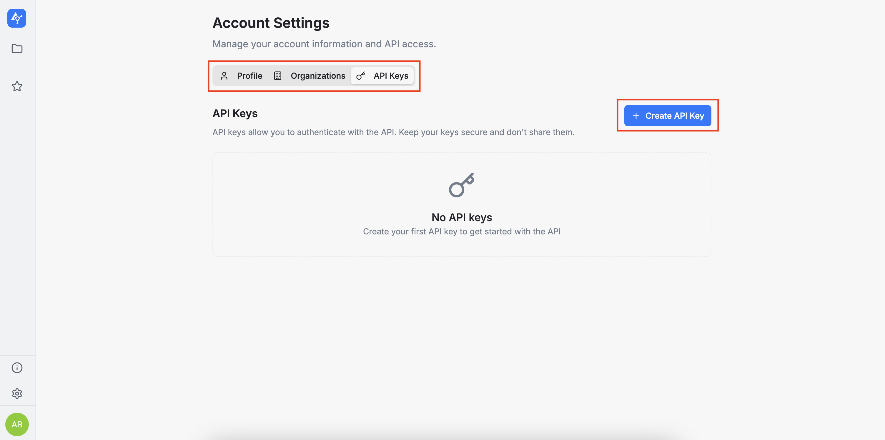
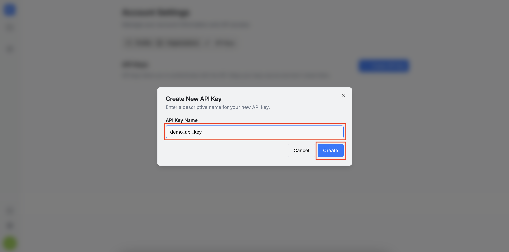
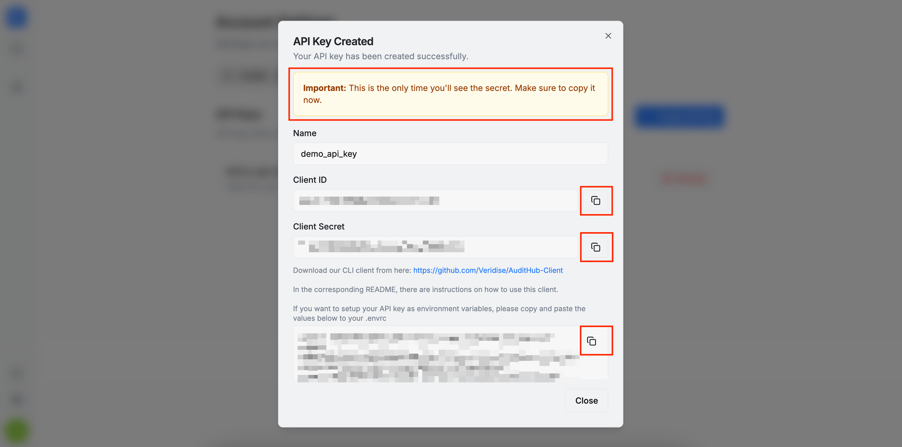
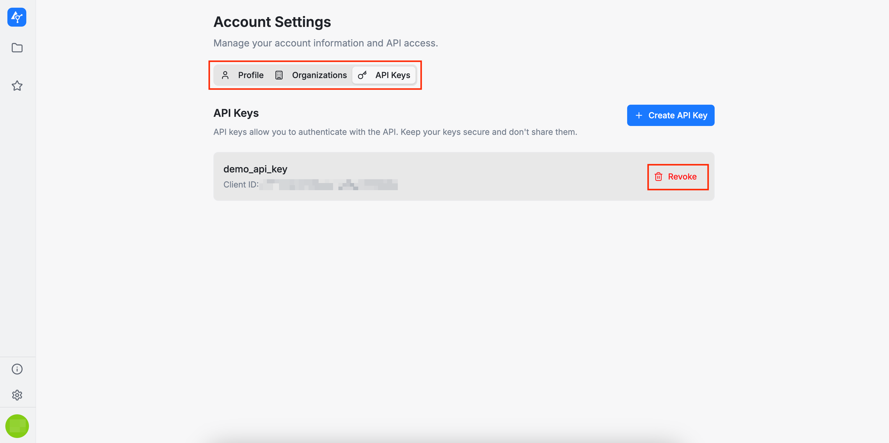

In the **API Keys** section, users can create and revoke their own API keys. Each user can have up to 10 active keys. These API keys can be used to integrate AuditHub into automated workflows, scripts, or CI pipelines (via the [AuditHub client](https://github.com/Veridise/AuditHub-Client)).

To create an API key, click the `+ Create API Key` button. A dialog will appear where you will first enter a name for the key. In the next step, the system will generate your credentials. This is the only time the credentials will be shown, so make sure to copy and store them in a secure location.

To revoke an API key, simply click the `Revoke` button as shown below.

