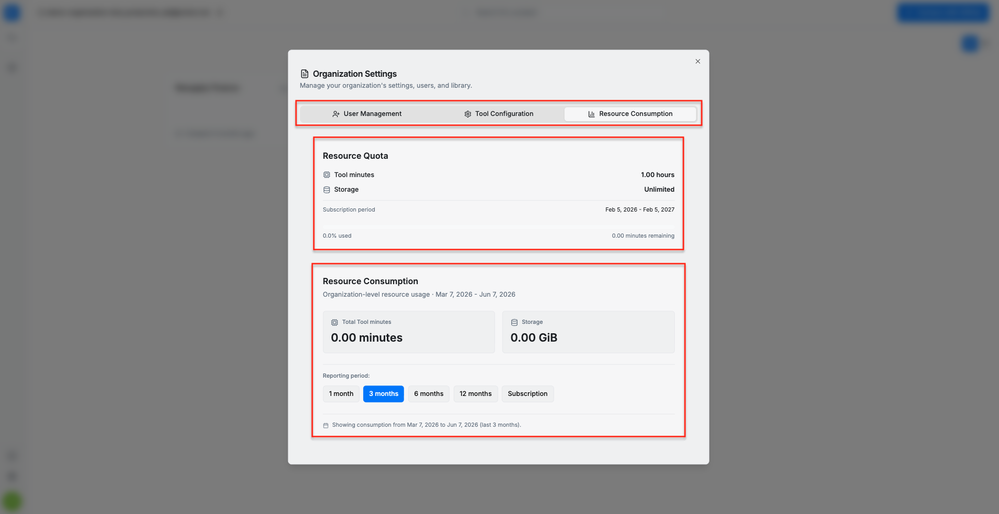

The **Resource Consumption** section provides an overview of the organization’s resource quota and current usage. It displays the available tool minutes, storage limit, subscription period, percentage of quota used, and remaining tool minutes. This section also shows organization-level resource consumption for a selected reporting period. You can switch between predefined reporting periods, such as 1 month, 3 months, 6 months, 12 months, or the full subscription period, to view usage for the corresponding date range.

