You can create a new project by clicking either of the two highlighted options below. This will open a wizard that guides you through the setup steps for the project.
Please note that during the project creation we also create the first version of the project, which is called `initial`. Thus, through the project creation:
1. We define the project attributes
2. We create the first project source code version

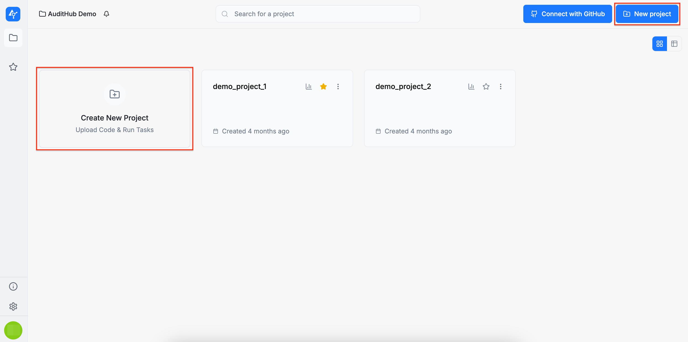

## Project Name

Enter a name for your project. Please be aware that the name must be unique across an organization.

:::note
Navigation through the form steps is performed using the `Previous` and `Next` buttons.
:::

## Source Location

There are three ways to provide a project's source code: a local archive, a remote archive accessible via a URL, or a GitHub repository. After selecting the preferred source code upload option, click the `Upload` button to continue.

### Local Archive

By selecting this option, you can upload an archive from your local machine. Currently, only the `.zip` archive format is supported. Please note that the archive size must not exceed `200 MB`.

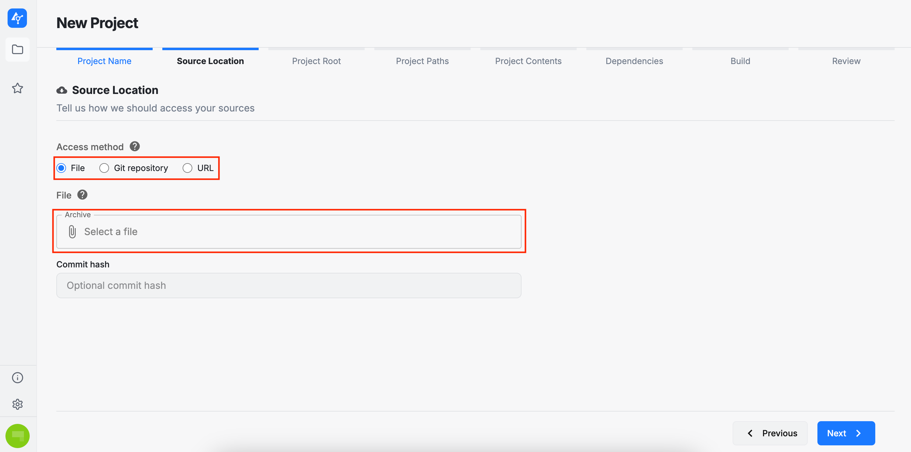
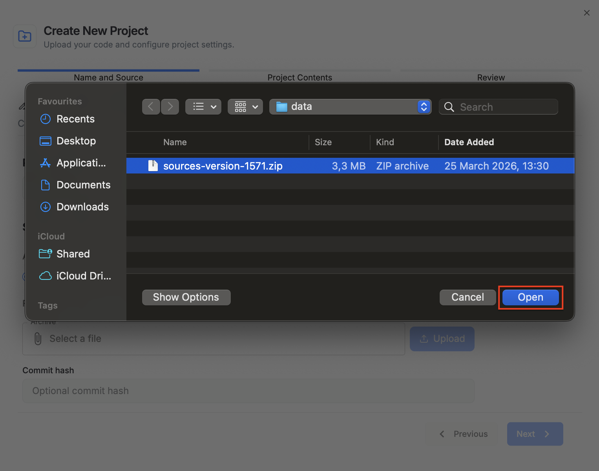
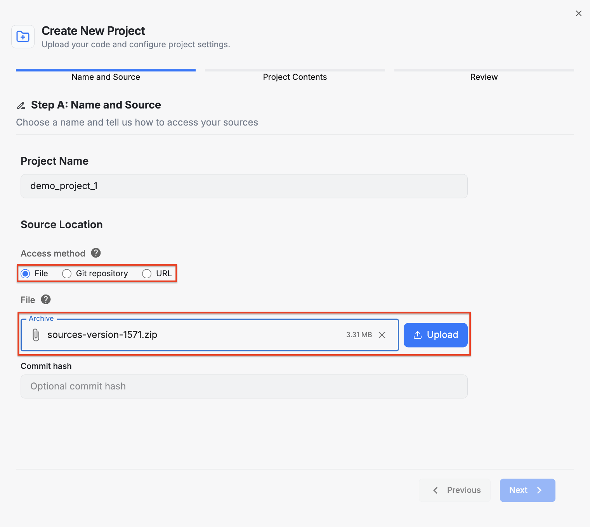

### Remote Archive

By selecting this option, you must provide a public URL pointing to your archive. AuditHub will then retrieve the corresponding data.

### GitHub Repository

By selecting this option, you must provide the URL of a GitHub repository. Please note that the repository must be public, as AuditHub currently does not support accessing private repositories. In addition to the URL, you may also specify the revision (i.e., the branch to be used when fetching the repository data).

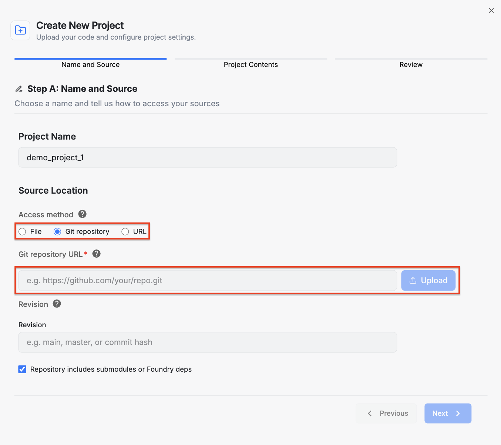

:::note
If a commit hash or revision is provided, auditors can trace the exact GitHub commit associated with the source code and ensure that the correct scope is being reviewed. This information is linked to the version and can be viewed or edited in the [Project Viewer](/saas/guide/pages/projects/project_viewer/project_configuration_and_version_management.md#version-actions) page.
:::

:::info
The following sections are related to the project's configuration.
This configuration is primarily relevant for the AuditHub tools that will be applied to the project’s source code and that rely on this configuration during execution.

Please note that once the source is uploaded, AuditHub automatically detects the project attributes. As you move through the wizard, you will notice that these fields are prefilled.

Because uploaded sources can vary, auto-detection may not always produce the expected values. In these cases, you can manually adjust the detected information. For completeness, this section walks you through the extended setup options so you can understand what is available and update the auto-detected values when needed. 
:::

## Project Paths

Here, you must select the paths relevant to your project:

* **Source path**: the folder containing the project’s source files
* **Include path**: the folder containing the project’s dependencies, if any
* **[V] Specs path**: the folder containing embedded [V] specifications to be used by our fuzzing tool (OrCa), if any
* **Hints path**: the folder containing embedded hints to be used by our fuzzing tool (OrCa), if any.

<!-- AUDITING-FEATURES: start -->
## Project Contents

Select the types of code included in your project. Your selection determines which AuditHub tools will be available to analyze the project’s source code. If none of the options below are selected, AuditHub will not display any tools. This is the default setting, particularly for projects intended for manual review only.

* **Solidity contracts** will enable OrCa and DeFi Vanguard
* **Circom circuits** will enable ZK Vanguard (Circom) and Picus (Circom)
* **Picus files** will enable Picus
* **LLZK files** will enable ZK Vanguard.

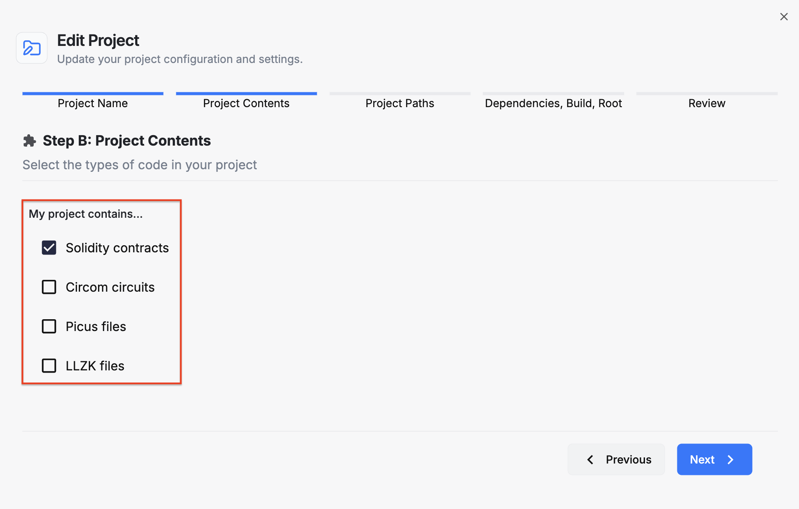
<!-- AUDITING-FEATURES: end -->

## Dependencies

In this section, you can select your project dependencies. AuditHub supports installing dependencies using the following package managers:
* `npm`
* `yarn`
* `pnpm`

You can also indicate whether a `lockfile` is present in your source code and whether your project requires a specific `Node.js` version.

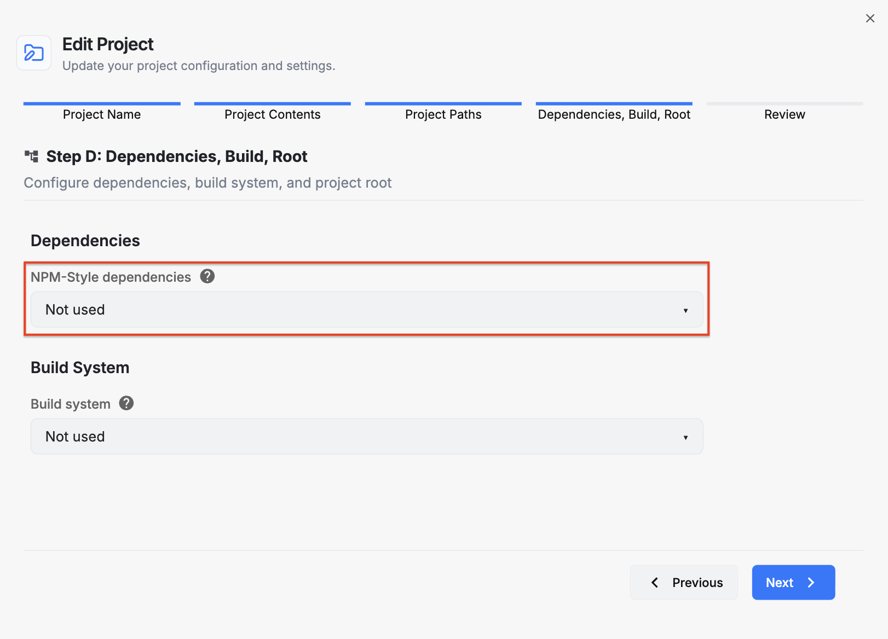
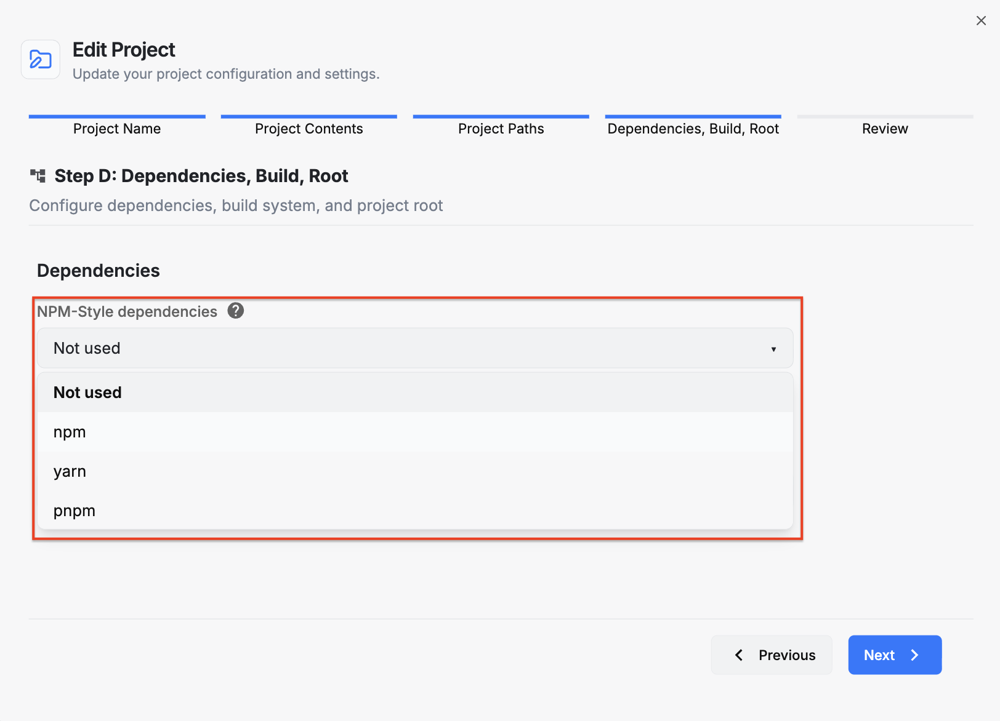

## Build

Here you can select the build system supported by your project.

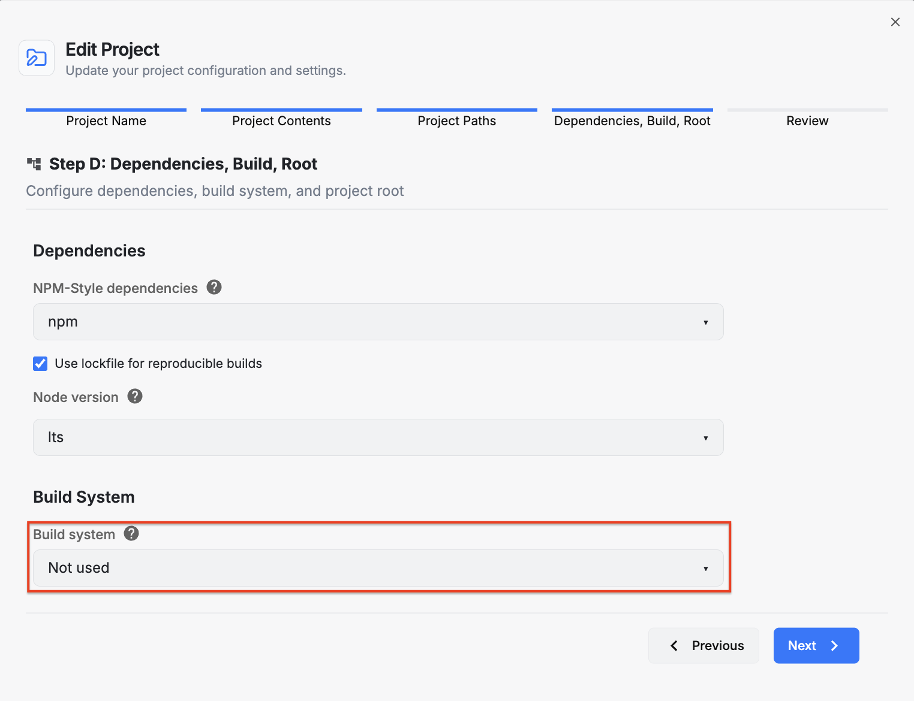

Currently, AuditHub supports the following build systems:

* **Foundry**

* **Hardhat - Legacy** (the initial Hardhat offering)

* **Hardhat - Ignition** (the latest Hardhat offering)

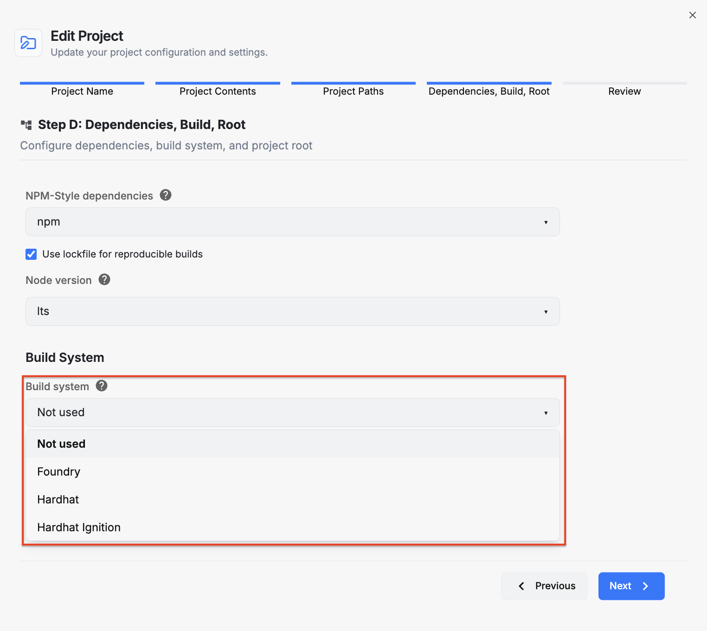

Providing the deployment script path is optional when using DeFi Vanguard. However, if you intend to use OrCa on this project the deployment script path is required.
In any case you are able to overwrite this setting on OrCa task execution wizard. 

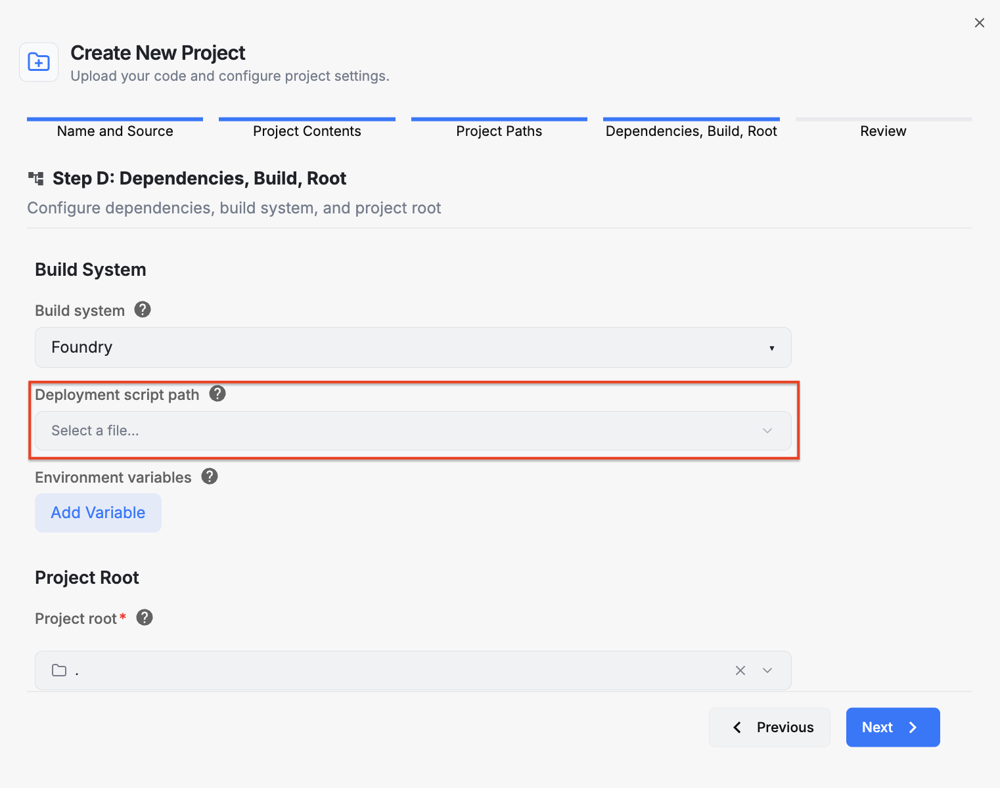

You can also add environment variables required by the build process. To do this, click the `Add Variable` button and enter the name and value. Use the `X` button to remove an entry.

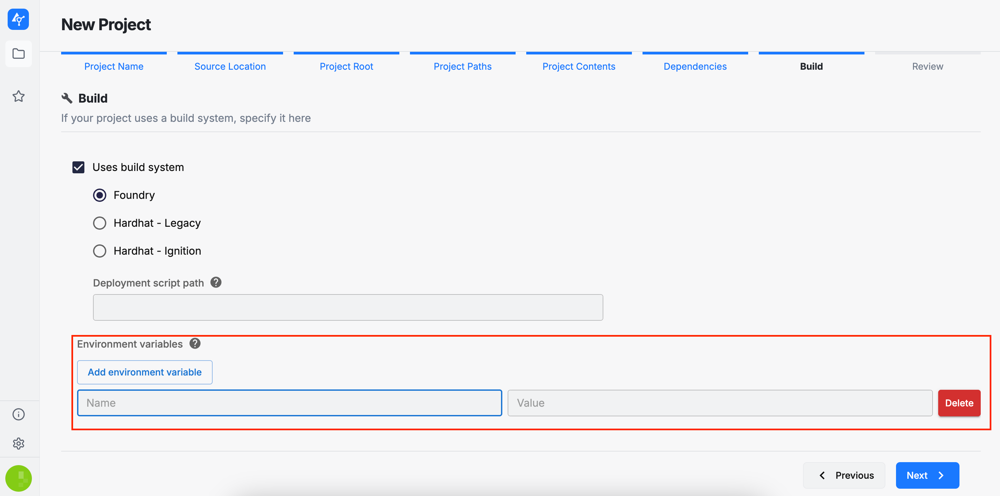

## Project Root

In this section, you need to select the root directory for your project. This directory serves as the location where the build system commands (e.g., Foundry, Hardhat, etc.) will be executed.

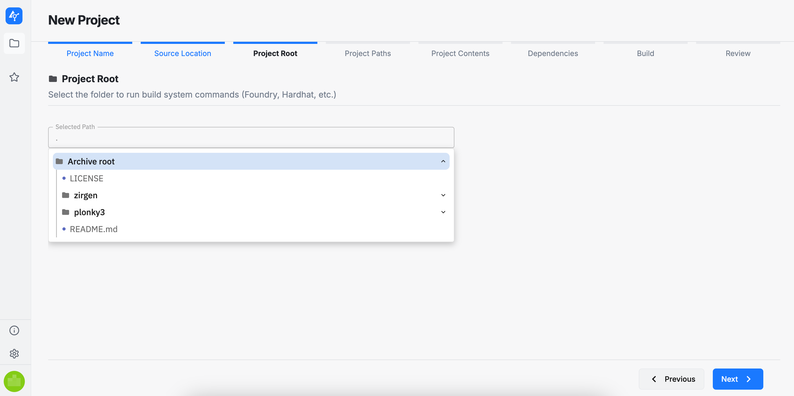

## Review

In this final section, you can review the project configuration options you have selected. If you are satisfied with your choices, you may proceed with submitting the project. Otherwise, you can return to previous steps in the wizard and make any necessary changes. Please also note that the project configuration can be edited and new versions of the source code can be added at any time after submission.

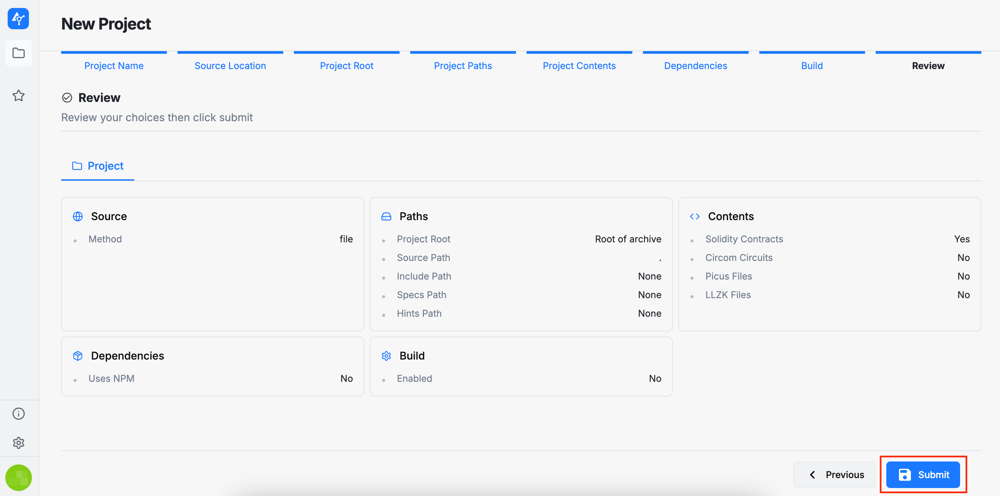

After submitting the project, you will be redirected to the [Project Viewer](/saas/guide/pages/projects/project_viewer) page.
