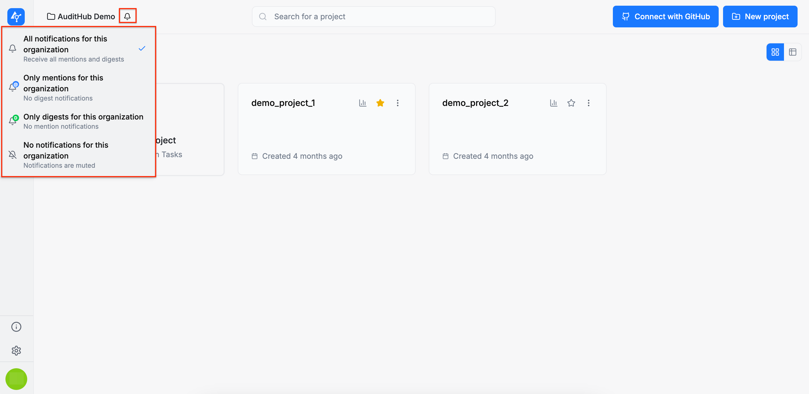
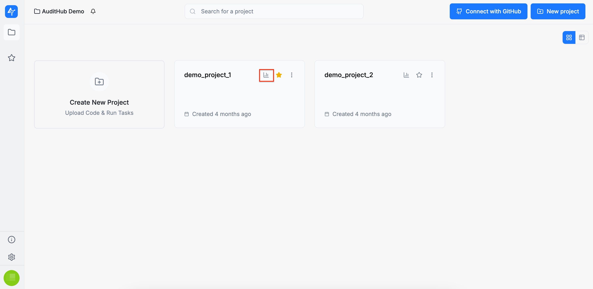
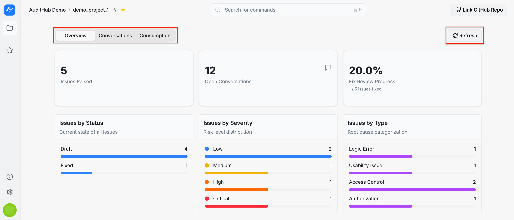
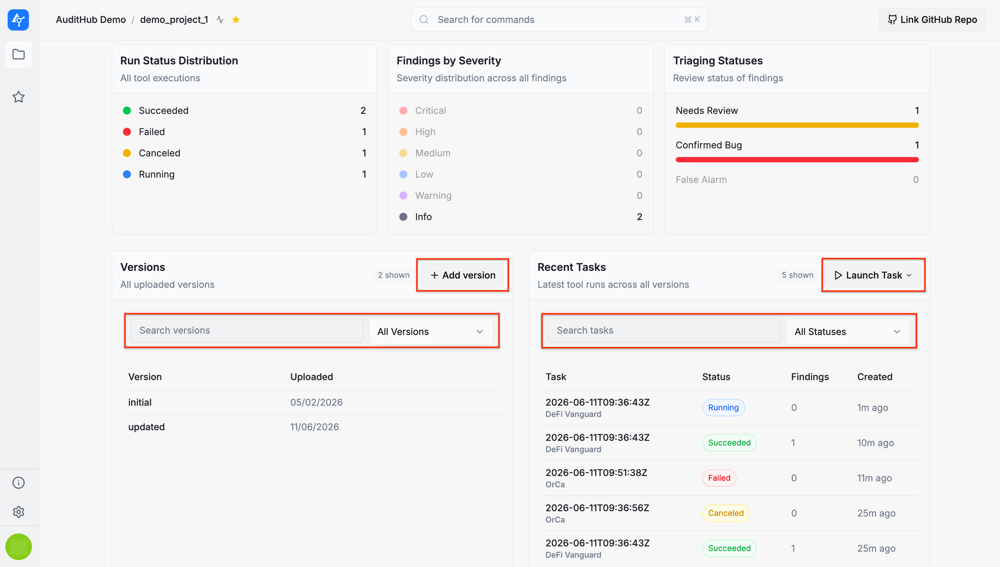
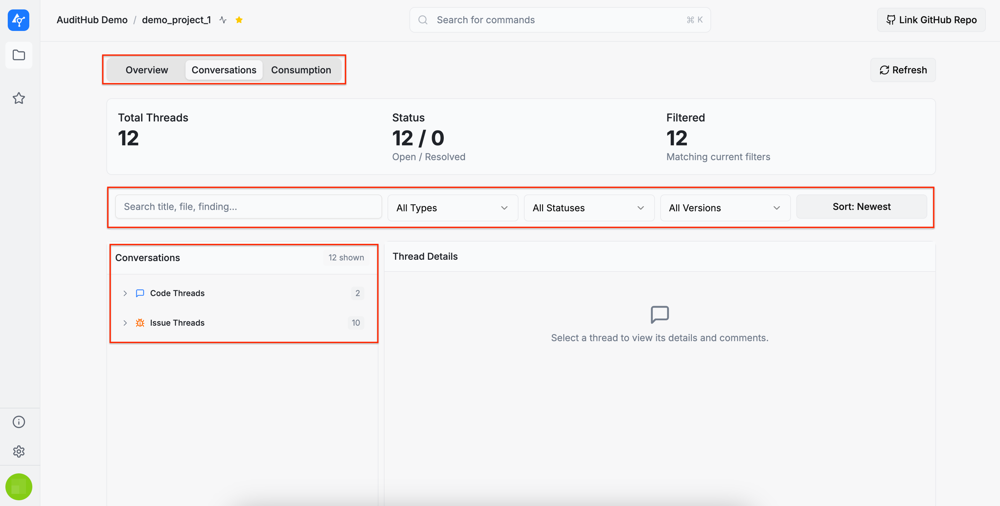
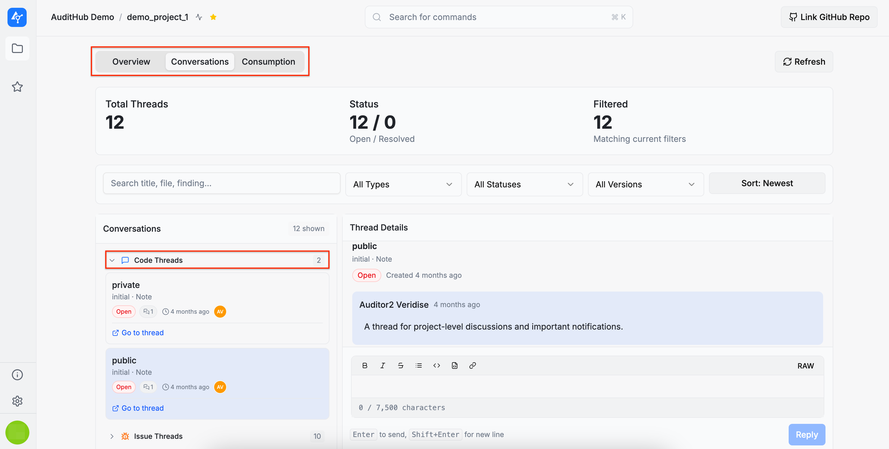
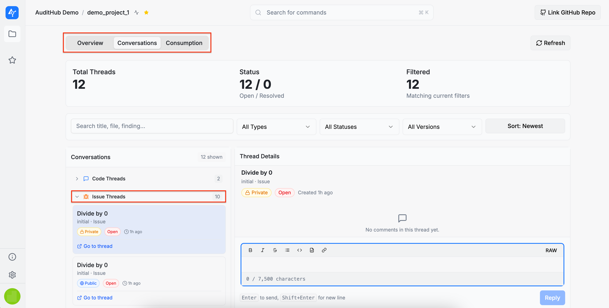
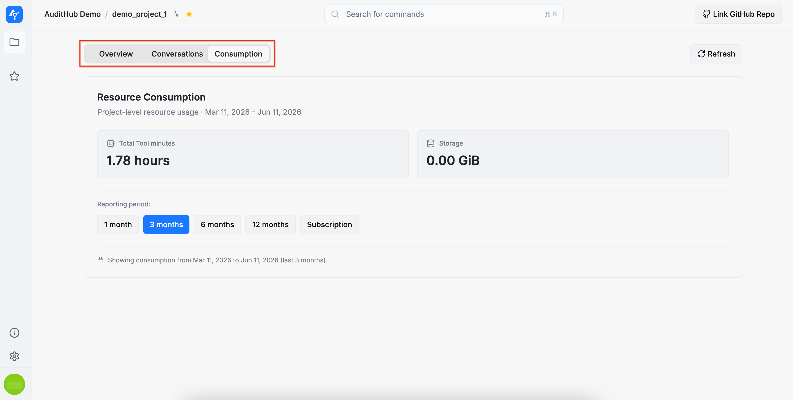
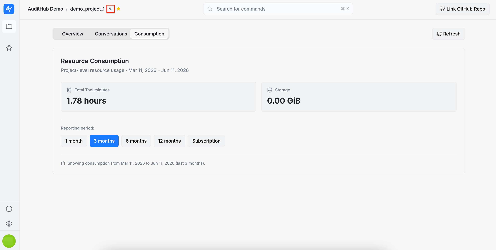
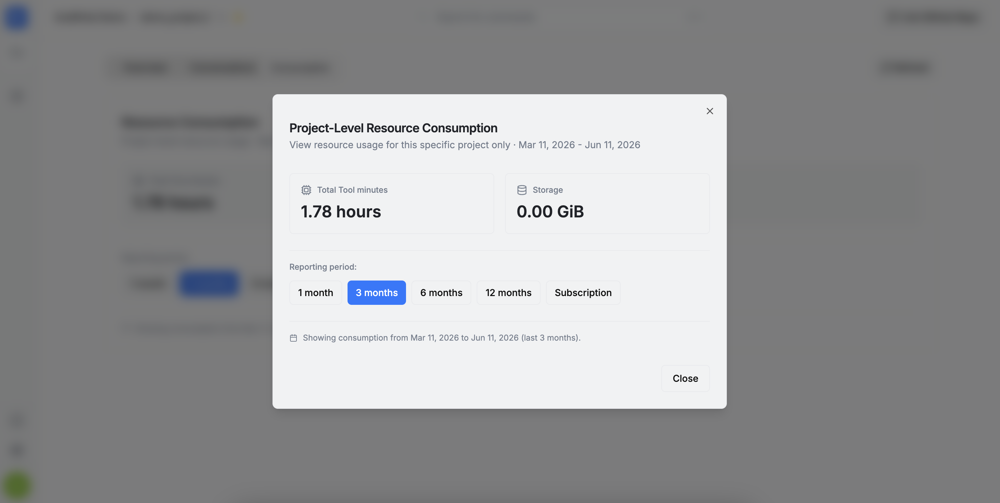

# Projects

The **Projects** page is the home page of AuditHub. It displays all projects created within an organization.

:::info
For background on projects and versions, see [Projects](/saas/guide/concepts/projects) and [Versions](/saas/guide/concepts/versions). This page focuses on how to navigate and manage the projects.
More information on project creation can be found in the [Create Project](/saas/guide/pages/projects/create_project) section.
:::

You can view the **Projects** page in two modes: grid view and table view. In table view, you can also sort projects by name, active status, and creation date. Additionally, a search bar is available to filter projects by name.

You can also star projects to mark them as favorites. Starred projects will appear in the **Favorite Projects** section in the left sidebar, allowing you to access them quickly and conveniently.

Each project card includes a set of available actions, accessible from the dropdown menu by clicking the three dots in the corner of the card:

* **Edit project**: allows you to modify the project’s configuration

* **Show details**: displays the current configuration of the project

* **Delete project**: permanently deletes the project

On the **Projects** page, you can also set organization notification preferences by clicking the bell button in the top-left corner. This opens a menu with all available notification options. By default, all notifications are enabled.

## Project statistics

From the **Projects** page, you can open project statistics for any project by clicking the statistics button on the project card.

This opens the project statistics view, where you can inspect project-related activity, conversations, and resource usage. The view is organized into three tabs: **Overview**, **Conversations**, and **Consumption**.

### Overview

The **Overview** tab summarizes the current state of the project. It shows high-level metrics such as the number of raised issues, open conversations, and fix review progress. Below these metrics, the page displays breakdowns for issues, findings, task runs, triaging statuses, and available project versions.

You can use this tab to review issue distribution by status, severity, and type, as well as finding severity and task run status. The **Versions** section lists all uploaded versions and includes controls for searching and filtering versions. The **Recent Tasks** section lists the latest tool runs across all versions, together with their status, findings count, and creation time. The tasks can be opened directly from the table.

You can also perform common project actions directly from this tab. Use **Add version** to upload a new project version, **Launch Task** to start a new task, and **Refresh** to load the latest available data.

### Conversations

The **Conversations** tab provides a project-level view of all conversation threads associated with the project, including code threads and issue threads. The summary area shows the total number of threads, the number of open and resolved threads, and the number of threads matching the current filters.

You can search conversations by title, file, or finding, and filter them by type, status, and version. The sort control allows you to change the order in which threads are displayed. Conversation groups can be expanded to inspect individual threads, and selecting a thread opens its details and comments on the right side of the page.

You can reply to a thread directly from this view. However, existing messages cannot be edited or deleted here. To manage an existing message, open the original thread using the **Go to thread** link.

### Consumption

The **Consumption** tab shows project-level resource usage for the selected reporting period. It includes the total tool minutes used by the project and the amount of storage consumed.

Project-level resource consumption can also be opened from inside a project by clicking the consumption icon next to the project name.

This opens a dedicated resource consumption dialog, allowing you to review tool minutes and storage usage without leaving the page.

