<!-- AUDITING-FEATURES: start -->
The following features were designed to support manual auditing and to create a synergy between automated findings and manual review.
For the rest of this section we refer to users that have the auditor role as auditors, and to all other users as developers.

## Findings

:::info
For more background on findings, see [Findings](/saas/guide/concepts/findings). This section focuses on the **Tool Findings** table and related actions.
:::

The findings are also available in the **Tool Findings** table shown below. Unlike the task-level view, this table aggregates findings from **all** tasks. Findings can be filtered by tool, severity, and other criteria, and all functionalities available on the **Task Summary** page apply here as well (i.e., triage, jump to line, etc.).

This view also introduces two additional features:

* **Finding expansion**: each finding can be expanded to display the full description and the associated discussion
* **Jump to discussion**: a dedicated button allows quick navigation directly to the discussion for that finding.

:::note
The bottom panel containing the **Tool Findings** and **Issues** tables can be resized by dragging it up or down.
:::

## Issues

:::info
For more details on issues, see [Issues](/saas/guide/concepts/issues). This section describes how to create and manage issues during an audit.
:::

### Create Issue

An issue can be created in two ways:
* By clicking the `+ Create` button in the **Issues** table, or
* By selecting the file containing the bug, highlighting the relevant line or lines, and right-clicking to open a dropdown menu with the `New Issue from Selection` option.

Selecting either method opens an issue creation form, where the required information must be provided.

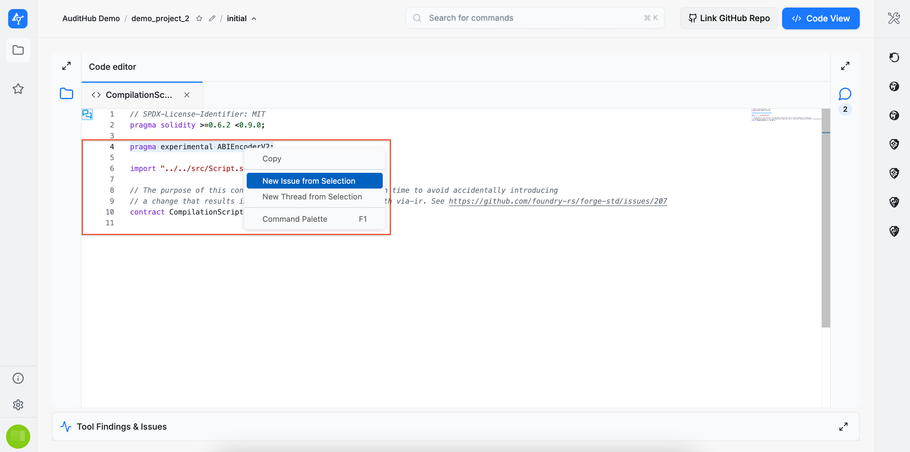

The issue form is divided into three sections: `Base Properties`, `Internal Properties`, and `Resolution` (the `Resolution` section is only available when editing an existing issue).

#### Base Properties

In the `Base Properties` section, the following information must be provided:

* **Title**
* **Markers** that help indicate the importance of the issue, including:
  * **Likelihood**
  * **Impact**
  * **Severity**
  * **Type**
  * **Raised By** (the auditor who identified the issue)

**Likelihood**, **Impact**, and **Severity** have predefined values to choose from. However, **Type** also allows custom entries. A new type can be added by scrolling to the bottom of the dropdown and selecting the **+ Create new type** option.

A bug may affect multiple files, so the issue form allows specifying one or more impacted file paths from the codebase. For each file, a line interval can be provided, or the checkbox can be selected to indicate that the entire file is affected. If no specific line information is provided, the bug’s line number defaults to 1, although this value can be edited afterward.

Below the **Affected Files** section is the **Promoted Findings** section. If any automated tool has produced findings that are confirmed as true positives, they can be referenced here and further elaborated in the issue’s **Description** field.

The **Description** field supports two editing modes: **WYSIWYG** and **RAW**.

#### Internal Properties

In the **Internal Properties** section, three values can be set: **Candidate for Tool** (indicating whether the issue could be detected by a specific tool in the AuditHub suite), **PoC Author**, and **Document Authors**. To proceed with issue creation, please click the `Create Issue` button.

### Issues Table

Below is the **Issues** table displaying the issue created earlier. Note that newly created issues are initially visible only to auditors, indicated by the gray crossed-out **eye** icon. Once the issue is shared with developers, this changes to a green open eye icon. Additional actions are available as well, such as edit (**pencil** icon) and delete (red **trash** icon).

Editing an issue opens the same form populated with the previously entered data, but it also enables the final section: **Resolution**. This section can be filled with a pull request and commit reference indicating where the developers addressed the issue.

Clicking an entry in the **Issues** table opens the **Issue Details** section, where a summary of the most important information is displayed. In this section, users can:

* **Inspect affected files** by clicking them. Each file entry includes a link to the file and the referenced line(s) of code.

* **Copy the issue link** using the copy icon in the upper-right corner, allowing the issue to be referenced elsewhere.
* **Copy the raw Markdown** of the issue description using the dedicated copy button.
* **Perform issue actions**, such as sharing the issue, discussing it, or linking pull requests with fixes. This section is central to the collaboration process between auditors and developers.
* **Navigate directly to the discussion** using the provided button.

* **Expand the issue details**, which opens a dialog containing the full issue information along with the discussion thread.

Each issue includes a discussion section divided into two threads: **Private** and **Public**. Developers have access only to the public thread, while the private thread is reserved for internal communication among auditors.

For each message, options are available to **copy the raw Markdown**, **edit**, or **delete** the message.

## Push Issues to GitHub

AuditHub offers a GitHub application named `AuditHub.dev`, that allows interoperability between AuditHub and GitHub. It enables AuditHub users to publish audit issues directly to a GitHub repository as **GitHub Issues** or **GitHub Security Advisories**, so remediation progress can be tracked there by the developers. 
<!-- 
Once published, issues can be tied to a pull request, discussed in-context, and reviewed through the developers' existing code review and CI practices. 
This creates a shared source of truth for both auditors and clients, improves visibility and accountability, and makes it easier to track progress from discovery to fix.
-->
:::warning
Because this feature relies on GitHub APIs and availability, **GitHub incidents or downtime may impact connecting accounts, linking repositories, and exporting issues/ security advisories**.
:::

### Connect an AuditHub organization to a GitHub account {#github-connect}
To connect an AuditHub organization with a specific GitHub account, you need to install the `AuditHub.dev` GitHub application to said account. 
You can achieve this from within AuditHub, by following these steps:

1. Go to the **Projects** page of your AuditHub organization.
2. Click the **Connect with GitHub** button.
3. You’ll be prompted to choose where to install the `AuditHub.dev` GitHub application:
   * a **personal account**, or
   * a **GitHub organization** you belong to.
4. Complete the installation and grant access to one or more repositories.

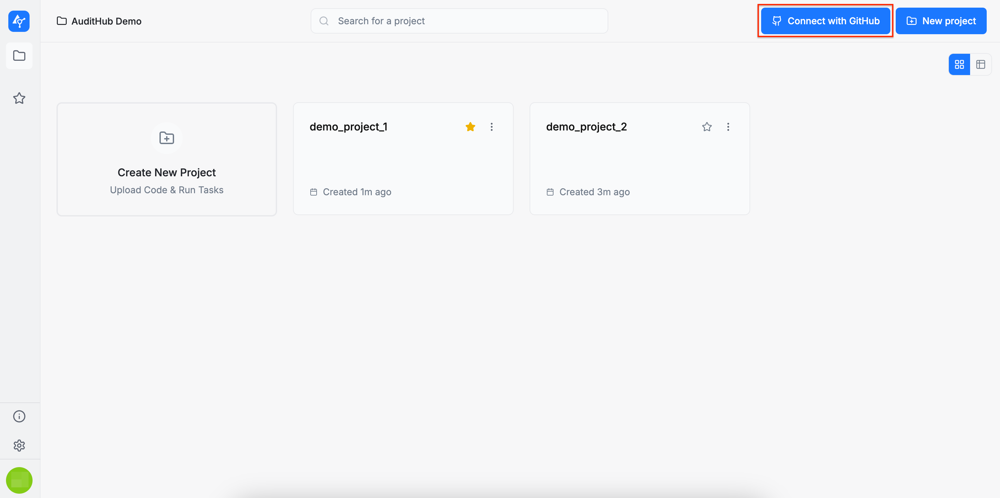
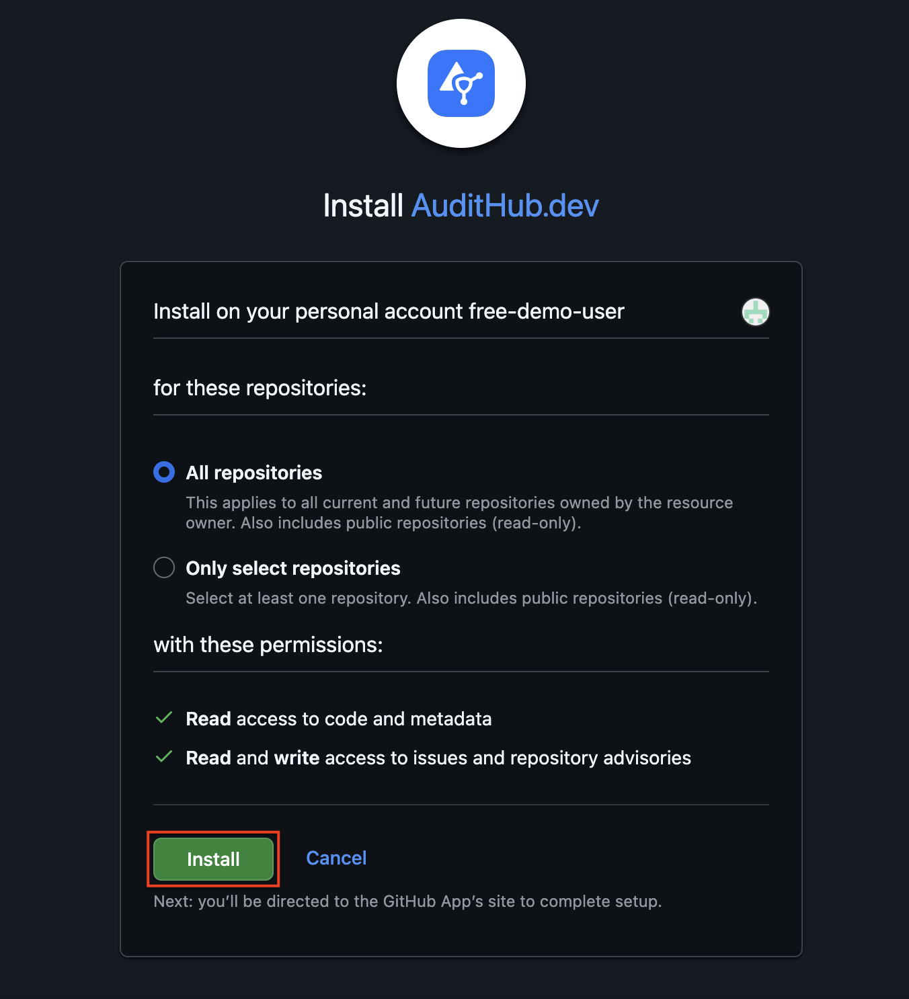

After this step, the selected AuditHub organization can interact with the repositories you authorized.

### Link a repository to a project

Once an AuditHub organization is connected to a GitHub account:
1. Open any project of this organization in AuditHub.
2. Click the **Link GitHub repository** button.
3. Select the GitHUb repository you want to associate with this project.

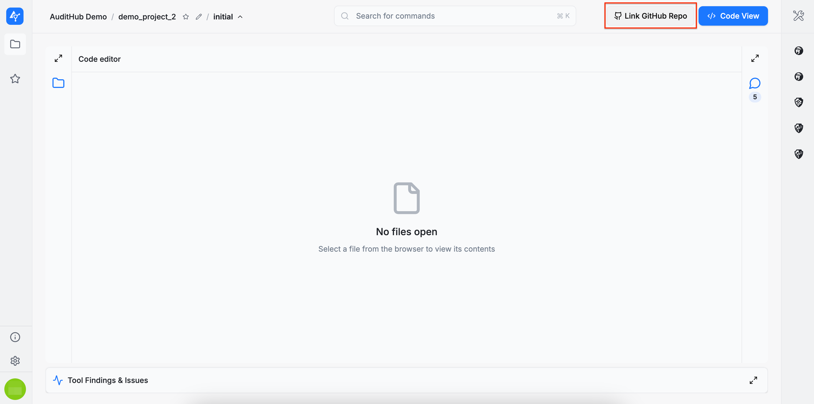
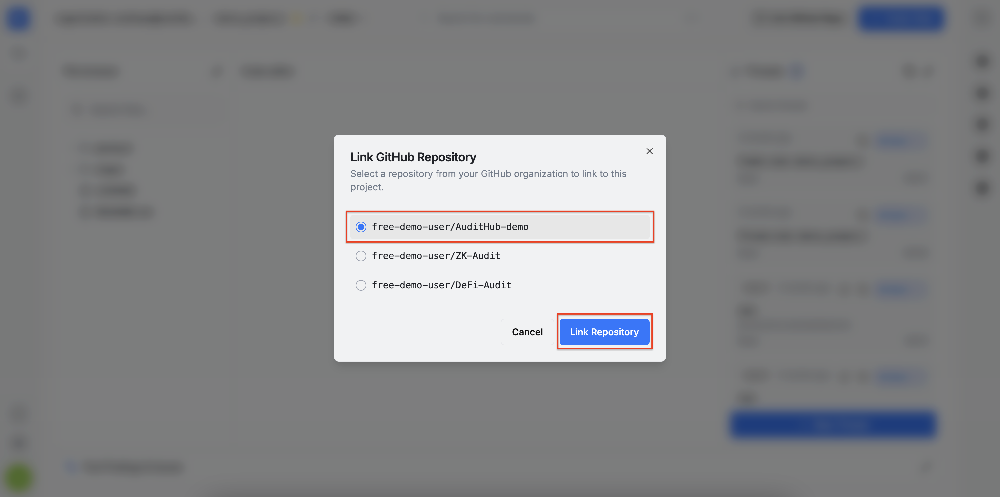

A GitHub repository can be unlinked and linked again at any time.

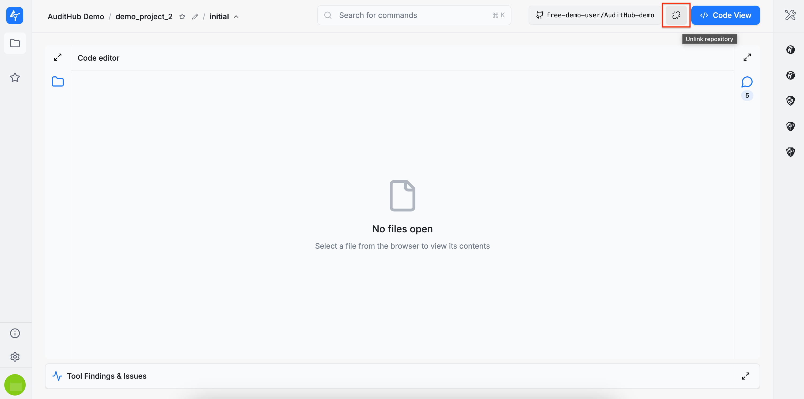

### Export AuditHub issues to GitHub

After a GitHub repository is linked:

1. Go to the project’s **Issues** table.
2. Select an issue.
3. Choose one of the export options:
   * **Create GitHub Issue**, or
   * **Create Security Advisory**.

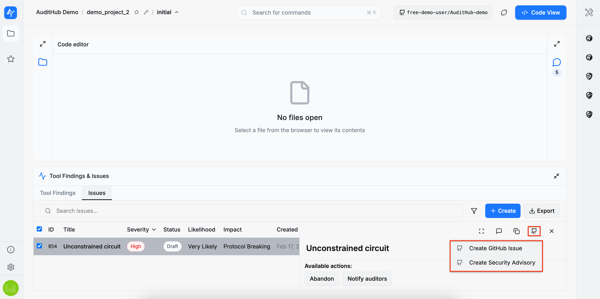

When the export finishes, AuditHub displays a success notification. From the original AuditHub issue, you can open the published GitHub **issue** or **security advisory** at any time.

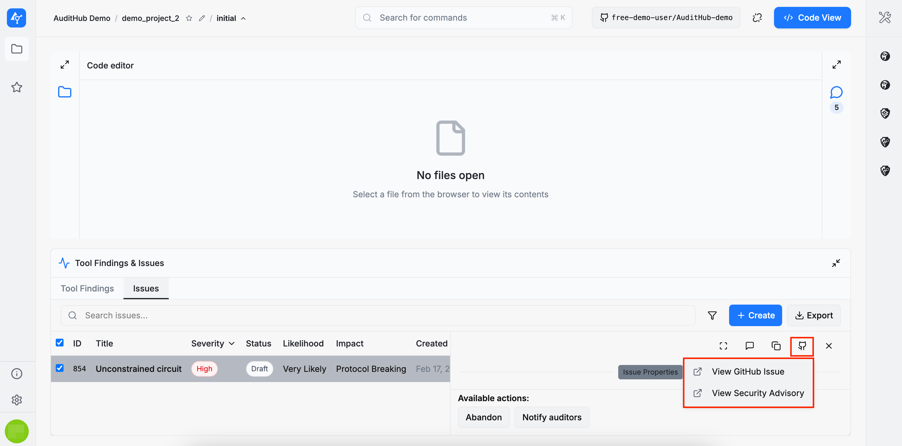

### Reconnect GitHub

If you uninstall the `AuditHub.dev` GitHub application from your GitHub account and need to reinstall it, you can go to the **Projects** page of your organization and click the **Reconnect GitHub** button. This will launch the same [process](#github-connect) as the original Connect feature, which you can follow from step 3.
  
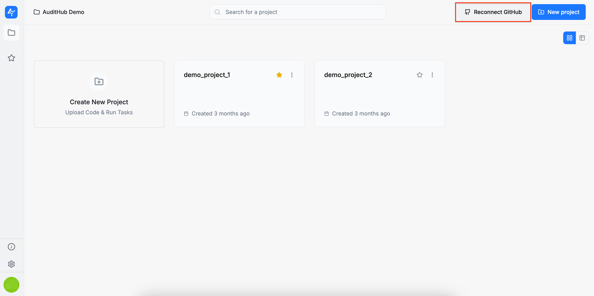

:::note
Project links remain intact. If you decide to switch to a different GitHub account, and you have already linked projects, please **relink** these project to repositories of the new account.
:::

## Threads

:::info
For more background on threads, see [Threads](/saas/guide/concepts/threads). This section describes how to create, filter, and manage threads.
:::

### Create Threads

A thread can be created in two ways:
* By clicking the `+ New Thread` button in the **Threads** section
* By selecting the file, highlighting the relevant line or lines, and right-clicking to open a dropdown menu with the `New Thread from Selection` option, or
* By hovering over the line of interest in the code editor and clicking the **plus (+)** icon in the left sidebar.

:::note
It is important to note that **all created threads are visible to everyone**.
:::

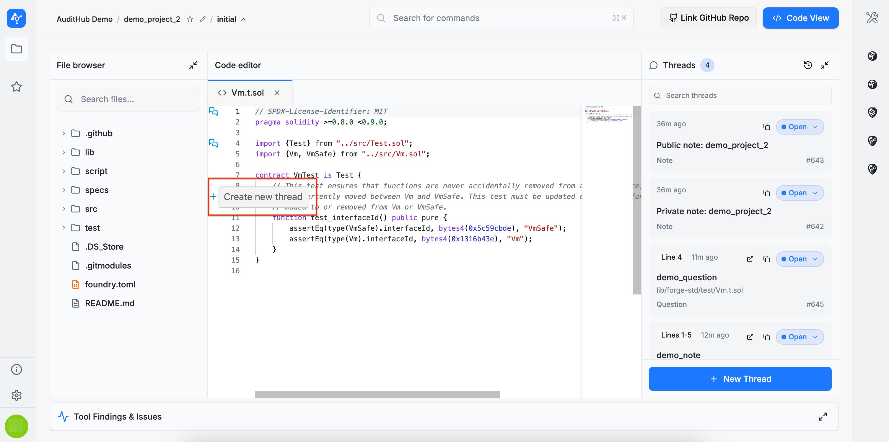

Selecting either method opens a thread creation form where the required information must be provided. There are two types of threads: **notes** and **questions**. Notes are intended for general observations or documentation, while questions are used to request clarification or assistance.

All fields in the thread creation form are mandatory. A title, a description, and a source code location (file and line number) must all be provided. To proceed with the thread creation, please click the `Create Thread` button. 

:::warning
Please note that we don’t preserve a cache of the `Create Thread` form in the following situations:
* When you refresh the page
* When you navigate to another page
:::

However, if you click `Back` or try to [filter threads](/saas/guide/pages/projects/project_viewer/audit_issue_management.md#filter-threads) (by clicking the `dialog` or `filter` icons) while the form contains unsaved content, you’ll be prompted with one of the following dialogs:

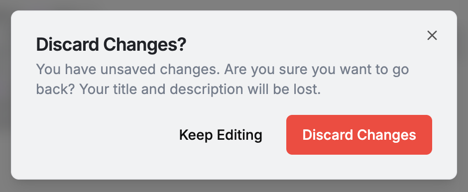
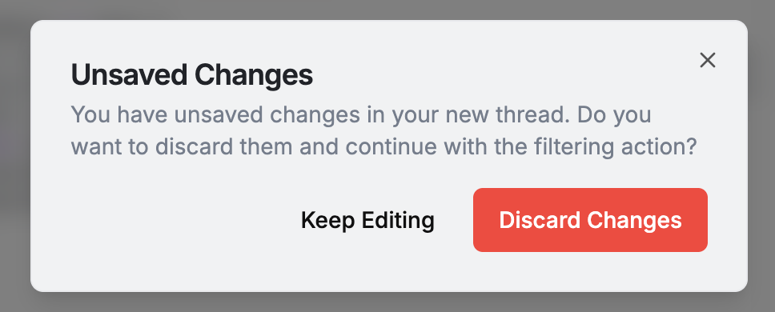

Once the thread is created, you’ll be redirected to the full thread view shown below.

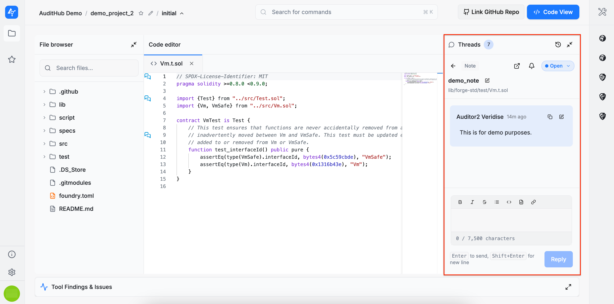

To return to the thread list, click the **back arrow**. To open a thread’s full view again, click any entry of your choice in the **Threads** section. When you open a thread, the referenced file automatically opens at the specified line number. If you navigate to other files afterward, you can return to the referenced location by clicking the **Go to line** button in the thread header.

### Filter Threads

There is also a filtering feature for threads. Below are the most relevant details:

* A `dialog` icon is used for both single-line and multi-line threads. For multi-line threads, the icon appears only on the first line.
* Clicking the `dialog` icon automatically filters the thread list to show only threads that either begin on that line or reference it within a multi-line range.

When hovering over lines, contextual actions are displayed:

* If the line is not referenced by any existing thread, a **plus (+)** icon appears, indicating that clicking it will [create a new thread](/saas/guide/pages/projects/project_viewer/audit_issue_management.md#create-threads) starting at that line.
* If the line is referenced by one or more threads, a **filter** icon appears, indicating that clicking it will filter the thread list to those threads.

When threads are filtered by line (either by clicking the `dialog` icon or the `filter` icon), clicking the **+ New Thread** button opens the thread creation form with the start line pre-filled based on the currently selected line.

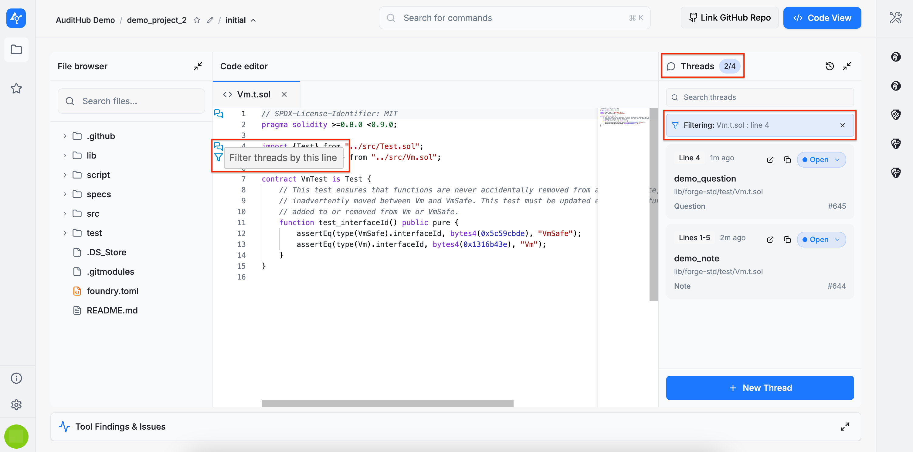

### Thread Messages

Within a thread, messages can be posted. This example illustrates two features:

1. **Linking issues in messages**: simply pasting an issue link automatically displays its name, which becomes a clickable reference.
2. **Tagging participants**: different parties in the organization can be tagged. Auditors and developers can be mentioned as groups using **@auditors** and **@developers**.

### Thread Notifications

There is also an option to customize notification preferences for messages posted in threads. These notifications are included in the digest email. By default, all notification types are enabled.

### Resolve Threads

You can also copy a direct link to a thread for use elsewhere. Additionally, a thread can be marked as resolved when it is no longer needed. 

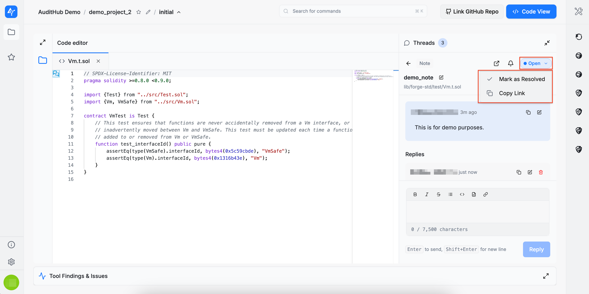

Resolved threads are automatically moved to the end of the list and their status colour switches to **red**.

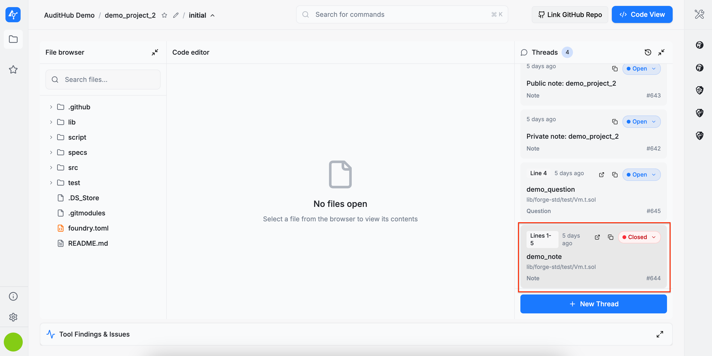
<!-- AUDITING-FEATURES: end -->

### All Comments

The `All Comments` view brings together comments from all threads tied to the current version, enabling efficient review and triage.

It allows you to:
* **View all comments in the current version**
  * Displays every comment/thread associated with the version you’re viewing.
* **Search comments**
  * Filter comments by keyword to quickly find relevant discussions.
* **Sort comments**
  * Change the ordering of comments (e.g., showing newest activity first).
* **Filter by user**
  * Narrow the list to comments created by a specific user or view comments from everyone.
* **Navigate to the originating thread**
  * Selecting a comment entry opens the corresponding thread.

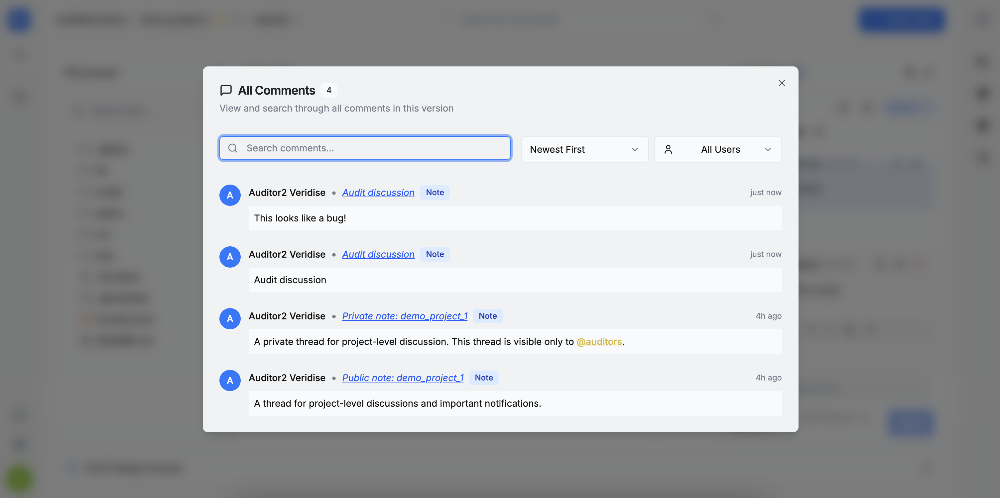
