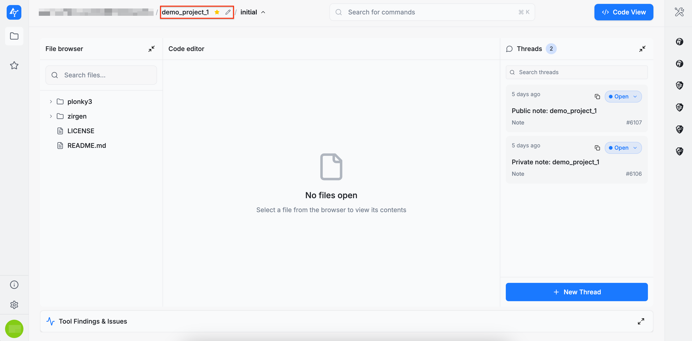
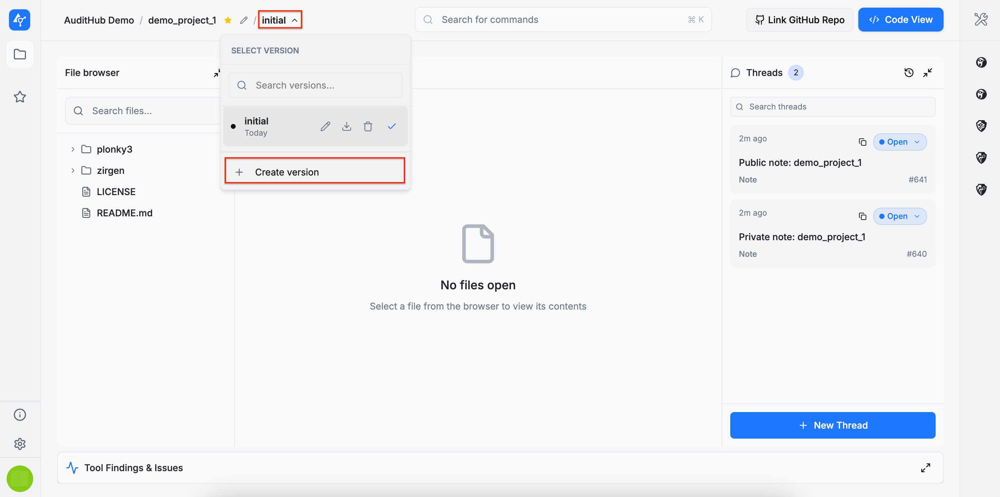
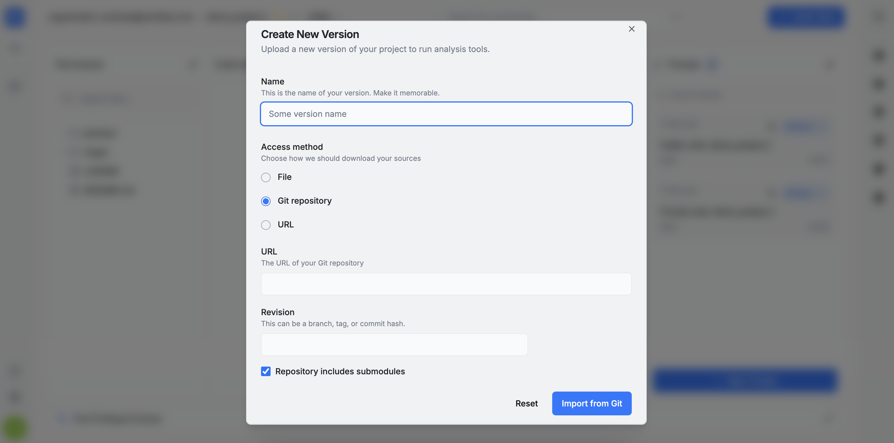
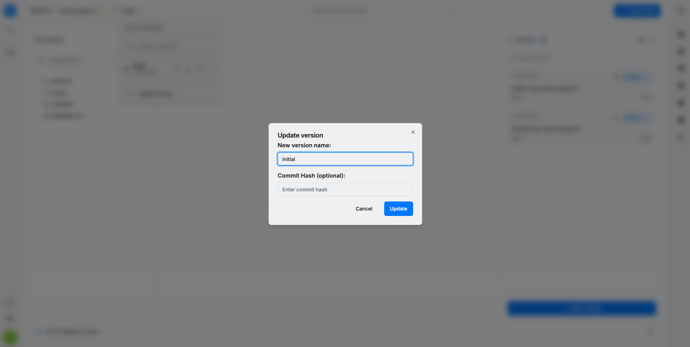
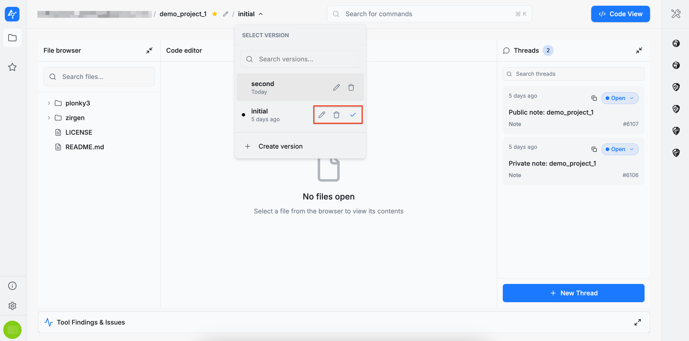
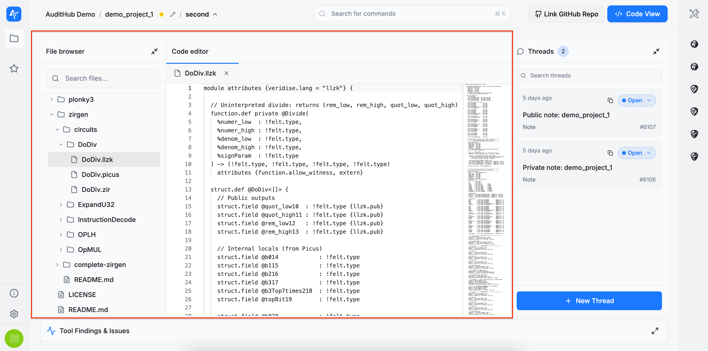
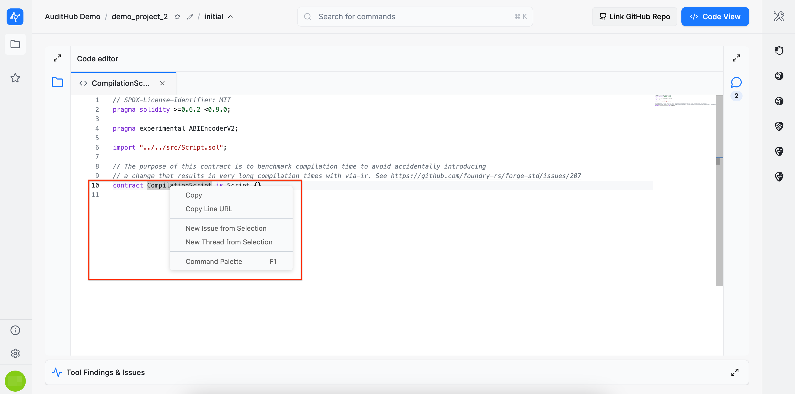

### Edit Project

To edit a project, click the `pencil` icon located next to the project name. This action opens a wizard similar to the one used during project creation. Note that only the project configuration can be modified here. Uploading new source code versions is handled separately and is described in a later section.



### Create New Version

:::info
For more details on versions, see [Versions](/saas/guide/concepts/versions).
:::

To create a new version, click the area located next to the project name. The original version of a project is labeled `initial`. Clicking this area opens a dropdown menu containing the `+ Create version` option.



Selecting this option launches a wizard that allows a new source code version to be added using one of three methods: a local archive, a remote archive accessible via URL, or a GitHub repository.



### Version Actions

Project versions can be edited, downloaded, or deleted, but at least one version must always exist therefore, the last remaining version cannot be deleted. 

Only the name and the revision (commit hash) are editable for project versions. If provided, the revision (commit hash) allows auditors to track the GitHub commit associated with the source code, helping ensure the correct scope is being reviewed.



When switching to a different version, a blue check mark indicates the currently active one.




## Source code navigation

### File Browser

On the left side of the page, the **File Browser** displays all files included in the selected archive, along with a search bar to help locate items quickly. Any file can be opened to view its contents in the **Code Editor**. 



### Code Editor

Right-clicking inside the code editor opens a context menu with several commands, including:

* `Copy`: copies the selected line or lines of code.
* `Copy Line URL`: copies the URL of the selected line or lines of code.
* `New Issue from Selection`: creates an issue based on the selected code (described in detail [here](/saas/guide/pages/projects/project_viewer/audit_issue_management.md#create-issue)).
* `New Thread from Selection`: creates a thread based on the selected code (described in detail [here](/saas/guide/pages/projects/project_viewer/audit_issue_management.md#create-threads)).
* `Command Palette`: provides access to additional commands.



The **Code Editor** currently supports syntax highlighting for the following languages:

```
C/C++: .cpp, .h, .hpp
C#: .cs
CSS: .css
Go: .go
HTML: .html
Java: .java
JavaScript: .js, .mjs
JSON: .json
Kotlin: .kt
Lisp/Scheme: .lisp, .scm
Markdown: .md, .mdx
Protocol Buffers: .proto
Python: .py
Rust: .rs
Shell: .sh
Solidity: .sol
TypeScript: .ts, .tsx
XML: .xml
YAML: .yaml, .yml
Circom: .circom
Leo: .aleo, .leo
[V] Specification Language: .spec
Hint Language: .hint
Sui Move: .move
Noir: .nr
```

For additional or custom syntax highlighting support, please contact us.

