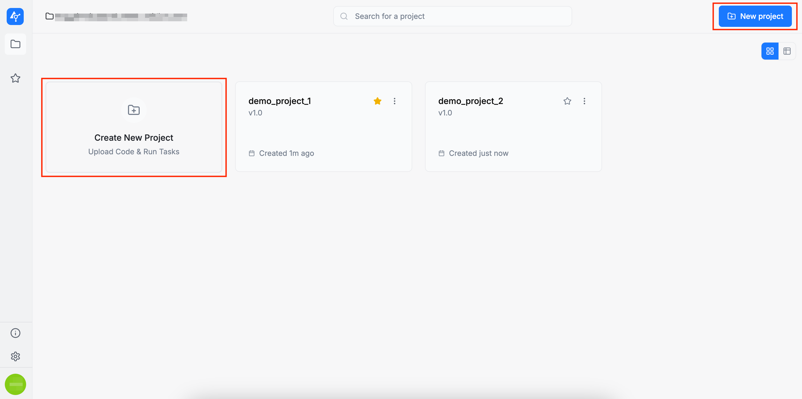
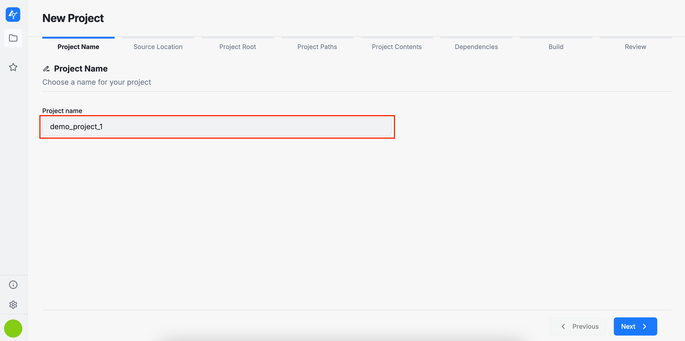
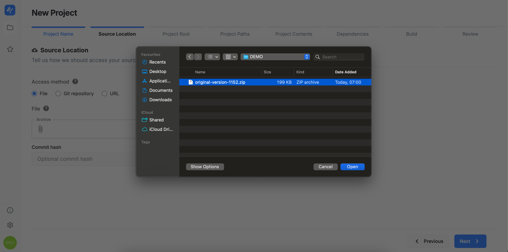
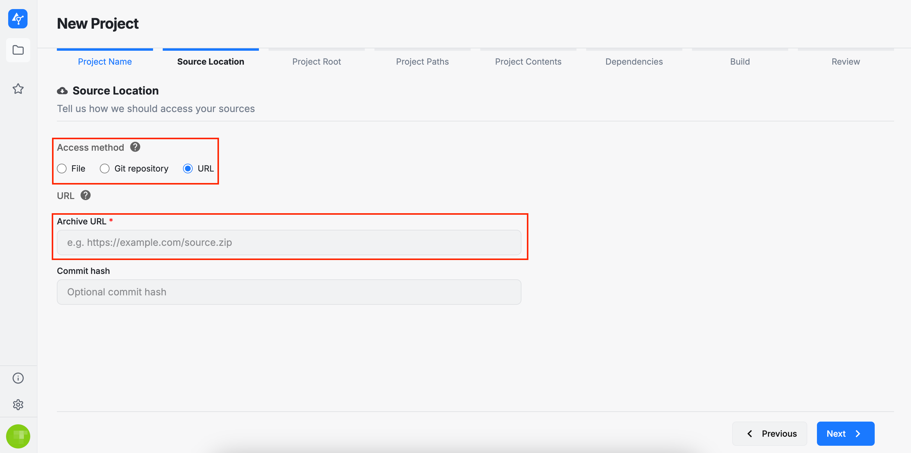
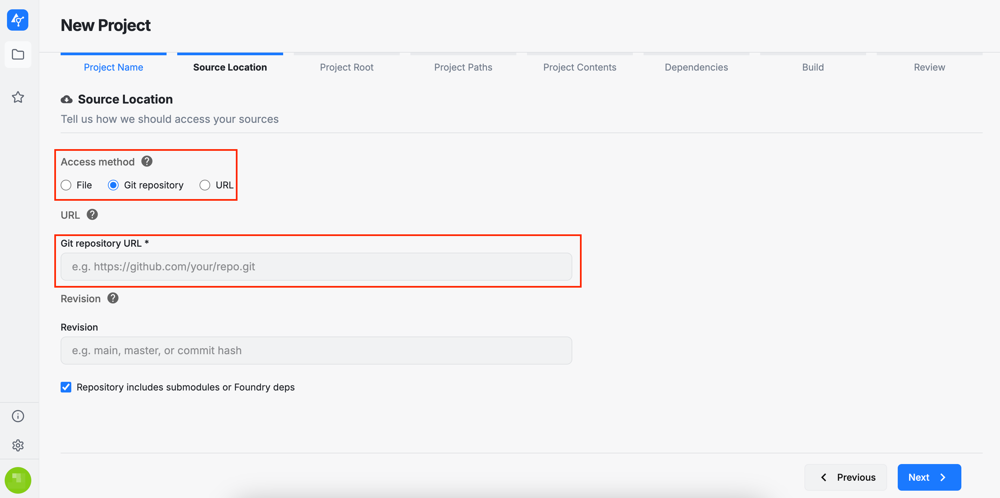
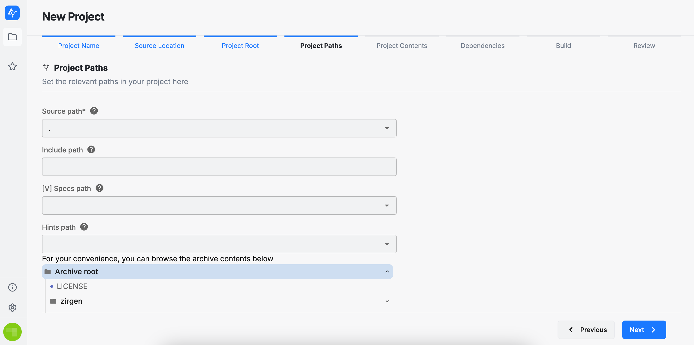
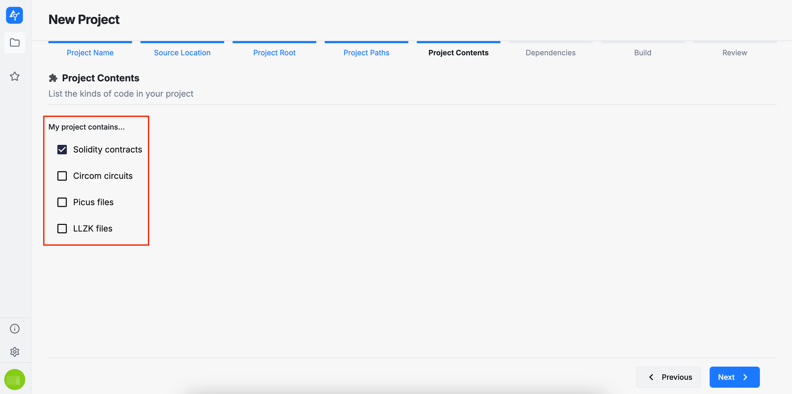
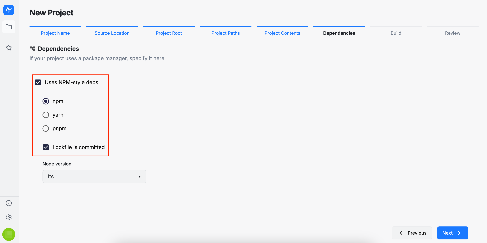
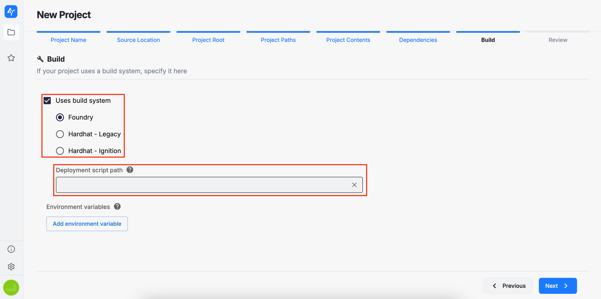

You can create a new project by clicking either of the two highlighted options below. This will open a wizard that guides you through several setup steps for the project.

:::info
The following sections are related to the project's source code (initial version).
:::

## Project Name

Enter a name for your project. Please be aware that the name must be unique.

## Source Location

There are three ways to provide a project's source code: a local archive, a remote archive accessible via a URL, or a GitHub repository.

### Local archive

By selecting this option, you can upload an archive from your local machine. Currently, only the `.zip` archive format is supported. Please note that the archive size must not exceed `200 MB`.

### Remote archive

By selecting this option, you must provide a public URL pointing to your archive. AuditHub will then retrieve the corresponding data.

### GitHub repository

By selecting this option, you must provide the URL of a GitHub repository. Please note that the repository must be public, as AuditHub currently does not support accessing private repositories. In addition to the URL, you may also specify the revision (i.e., the branch to be used when fetching the repository data).

:::info
The following sections are related to the project's configuration.
This configuration is primarily relevant for the AuditHub tools that will be applied to the project’s source code and that rely on this configuration during execution.
:::

## Project Root

In this section, you need to select the root directory for your project. This directory serves as the location where the build system commands (e.g., Foundry, Hardhat, etc.) will be executed.

## Project Paths

Here, you must select the paths relevant to your project:

* **Source path**: the folder containing the project’s source files
* **Include path**: the folder containing the project’s dependencies, if any
* **[V] Specs path**: the folder containing embedded [V] specifications to be used by our fuzzing tool (OrCa), if any
* **Hints path**: the folder containing embedded hints to be used by our fuzzing tool (OrCa), if any.

## Project Contents

Select the types of code included in your project. Your selection determines which AuditHub tools will be available to analyze the project’s source code.

* **Solidity contracts** will enable OrCa, DeFi Vanguard and DeFi Vanguard (Legacy)
* **Circom circuits** will enable ZK Vanguard (Circom) and Picus (Circom)
* **Picus files** will enable Picus
* **LLZK files** will enable ZK Vanguard.

## Dependencies

In this section, you can select your project dependencies. AuditHub supports installing dependencies using the following package managers:
* `npm`
* `yarn`
* `pnpm`

You can also indicate whether a `lockfile` is present in your source code and whether your project requires a specific `Node.js` version.

## Build

Here you can select the build system supported by your project, as well as any environment variables required during the build process. Currently, AuditHub supports the following build systems:

* **Foundry**

* **Hardhat - Legacy** (the initial Hardhat offering)

* **Hardhat - Ignition** (the latest Hardhat offering)

Providing the deployment script path is optional when using DeFi Vanguard or DeFi Vanguard (Legacy). However, if you intend to use OrCa on this project, specifying the deployment script path is mandatory.

## Review

In this final section, you can review the project configuration options you have selected. If you are satisfied with your choices, you may proceed with submitting the project. Otherwise, you can return to previous steps in the wizard and make any necessary changes. Please also note that the project configuration can be edited and new versions of the source code can be uploaded at any time after submission.

After submitting the project, you will be redirected to the project viewer page.