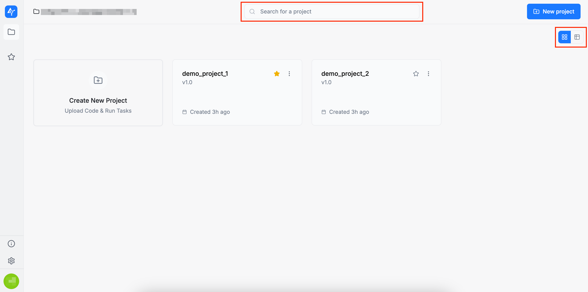
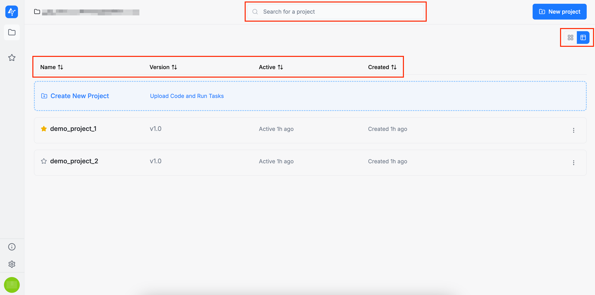
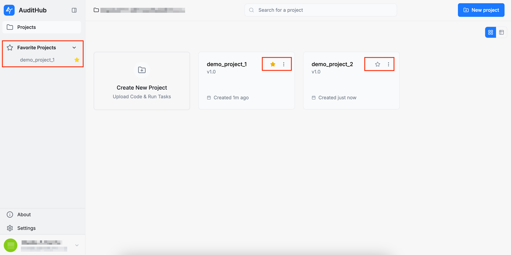
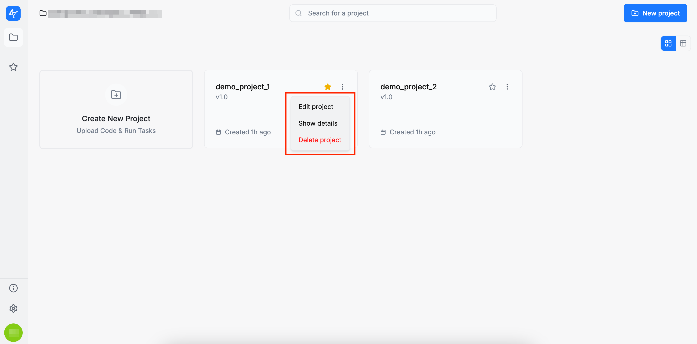
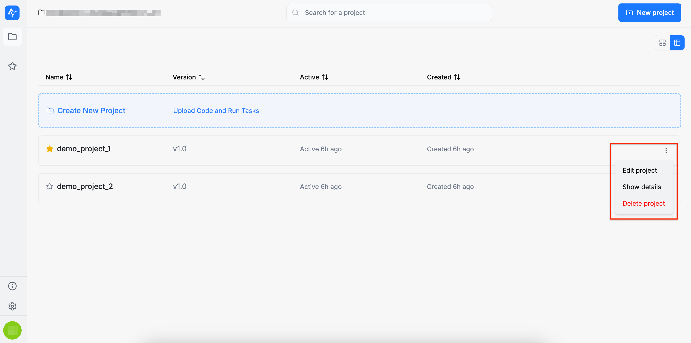

# Projects

The **Projects** page is the home page of AuditHub. It displays all projects created within your organization.

:::info
Conceptually, a project is defined by its source code and its configuration. The source code can originate from a local archive, a remote archive accessible via a URL, or a GitHub repository. A project is intended to be analyzed both by AuditHub’s automated tools and manually by a team of auditors during an audit.

A project may contain multiple versions of its source code. However, it is important to note that the same configuration applies to all versions. More information on project creation can be found in the [Create Project](/saas/guide/projects/create_project) section.
:::

You can view the **Projects** page in two modes: grid view and table view. In table view, you can also sort projects by name, version, active status, and creation date. Additionally, a search bar is available to filter projects by name.

You can also star projects to mark them as favorites. Starred projects will appear in the **Favorite Projects** section in the left sidebar, allowing you to access them quickly and conveniently.

Each project card includes a set of available actions, accessible from the dropdown menu by clicking the three dots in the corner of the card:

* **Edit project**: allows you to modify the project’s configuration

* **Show details**: displays the current configuration of the project

* **Delete project**: permanently deletes the project (please note that this action cannot be undone, so use it with caution).

