The following features were designed to support manual auditing and to create a synergy between automated findings and manual review.
For the rest of this section we refer to users that posses the auditor role as auditors, and to all other users as developers.

## Findings

The findings are also available in the **Tool Findings** table shown below. Unlike the task-level view, this table aggregates findings from **all** tasks. Findings can be filtered by tool, severity, and other criteria, and all functionalities available on the **Task Summary** page apply here as well (i.e., trige, jump to line, etc.).

This view also introduces two additional features:

* **Finding expansion**: each finding can be expanded to display the full description and the associated discussion
* **Jump to discussion**: a dedicated button allows quick navigation directly to the discussion for that finding.

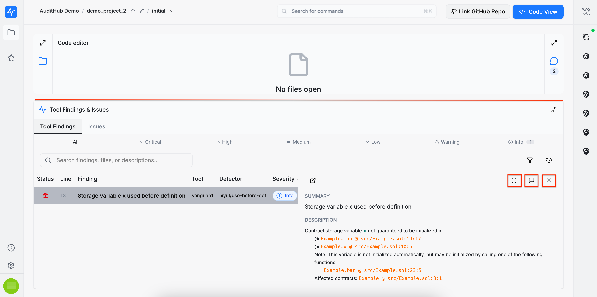
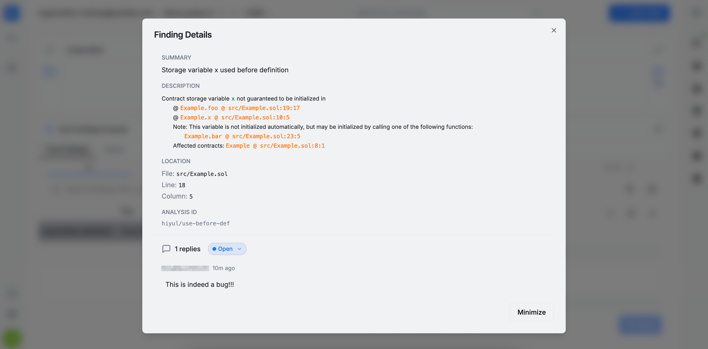

:::note
The bottom panel containing the **Tool Findings** and **Issues** tables can be resized by dragging it up or down.
:::

## Issues

During an audit, auditors need a structured way to communicate the issues they identify in the developers’ source code. These issues serve as a method for documenting and conveying the results of an audit, either for issues detected manually or automatically (via tool executions).

### Create Issue

An issue can be created in two ways:
* By clicking the `+ Create` button in the **Issues** table, or
* By selecting the file containing the bug, highlighting the relevant line or lines, and right-clicking to open a dropdown menu with the `New Issue from Selection` option.

Selecting either method opens an issue creation form, where the required information must be provided.

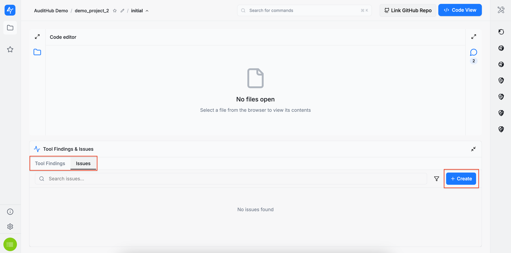

The issue form is divided into three sections: `Base Properties`, `Internal Properties`, and `Resolution` (the `Resolution` section is only available when editing an existing issue).

#### Base Properties

In the `Base Properties` section, the following information must be provided:

* **Title**
* **Markers** that help indicate the importance of the issue, including:
  * **Likelihood**
  * **Impact**
  * **Severity**
  * **Type**
  * **Raised By** (the auditor who identified the issue)

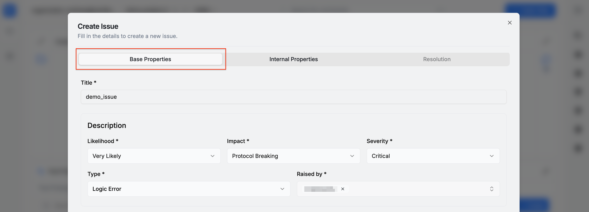

**Likelihood**, **Impact**, and **Severity** have predefined values to choose from. However, **Type** also allows custom entries. A new type can be added by scrolling to the bottom of the dropdown and selecting the **+ Create new type** option.

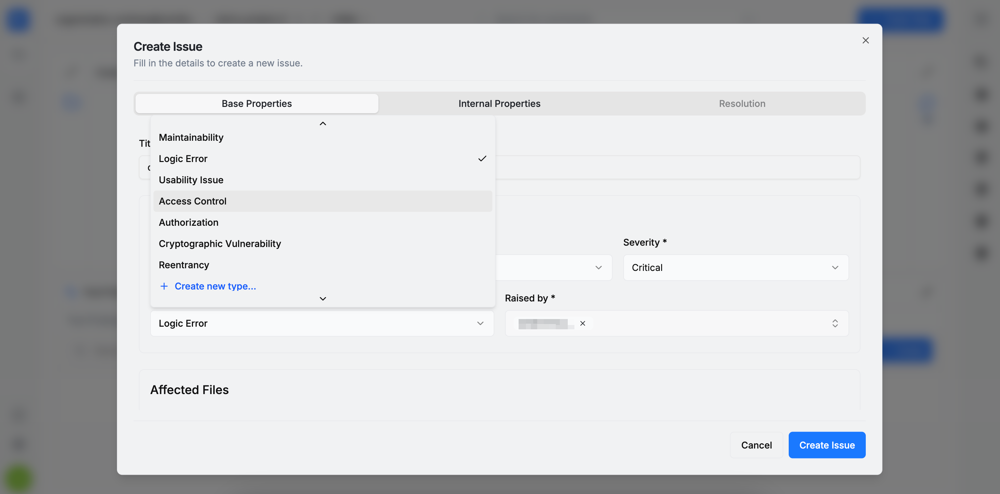

A bug may affect multiple files, so the issue form allows specifying one or more impacted file paths from the codebase. For each file, a line interval can be provided, or the checkbox can be selected to indicate that the entire file is affected. If no specific line information is provided, the bug’s line number defaults to 1, although this value can be edited afterward.

Below the **Affected Files** section is the **Promoted Findings** section. If any automated tool has produced findings that are confirmed as true positives, they can be referenced here and further elaborated in the issue’s **Description** field.

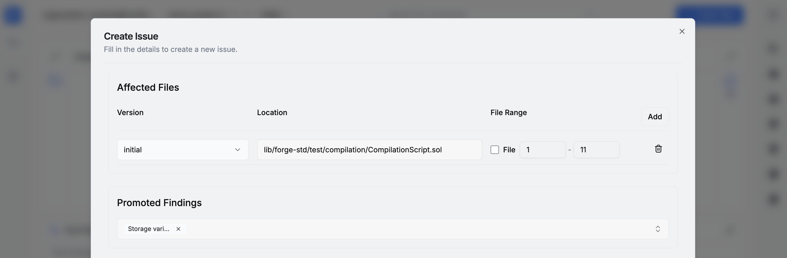

The **Description** field supports two editing modes: **WYSIWYG** and **RAW**.

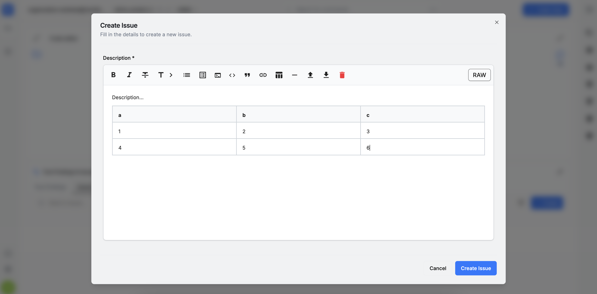
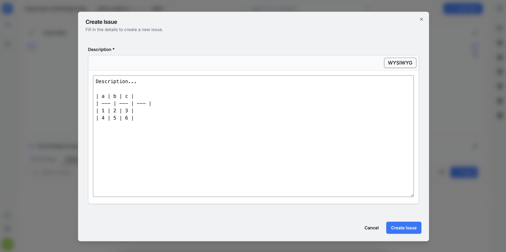

#### Internal Properties

In the **Internal Properties** section, three values can be set: **Candidate for Tool** (indicating whether the issue could be detected by a specific tool in the AuditHub suite), **PoC Author**, and **Document Authors**. To proceed with issue creation, please click the `Create Issue` button.

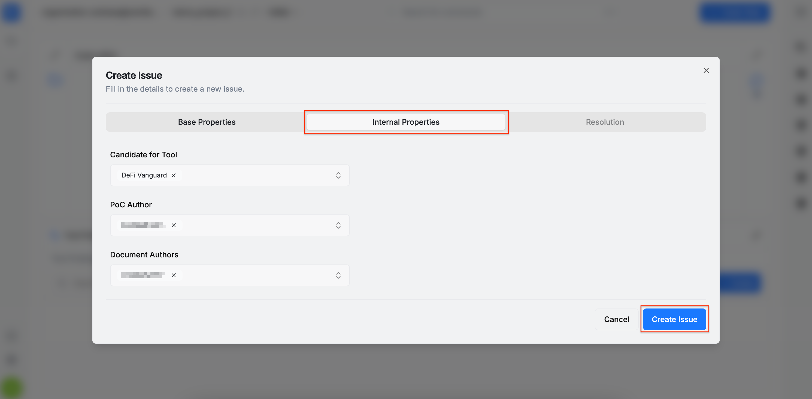

### Issues Table

Below is the **Issues** table displaying the issue created earlier. Note that newly created issues are initially visible only to auditors, indicated by the gray crossed-out **eye** icon. Once the issue is shared with developers, this changes to a green open eye icon. Additional actions are available as well, such as edit (**pencil** icon) and delete (red **trash** icon).

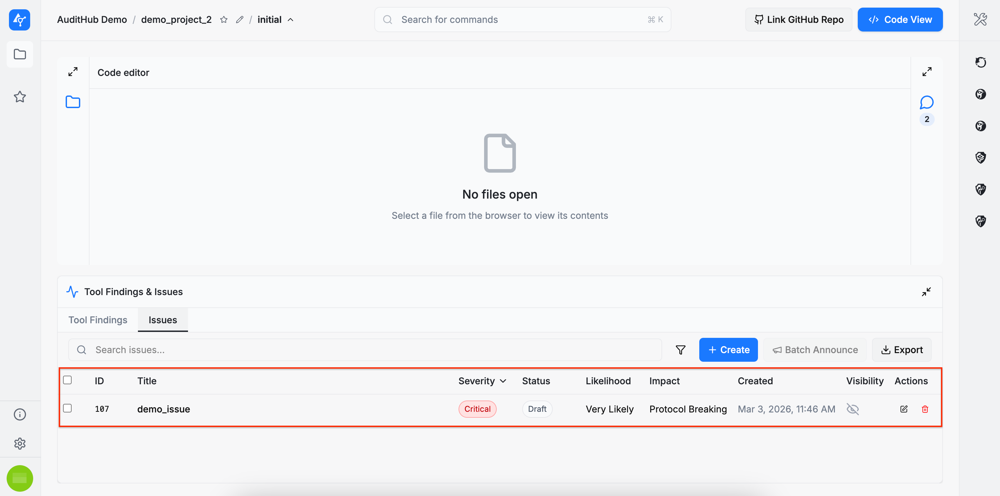

Editing an issue opens the same form populated with the previously entered data, but it also enables the final section: **Resolution**. This section can be filled with a pull request and commit reference indicating where the developers addressed the issue.

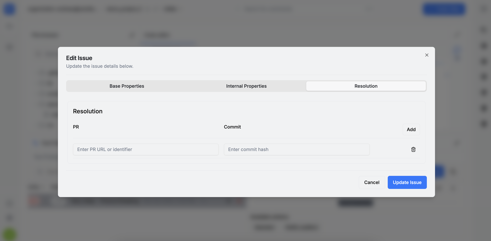

Clicking an entry in the **Issues** table opens the **Issue Details** section, where a summary of the most important information is displayed. In this section, users can:

* **Inspect affected files** by clicking them. Each file entry includes a link to the file and the referenced line(s) of code.

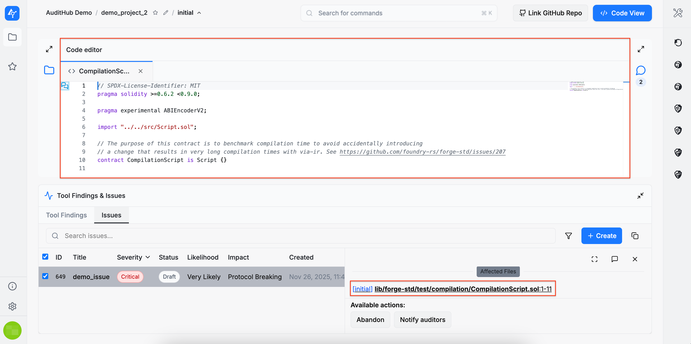

* **Copy the issue link** using the copy icon in the upper-right corner, allowing the issue to be referenced elsewhere.
* **Copy the raw Markdown** of the issue description using the dedicated copy button.
* **Perform issue actions**, such as sharing the issue, discussing it, or linking pull requests with fixes. This section is central to the collaboration process between auditors and developers.
* **Navigate directly to the discussion** using the provided button.

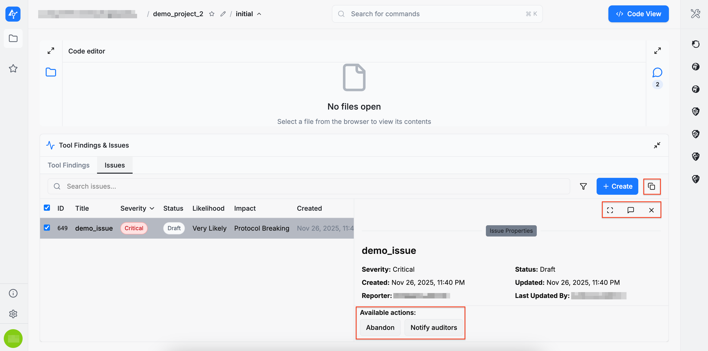

* **Expand the issue details**, which opens a dialog containing the full issue information along with the discussion thread.

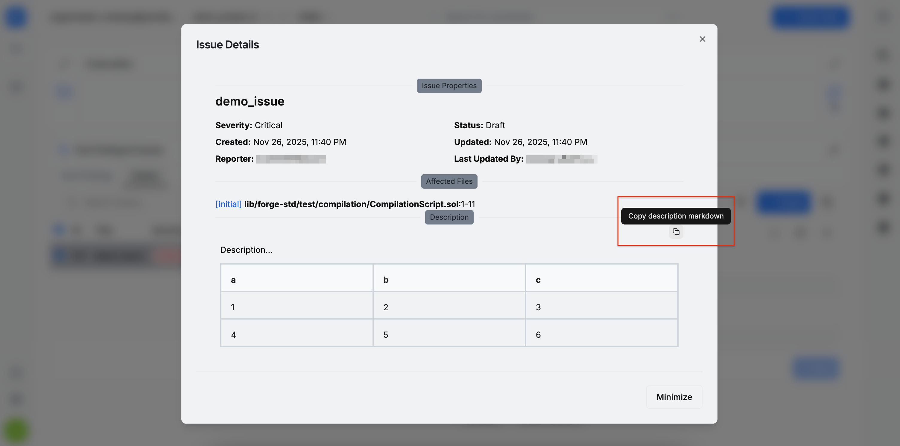

Each issue includes a discussion section divided into two threads: **Private** and **Public**. Developers have access only to the public thread, while the private thread is reserved for internal communication among auditors.

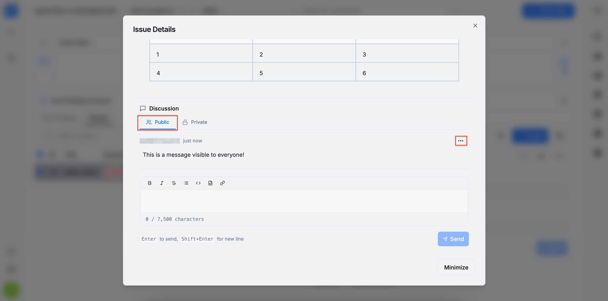

For each message, options are available to **copy the raw Markdown**, **edit**, or **delete** the message.

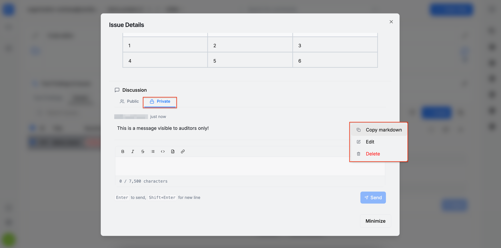

## Threads

Threads are used to facilitate communication between auditors and developers. By default, each project includes two threads: a **Private** thread and a **Public** thread. The private thread is intended for internal communication, while the public thread is visible to all parties (i.e., both auditors and developers). 

These two threads serve as channels for communicating important updates, such as when a new issue is created, when an issue’s status changes, or when specific actions are taken on an issue, etc.

### Create Threads

A thread can be created in two ways:
* By clicking the `+ New Thread` button in the **Threads** section, or
* By selecting the file, highlighting the relevant line or lines, and right-clicking to open a dropdown menu with the `New Thread from Selection` option.

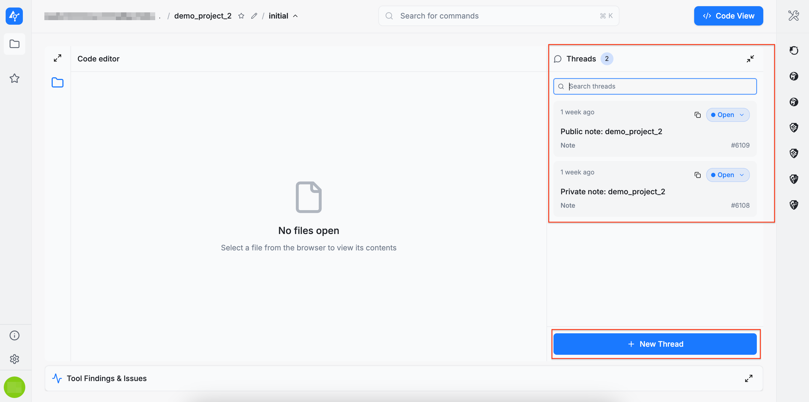
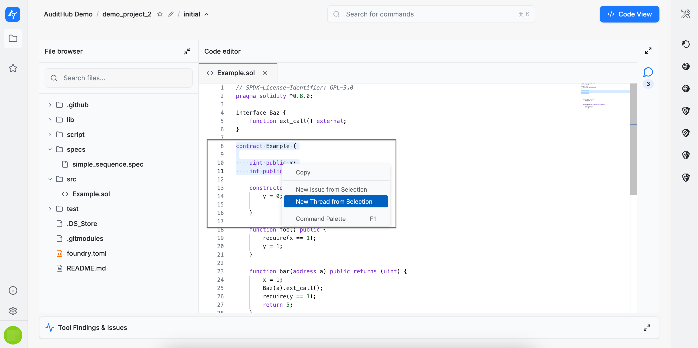

Selecting either method opens a thread creation form where the required information must be provided. There are two types of threads: **notes** and **questions**. Notes are intended for general observations or documentation, while questions are used to request clarification or assistance.

It is important to note that **all created threads are visible to everyone**.

All fields in the thread creation form are mandatory. A title, a description, and a source code location (file and line number) must all be provided. To proceed with the thread creation, please click the `Create Thread` button.

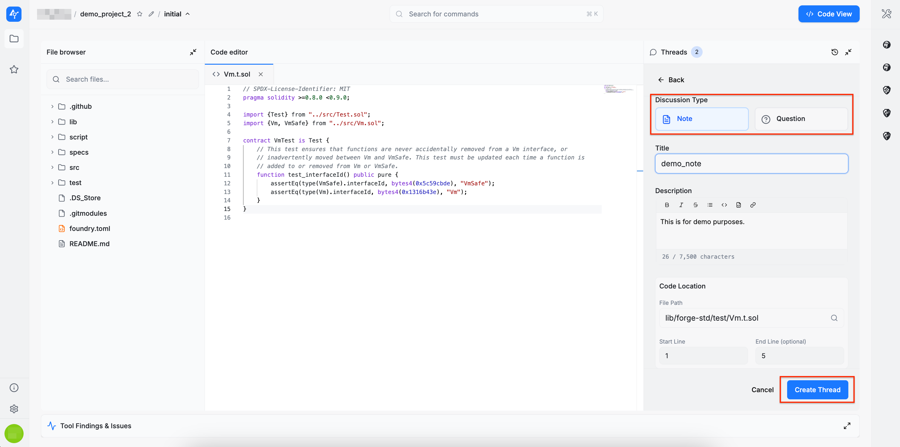

To access the full view of a thread, click any entry in the **Threads** section. When a thread is opened, the referenced file automatically opens at the specified line number. If you navigate to other files afterward, you can return to the referenced location by clicking the **Go to line** button in the thread header.

Within a thread, messages can be posted. This example illustrates two features:

1. **Linking issues in messages**: simply pasting an issue link automatically displays its name, which becomes a clickable reference.
2. **Tagging participants**: different parties in the organization can be tagged. Auditors and developers can be mentioned as groups using **@auditors** and **@developers**.

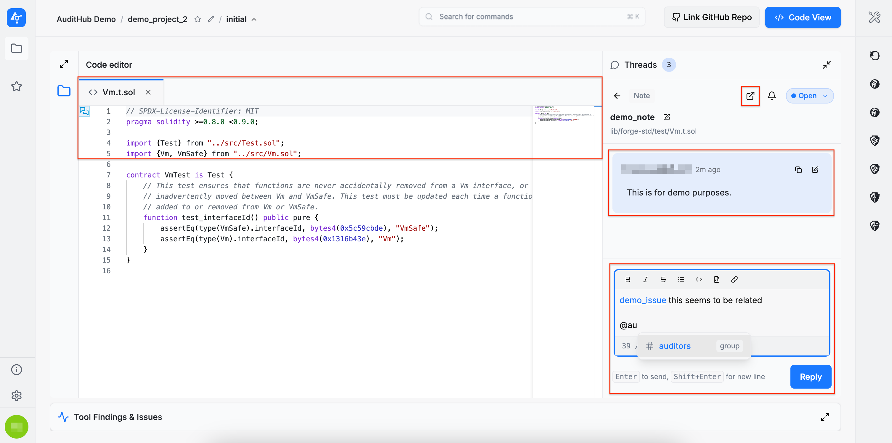

There is also an option to customize notification preferences for messages posted in threads. These notifications are included in the digest email. By default, all notification types are enabled.

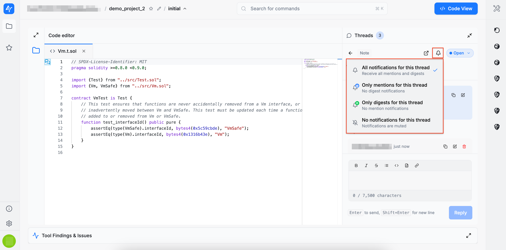

You can also copy a direct link to a thread for use elsewhere. Additionally, a thread can be marked as resolved when it is no longer needed. Resolved threads are automatically moved to the end of the list.

