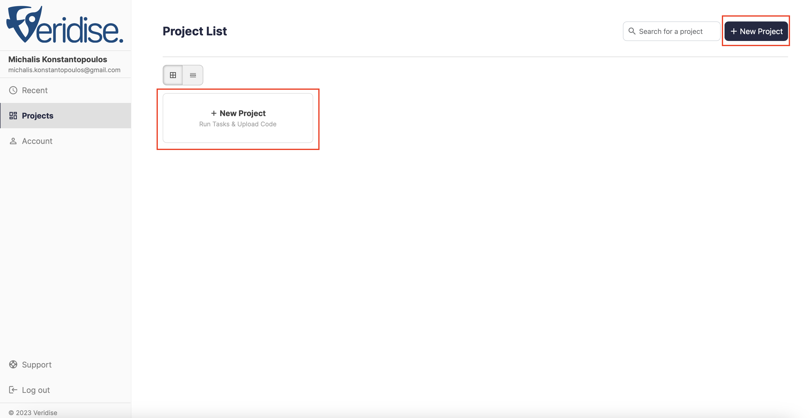
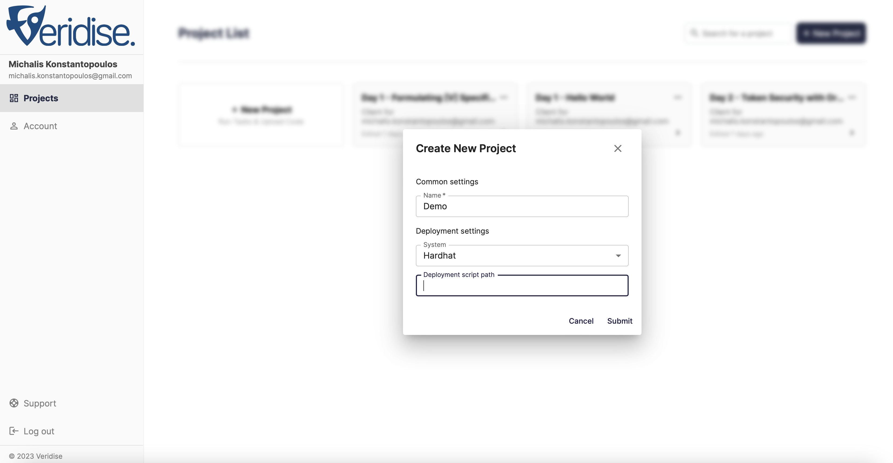
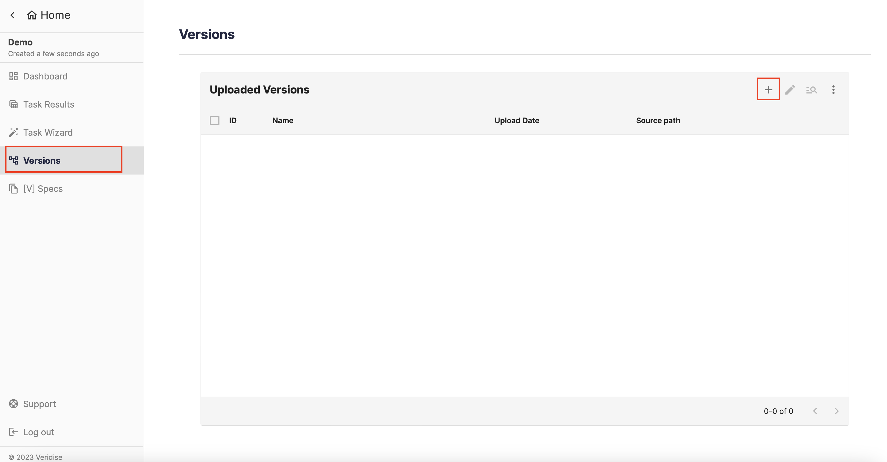
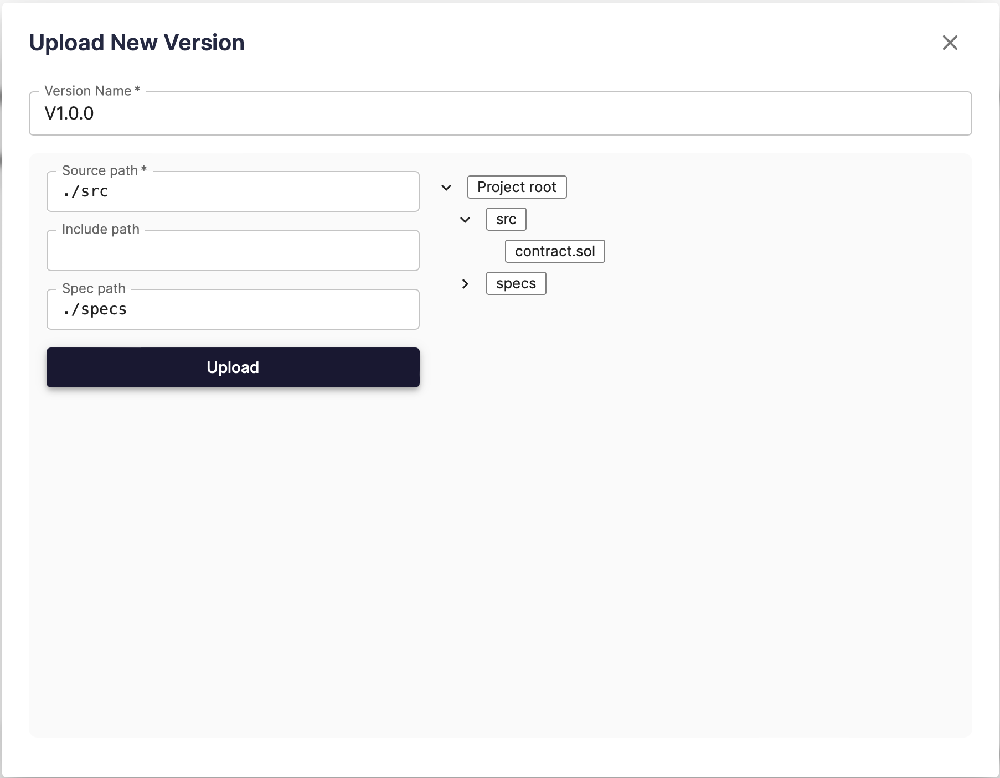
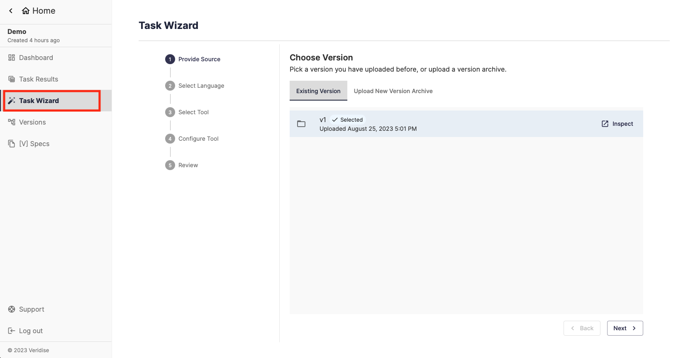
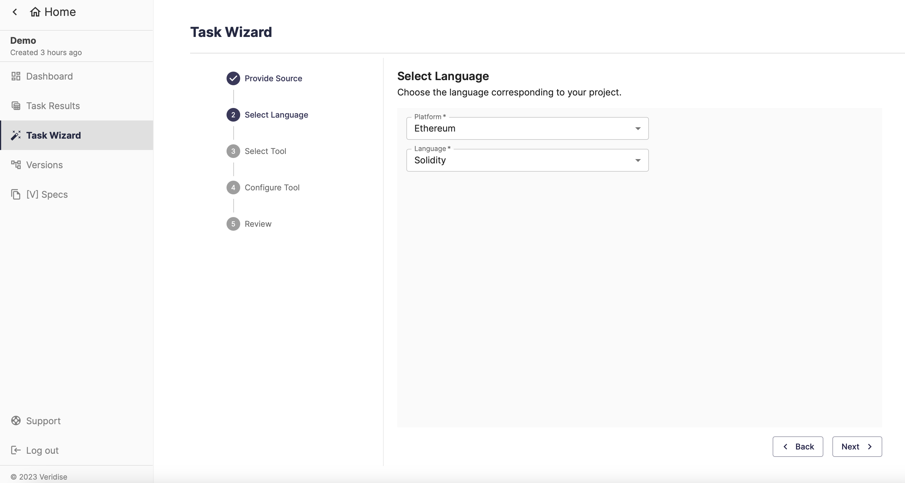
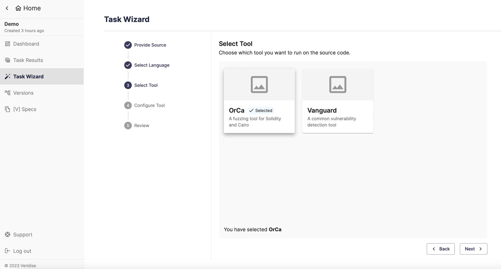
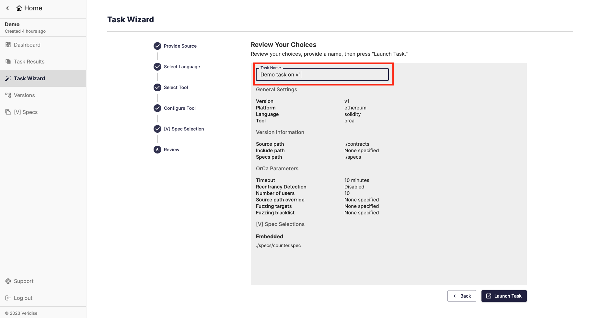
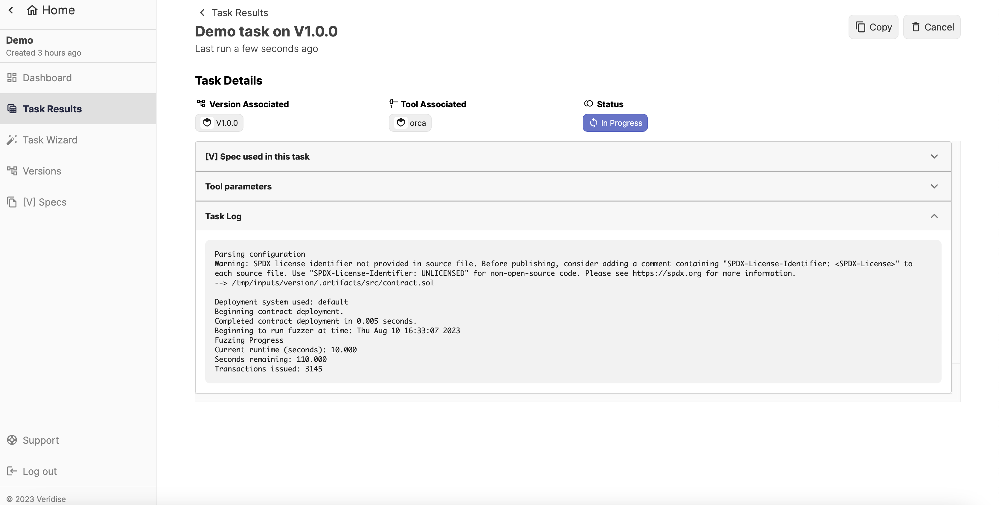
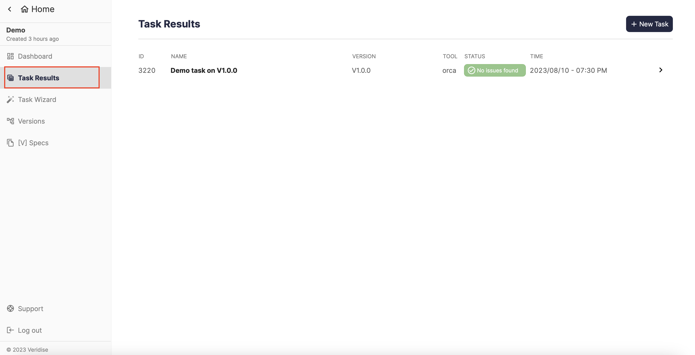

# Introduction to SaaS

Our Security-as-a-Service platform allows instant access to Veridise security analysis tools.

## On boarding process

**TODO: Update with production link**

To start using our tools visit the [SaaS page](https://saas.internal.veridise.tools/).
When you access the platform, you will be redirected to our SSO. 

### Registration 

As shown in the following image, you have three log in options: 
1. Log in using your Google account 
2. Log in using your Github account 
3. Create a new local user  

Please note that even if you use the first two options you will have to provide additional required information during the registration process. 
In the case of local user registration, you will also have to verify your email address.

### Access Request 

**TODO: work on the access request for existing organization**

As soon as you are logged in to our platform you will have to request access to the SaaS platform. 
When the administrators of SaaS approve your request, you will receive an email that you are ready to use the platform.

## Usage of SaaS

After gaining access to SaaS, you will be able to use Veridise tools available for your organization. 

### Select Project

A project is an associated set of source files such as (but may not always be) a github repository that a user wishes to analyze. 
The user can upload multiple versions of her source code, and run any of the available tools with a single version as input.

To create a project, click the `New Project` button and provide name for your new project.

### Upload source code

Select your target project and go to the `Versions` tab. Click the `+` button to upload a new version of your source code.

Create a zip archive containing tour source code. When uploading your archive, you have to select the path of the source code. Use the drag and drop feature from the directory listing on the right side of the screen.
You may also provide an include path and/or a specs path, if available in your archive.
An include path, is a path containing required dependencies your your source code, such as node modules.
More information for VSpecs that may be included in specs path can be found [here](../orca/user_guide/v/contract_initialization).

**TODO: setup dedicated doc page for VSpec and link it ? **

### Tool execution

To analyze your source code with our tools go to the `Task Wizard` tab.
Select the target source code version, or upload a new.

Then select the platform you would like to test, and the language of your source code. 

According to your selection in the previous step, you are able to select any tool that is available to your organization, and supports the selected language and platform. 

Next steps include further configuration options, according to the selected tool.
For more information on configuring any of our tools go the tool's documentation page ( [OrCa](../orca/getting_started/running_orca_through_saas#orca-configuration) and [Vanguard](../vanguard) )

Finally, review your choices, optionally select a task name, and submit your task for execution.

### Task details

When creating a task, you will be redirected to the `Task Details` page.
The logs of the task will be available there as its progressing, along with the selected configuration options.

Note that in this page you are also able to cancel the task execution, or copy the configuration to start a new task.

 

### Task results

In the `Task Results` tab you are able to check the status of all tasks, and by selecting any of them you can go back to the task details page.

 