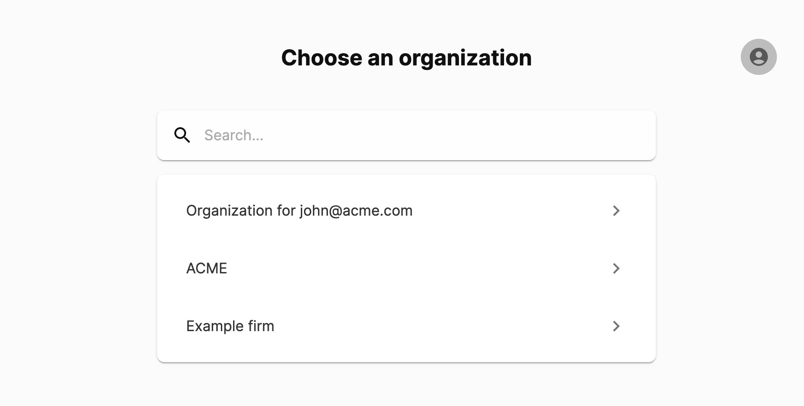

## What is this page for?

When users have access to more than one organization, they are able to access
the "Organizations" page. This page allows you to search for organizations and
select an organization. 

Additionally, there is an "Account" button on the top right corner allowing you
to log out or change user preferences.

:::note

If you have access to no organizations, then you are welcomed with the
onboarding page. If you have access to exactly one organization, then the one
organization is automatically selected for you.

:::

## Screenshot of page

