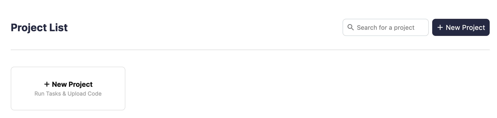

## Summary

This is the default page after entering an organization. In this page, you are
able to

- create new projects
- search for projects
- view all projects
- edit attributes of existing projects
- delete existing projects

## Actions on projects

### Creating a project

To create a new project, you can either
a. click the "New Project" button at the top right corner
b. click the "New Project" card below "Project List"

### Searching projects

The search bar next to the "New Project" button allows you to search for
projects. When no projects match your search query, you will be told so. Otherwose, you will see a filtered list of projects matching your query.

### Other actions on projects

To edit or delete projects, click the ellipsis icon in the project card. This
opens a menu with options to edit or delete projects.

:::caution

Deleting projects is an **undoable** action. If you have accidentally deleted a
project, contact an administrator to restore the deleted project.

:::

## Screenshot of page

