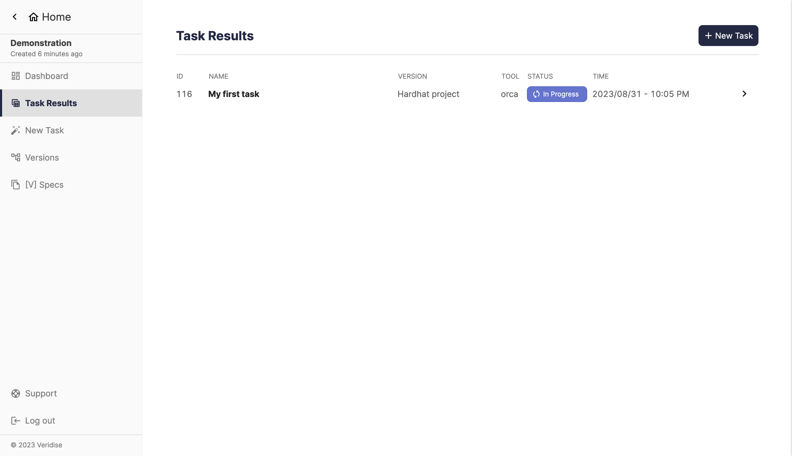
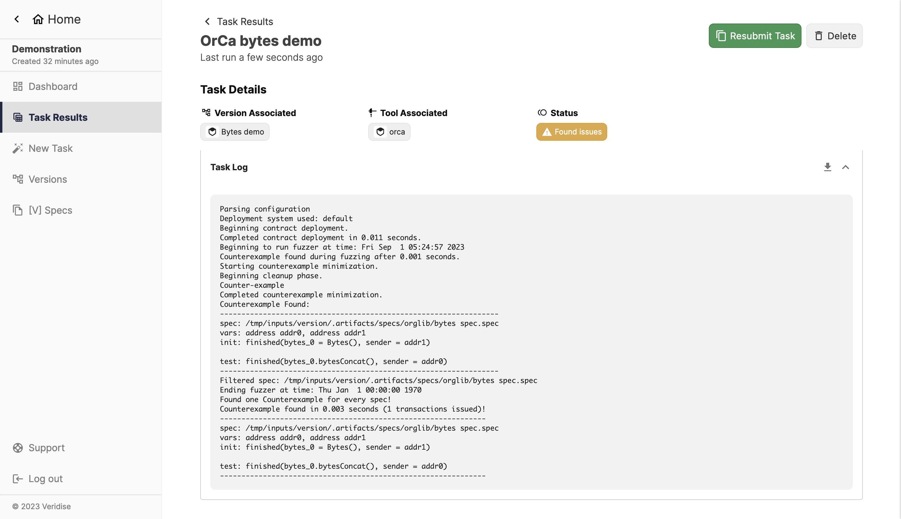

This section covers two pages: task results and task details. You can think of
the "Task Results" page as a summary of your tasks, whereas the "Task Details"
page gives you all of the details of a particular task.

## Task Results

### Summary

This pages shows a table of all tasks launched within your project. You can
click on the name of a task (or the arrow icon on the right) to view the details
of the task.

### Screenshot of page

## Task Details

### Summary

In this page, will see three major things:

1. The contents of each [V] Specification used in the task
2. The configuration of the tool chosen for the task
3. The logs from running the task

There is also other functionality, such as the ability to download task logs and
resubmit the task.

### Downloading task logs

To download logs of a task, click the "Download" icon in the header titled "Task
Logs". This button is disabled until a task has finished running. Clicking the
button will immediately download the logs as a plain text file.

### Resubmitting task

Click the green button at the top to resubmit a task. This button is disabled
until the task has finished running.

### Cancel a running task

When a task's status is "queued" or "in progress", you are able to cancel the
task. To do so, you click the "Cancel" button at the top right corner.

:::note

The cancel button is **not** available for finished tasks.

:::

### Deleting a task

When a task is cancelled or finished, you may delete the task by clicking the
"Delete" button at the top right corner.

:::note

The delete button is **not** available for running tasks. Instead, there is a
cancel button.

:::

### Screenshot of page 

This screenshot shows an example of a task where issues were found. We expanded
the "Task Logs" section so you can see the full output of the tool.

