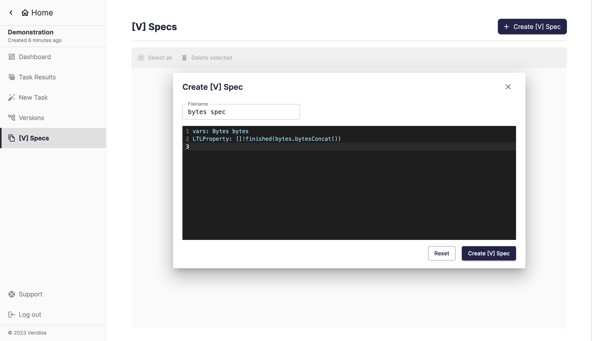
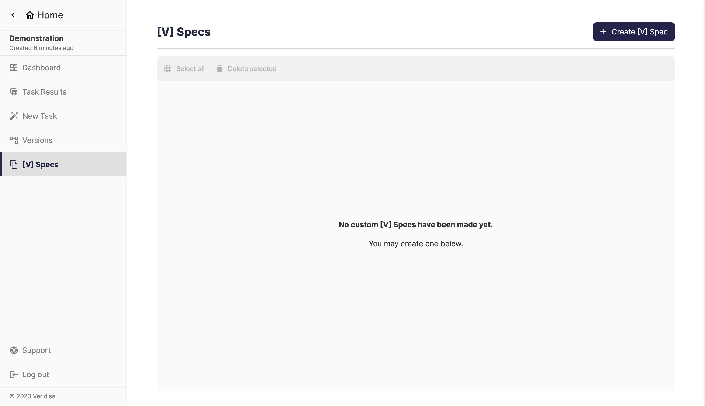

## Summary

This page shows a list of all [V] Specifications available across an
organization. You are able to

- create a new specification
- inspect an existing specification
- edit an existing specification 
- delete an existing specification

:::warning

The specifications in this page are **organization-wide**. Be very careful when
editing or deleting specifications you see in this page!

:::

## Creating a new specification

Click the "Create [V] Spec" button at the top right corner. This brings up a
dialog where you will provide the name and contents of your specification. Here
is an example of how this looks.

## Screenshot of page

The page overall looks like this.

