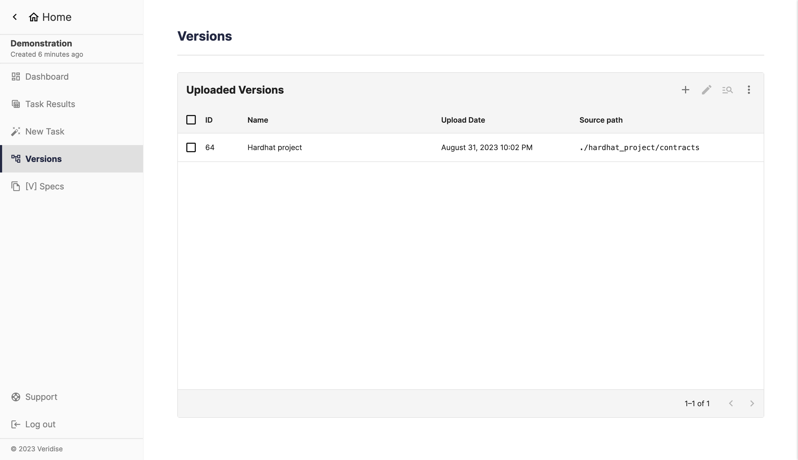

## Summary

This page shows a table that allows you to

- see the versions in a project
- create a new version
- edit attributes of an existing version
- inspect the contents of a version archive
- download an existing version
- delete an existing version

All of these actions besides the first one is done by clicking the corresponding
buttons on the toolbar. The table also allows sorting versions by attributes
(such as name and upload date).

## Creating a new version

Click the plus icon on the toolbar. This will open a dialog to upload an
archive and set attributes.

## Editing a version

Select a single version then click the pencil icon on the toolbar.

## Inspecting a version

Select a single version then click the magnifying glass icon on the toolbar.

## Other actions

To download or delete existing versions, click the ellipsis in the
toolbar. There are also other options, such as adjusting the table row density.

## Screenshot of page

