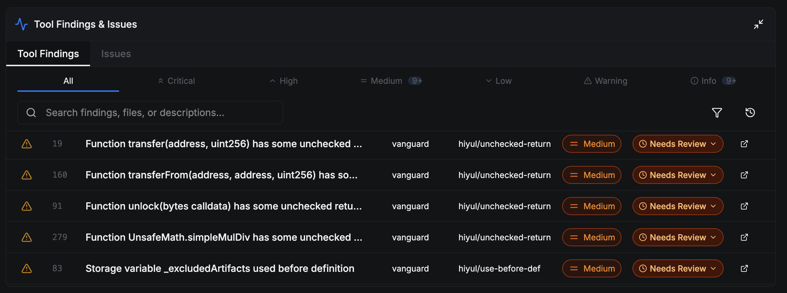
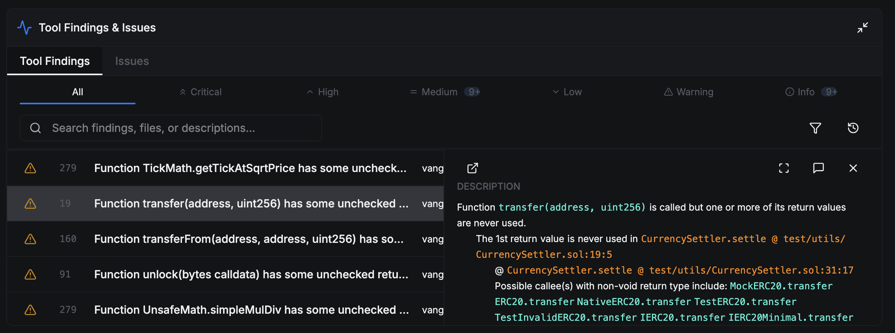
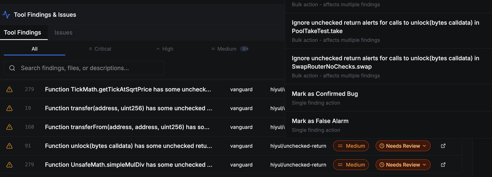
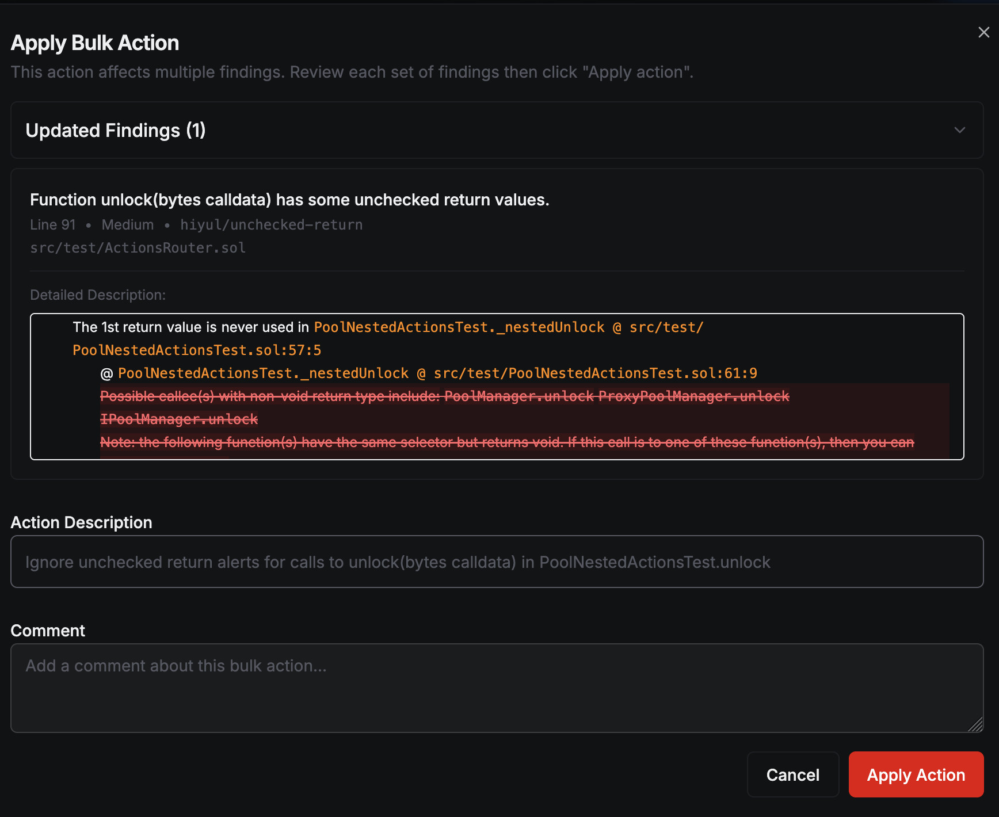

In this page, we will explain how to triage findings reported by Vanguard
through the AuditHub interface.

## Viewing Findings

After a Vanguard task is complete, any findings reported by Vanguard will be
listed in the "Tool Findings" pane at the bottom of the AuditHub interface.

You can select any one of the findings in the table to view its detailed
description, which will explain what the vulnerability is and its root causes.
When viewing a description, you can click on the highlighted details, such as
location information or variable names, to jump to the corresponding code
locations or declaration locations in the code viewer.

## Classifying Findings

When a finding is reported by Vanguard, it will initially have a status of
`Needs Triage`, as shown in the images above.
This means that no one has assessed the likelihood and impact of the finding
yet.
You can update the triage status by applying various types of _actions_
(described below).

To do so, click on the `Needs Triage` label in the finding label.
This will open a drop-down menu with a set of actions that can be taken to
update the triage status.

Every action requires the user to write a comment justifying why a finding's
triage status needs to be updated; this helps avoid confusion in the future.

### Manual Triage Actions

You can manually change the triage status of a finding into one of the
following:

* A _confirmed vulnerability_ (CV) status indicates that the full finding
  description is accurate, and that it represents an _actual_ vulnerability.
  Such findings must be treated seriously.

* A _false alarm_ (FP) status indicates that the finding reported by Vanguard is
  confirmed to _not_ be an actual vulnerability.
  Such a finding may be invalid or has little/no security impact.

These actions are labelled as "Mark as Confirmed Vulnerable" and "Mark as False
Alarm", respectively.

### Bulk Triage Actions

In some cases, a finding may be partially correct, where the description may
describe a confirmed vulnerability in one part but a false alarm in another.
A _bulk action_ allows you to remove the specific parts that wrong, or even the
_root causes_ that cause the finding to be irrelevant.

Bulk actions will automatically be applied to _all_ findings reported by the
same detector.
This means that if you use a bulk action to eliminate the root cause of a
finding, the action will also be applied to other findings produced by the
detector--including ones run in the past and in the future.

For example, if the [Unchecked Return detector](../detectors/unchecked-return.md)
reports that the return value of a function call is not used, but it does not
actually matter whether that return value of that function is used, then a bulk
action can be applied to suppress all such reports related to that function.

After a bulk action is applied, the descriptions of the affected findings will
be updated.
Suppressed details in the description will be shown with a strike-through.
Furthermore, if a finding is fully suppressed, then its triage status will
automatically change to `False Alarm`.

### Actions History

A record of all previously applied actions can be displayed by clicking on the
"Action history" bar at the top of the Tool Findings panel.
Here, you will be able to see what actions were applied in response to which
findings, who applied the actions, and the justifications.
This is helpful for undoing errorneously applied actions, or for performing a
post-mortem after a security breach.

## Soundness vs Completeness

Because it is theoretically impossible to create a static analysis tool that can
detect all vulnerabilities with perfect accuracy in general, tool authors need
to make a trade-off between (1) the degree to which the analyzer is confident
that a given program is free from vulnerabilities (_soundness_) and (2) the
degree to which the issues found are actual vulnerabilities (_completeness_).
In plain words, a _sound_ tool is always correct when it says that there are no
vulnerabilities (but may raise false alarms on some programs), and a _complete_
tool is always correct about the things it says are vulnerabilities (but it may
miss some legitimate vulnerabilities).

The principle behind Vanguard's design is that it is better to alert the user to
potential vulnerabilities---even if some of those may be false alarms---rather
than risk the possibility of missing a vulnerability.
That is, Vanguard's detectors are designed to be closer to the soundness part of
the spectrum rather than the completeness part of the spectrum.
To make up for the shortcoming of having false alarms, we provide the user with
the triage tools described on this page, so that the user can effectively
classify the findings and remove all false alarms, so only legitimate
vulneabilities remain.

:::tip

If you would like to learn more soundness and completeness, an excellent article
on the subject can be found [here][soundness-completeness-article].

:::

[soundness-completeness-article]: https://cacm.acm.org/blogcacm/soundness-and-completeness-defined-with-precision/
