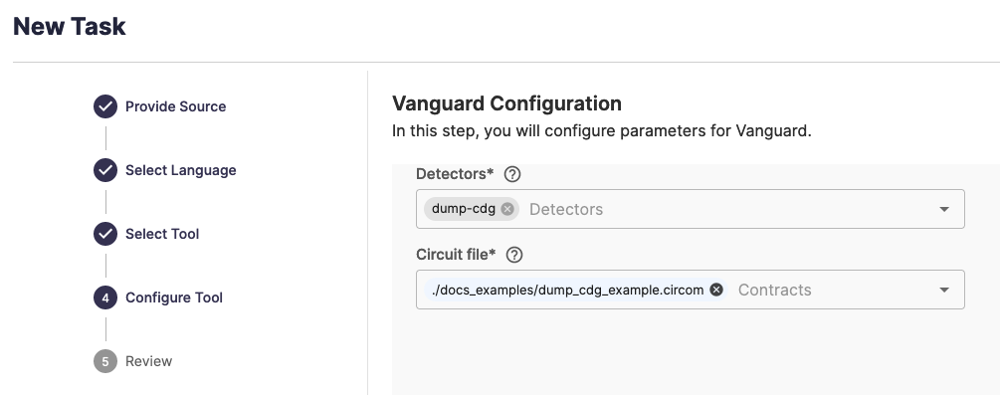
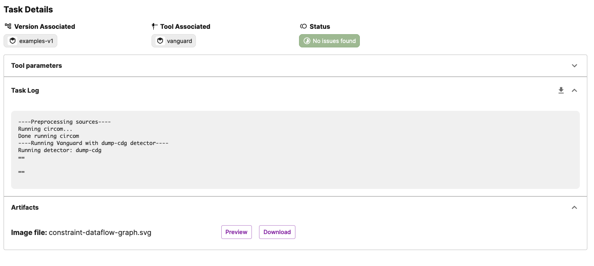
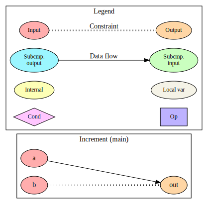

# Constraint-Dataflow Graph Generator (`dump-cdg`)

## Summary

The Constraint-Dataflow Graph Generator is not a bug detector, but rather an analysis pass that generates the Constraint-Dataflow Graph (CDG) of a ZK circuit.
The CDG generator creates a [Graphviz](https://graphviz.org/) graph that shows how data flows through the circuit and how different signals are connected through constraints.
The CDG graph also displays other structural information about a circuit, such as how subcomponent inputs and outputs are connected within a component and what signals are dependent on conditional statements.
A CDG graph is a powerful debugging tool that allows auditors to understand how signals are (or are not) connected to one another and find discrepancies that lead to major vulnerabilities.

## Usage Instructions

:::tip

The larger and more complex a circuit, the larger and more complex the CDG will become.
We recommend using the CDG generator on circuits with small numbers of signals and subcomponents, otherwise the graph will soon become difficult to navigate!

:::

### SaaS Usage
When using the CDG generator on SaaS, add "Dump CDG" (`dump-cdg`) to the Detector selection during the tool configuration step.

<details open>
<summary>CDG Generator Selection</summary>



</details>

After running the task, the SaaS platform will automatically convert ZK Vanguard's CDG output into a SVG image under the Artifacts dropdown that can be viewed or downloaded.

<details open>
<summary>CDG Generator Completion Screen</summary>



</details>


### Command-line Usage
The CDG generator is invoked on the command-line with the argument `--detector dump-cdg -o <desired output directory>`.
The CDG generator will then create a file `<desired output directory>/artifacts/constraint-dataflow-graph.dot`, which contains the CDG
as a Graphviz file.
The Graphviz file can be rendered into an image or PDF using the `DOT` rendering tool, which is documented [on the Graphviz website](https://graphviz.org/doc/info/command.html).

```shell title="Example DOT rendering command"
dot -Tsvg output/artifacts/constraint-dataflow-graph.dot > graph.svg
```


## Example Usage


```circom title="dump_cdg_example.circom" showLineNumbers
pragma circom 2.0.0;

template Increment() {
  signal input a;
  signal input b;
  signal output out;

  out <-- a + 1;
  out === b + 1;
}

component main = Increment();
```

In this example, output signal `out` is assigned `a + 1`, but is constrained on `b + 1`.
This means that `out` is dataflow dependent on input `a` but constraint dependent on input `b`.
In the CDG, we should therefore see an undirected constraint edge between `out` and `b`, but a dataflow edge from `a` to `out`.


<details>
<summary>ZK Vanguard Command-line and Log Output</summary>

```shell title=Command
vanguard_driver --detector dump-cdg dump_cdg_example.circom
```

```txt title=Output
----Preprocessing sources----
Running circom...
Done running circom
----Running Vanguard with dump-cdg detector----
Running detector: dump-cdg
==

==

```

</details>


<details open>
<summary>Generated CDG</summary>



</details>