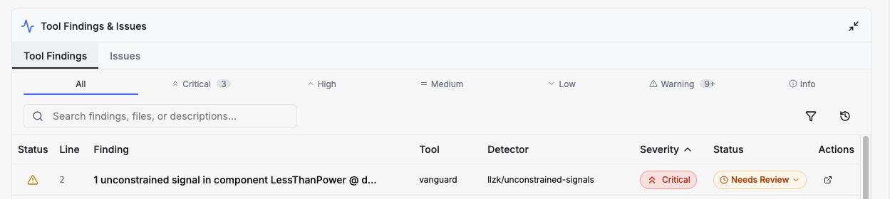

import {DisplayDetectorCards} from '@site/src/components/vanguard/DetectorTypeUtils';

## Using Detectors

After running a ZK Vanguard detector, you will be able to see the *findings* of
the detector under "Tool Findings" in the "Tool Findings & Issues" panel below
the code viewer.

Clicking on the "Status" drop-down will allow you to confirm the issue as a true
bug or mark the issue as a false alarm if you believe the detector's finding is
not a true finding (see the following detector documentation to learn more about
the limitations of each detector).
You can also click on the issue to see a detailed description, which will contain
file and line number links you can use to jump to the finding's location in the
code viewer.

## Available Detectors

ZK Vanguard is equipped with the following set of detectors:

<!-- These header links are required so backlinks redirect to the correct header. -->
## Compute or Constrain Detectors {#compute-or-constrain}

These detectors independently operate on both witness-generation operations and constrains in the circuit.
These detectors will operate on LLZK files that contain only constraints as well.

<!-- TODO: Add back "detectors/private-input-leakage" after DSS -->
<DisplayDetectorCards docIds={["detectors/out-of-range-signals", "detectors/unused-fields"]}/>

## Compute and Constrain Detectors {#compute-and-constrain}

These detectors require witness-generation operations and constrains in the circuit to function.

<DisplayDetectorCards docIds={["detectors/compute-constrain-difference"]}/>

<!-- TODO: Add in after DSS -->
<!-- ## Main-Entry Detectors {#main-entry}

<DisplayDetectorCards docIds={[""detectors/private-input-leakage"]}/> -->

## Compute-Only Detectors {#compute-only}

These detectors identify issues specific to witness generation.

<DisplayDetectorCards docIds={["detectors/divide-by-zero", "detectors/signal-dependent-control-flow"]}/>

## Constrain-Only Detectors {#constrain-only}

These detectors identify issues specific to circuit constraints.

<DisplayDetectorCards docIds={["detectors/unconstrained-signals", "detectors/underconstrained-outputs"]}/>