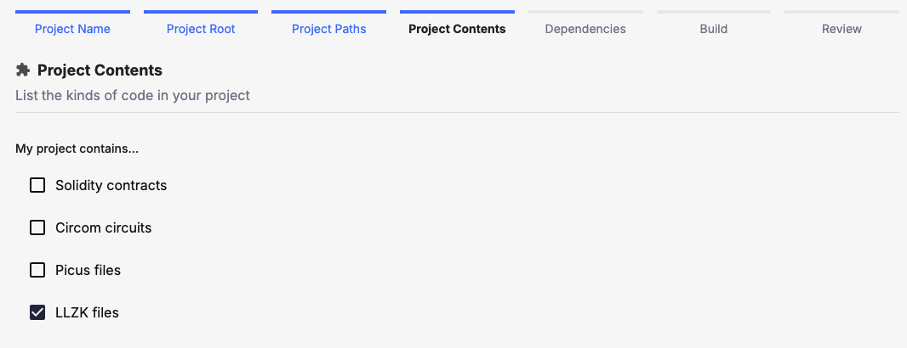

## What is ZK Vanguard?

ZK Vanguard is a static analysis tool used to discover common vulnerabilities in zero-knowledge (ZK) circuits.
ZK Vanguard is able to analyze any ZK language that can be translated into
[the LLZK intermediate circuit representation][llzk-docs], such as [Zirgen], [halo2], and [Plonky3].
Currently, ZK circuits must be compiled into LLZK before being uploaded to AuditHub.
An older version of ZK Vanguard which supports circom is available through the [ZK Vanguard (Circom)](/zkvanguard-legacy/) version.

## General Usage Instructions

If you're not familiar with AuditHub, first read the [AuditHub guide](/saas/).

To use ZK Vanguard on AuditHub, upload or import a project that contains LLZK IR files.
Then, during project setup, check the box that says "LLZK files."

If LLZK files are added in a new version of an existing project, you can edit the
project definition to indicate that LLZK files are now included.

Once LLZK files are made available, ZK Vanguard will be accessible from the
Audit Tools side panel.

<!-- TODO: add wizard screenshow once private-input-leakage is disabled on prod -->

Currently, ZK Vanguard analyzes a single LLZK file at a time.
Multiple detectors may be run simultaneously, but not all LLZK files can be analyzed
by all detectors, depending on what features are present in the LLZK file.
This is discussed in further detail on the next page.

[llzk-docs]: https://veridise.github.io/llzk-lib/main/
[Zirgen]: https://github.com/risc0/zirgen
[halo2]: https://zcash.github.io/halo2/
[Plonky3]: https://polygon.technology/plonky3
[circom]: https://docs.circom.io/
