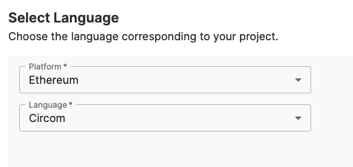
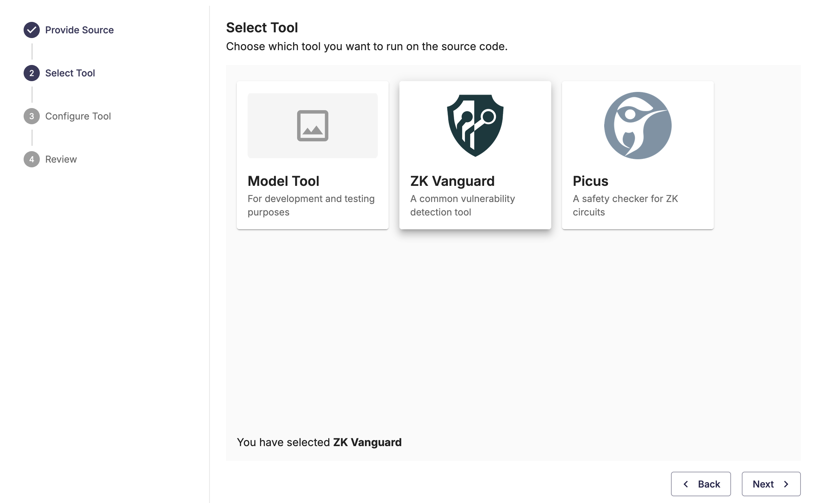

# ZK Vanguard Overview

## What is ZK Vanguard?

ZK Vanguard is a static analysis tool used to discover common vulnerabilities in zero-knowledge (ZK) circuits.
ZK Vanguard currently supports detecting bugs in ZK circuits written in [circom](https://docs.circom.io/).

## General Usage Instructions

### SaaS Usage

If you're not familiar with Veridise's Security-as-a-Service (SaaS) platform, first read the [SaaS guide](/saas/).

To use ZK Vanguard on SaaS, when creating a new task on Veridise's SaaS platform, select "Ethereum" as the Platform and "Circom" as the Language:

You'll then be able to select ZK Vanguard from among the available tools:

